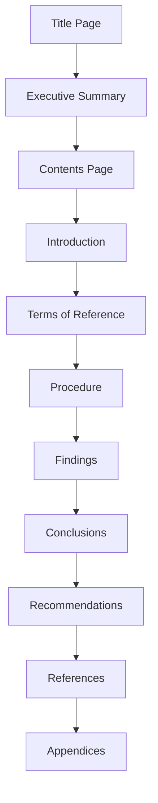

# Academic Skills for Success: A Comprehensive Study Guide

## Table of Contents
- [Introduction](#introduction)
- [Mastering 5-Minute Presentations](#mastering-5-minute-presentations)
- [Effective Reading of Research Papers](#effective-reading-of-research-papers)
- [Crafting Quality Reports](#crafting-quality-reports)
- [Enhancing Team Collaboration](#enhancing-team-collaboration)
- [References](#references)

## Introduction

This study guide covers four essential academic and professional skills: delivering impactful 5-minute presentations, efficiently reading research papers, crafting well-structured reports, and enhancing team collaboration. Each section provides practical strategies and actionable tips to help you excel in both academic settings and the workplace.

## Mastering 5-Minute Presentations

### The One-Message Rule 📢
**Focus on communicating a single central idea.**

> "A 5-minute presentation should focus on one compelling idea rather than trying to cover too much ground." — [HubSpot Marketing Blog](https://blog.hubspot.com/marketing/5-minute-presentation)

For example, instead of covering "climate change" broadly, narrow your focus to "how carbon emissions affect urban areas."

### Structure for Success ⏱️

| Section | Time | Purpose |
|---------|------|---------|
| Introduction | 30 seconds | Hook audience and outline your talk |
| Main Content | 3 minutes | Present problem, solution, and key points |
| Conclusion | 30 seconds | Reinforce central message |

### Preparation Strategies 🔍

1. **Research thoroughly** but present selectively
2. **Practice to the 4-minute mark** to allow buffer time during actual delivery
3. **Simplify visual aids** — use images over text-heavy slides

> "A single graph showing emission trends can be more impactful than paragraphs of explanation." — [AhaSlides](https://ahaslides.com/blog/how-to-make-a-5-minute-presentation/)

### Engagement Techniques 🌟

- **Start with a hook**: "Did you know urban areas contribute 70% of global emissions?"
- **Use storytelling**: Share a brief case study that illustrates your point
- **Body language matters**: Maintain eye contact and use confident gestures

> "Varying your tone and adding a smile enhances audience connection." — [Udemy Course: Give an Amazing Five Minute Presentation](https://www.udemy.com/course/five-wcf/)

## Effective Reading of Research Papers

### The Three-Pass Method 📚

This efficient approach to reading academic papers comes from [Stanford University's guide "How to Read a Paper"](https://web.stanford.edu/class/ee384m/Handouts/HowtoReadPaper.pdf).

#### First Pass (5-10 minutes) 🔎
Get a bird's-eye view to determine relevance:

- Read title, abstract, and introduction
- Review section headings
- Read conclusions
- Ask yourself the five Cs:
  - **Category**: What type of paper is this?
  - **Context**: How does it fit in the field?
  - **Correctness**: Does it seem valid?
  - **Contributions**: What are its key findings?
  - **Clarity**: Is it well-written?

#### Second Pass (Up to 1 hour) 📊
Grasp content without delving into details:

- Focus on figures, diagrams, and graphs
- Mark unread references
- Summarize the main argument

> **Example**: When examining a machine learning paper, pay special attention to performance graphs and look for error bars that indicate statistical validity.

#### Third Pass (1-5 hours) 🧠
Achieve deep understanding:

- Mentally re-implement the paper step by step
- Challenge assumptions
- Identify strengths and weaknesses
- Note missing citations or methodological flaws

### Conducting Literature Surveys 🔬

1. Use academic search engines (Google Scholar, CiteSeer) with keywords
2. Perform first pass on 3-5 recent papers
3. Identify key papers by looking for frequently cited works
4. Check recent conference proceedings
5. Select key papers for deeper reading

## Crafting Quality Reports

### Essential Characteristics ✨

- **Clarity**: Use straightforward language
- **Conciseness**: Be brief while conveying all necessary information
- **Accuracy**: Ensure all facts and figures are correct
- **Structure**: Follow a recognizable format

### Standard Report Structure 📋

#### Key Sections Explained:

- **Title Page**: Report title, author, date, institution
- **Executive Summary**: Brief overview (1 page) of main points
- **Introduction**: Purpose, scope, methodology
- **Findings**: Results with supporting data
- **Conclusions**: Summary of key findings and implications
- **Recommendations**: Suggested actions based on conclusions

> **Real-world example**: A business proposal might emphasize feasibility and benefits, while a research report requires detailed methodology.

### Adaptation Tips ⚙️

- Check assessment instructions for specific requirements
- Tailor to your audience's expertise level
- Ensure logical flow between sections
- Verify all data and cite sources properly

> "Reports should be adapted based on the report type and audience, ensuring accuracy and logical flow." — [Open Polytechnic's guide](https://www.openpolytechnic.ac.nz/current-students/study-tips-and-techniques/assignments/how-to-write-a-report/)

## Enhancing Team Collaboration

### 10 Guidelines for Effective Teamwork 🤝

1. **Clarify the Mission** ⭐
   - Ensure everyone understands objectives
   - Define measurable outcomes
   
   > **Example**: "Complete project X by date Y with Z quality standards"

2. **Foster Innovation** 💡
   - Encourage calculated risks
   - Welcome creative ideas
   
   > **Example**: Hold judgment-free brainstorming sessions where all ideas are recorded

3. **Promote Open Communication** 🗣️
   - Create transparent dialogue
   - Establish regular check-ins
   
   > **Example**: Schedule weekly stand-ups where everyone shares progress and challenges

4. **Build Group Cohesion** 🧩
   - Develop sense of belonging
   - Create shared accountability
   
   > **Example**: Organize team-building activities that highlight complementary skills

5. **Value Individual Contributions** 👥
   - Recognize unique expertise
   - Leverage diverse perspectives
   
   > **Example**: Assign tasks based on team members' strengths

6. **Encourage Creativity** 🎨
   - Establish norms supporting brainstorming
   - Avoid dismissive attitudes
   
   > **Example**: Use "yes, and..." instead of "but" during ideation sessions

7. **Commit to Continuous Improvement** 📈
   - Regularly assess processes
   - Refine methodologies
   
   > **Example**: Conduct retrospectives after project milestones

8. **Understand Team Dynamics** 🔄
   - Recognize development stages
   - Address conflicts proactively
   
   > **Example**: Acknowledge when the team is in the "storming" phase and facilitate resolution

9. **Resolve Conflicts Proactively** ⚖️
   - Develop clear resolution procedures
   - Address issues early
   
   > **Example**: Establish a mediation process for disagreements

10. **Adopt Shared Leadership** 👑
    - Implement participative decision-making
    - Distribute responsibilities
    
    > **Example**: Rotate leadership roles for different tasks

### Leadership Support 🏢

Securing management backing is crucial for:
- Resource allocation
- Obstacle removal
- Mission reinforcement

> **Note**: These guidelines may require adaptation based on team size, industry, or specific challenges.

## References

- AhaSlides. (2025). [How to Make a 5 Minute Presentation: 30 Killer Ideas](https://ahaslides.com/blog/how-to-make-a-5-minute-presentation/)
- Beautiful.ai. [How To Design and Deliver a 5-Minute Presentation](https://www.beautiful.ai/blog/how-to-design-and-deliver-a-5-minute-presentation)
- Cornell Careers Beyond Academia. [Tips for a Memorable 5-Minute Research Presentation](https://gradcareers.cornell.edu/spotlights/tips-for-a-5-minute-research-presentation/)
- Envato Tuts+. [Make Short 5-Minute Presentations (Quick Ideas & Tips +Video)](https://business.tutsplus.com/tutorials/5-minute-presentation--cms-29182)
- Frantically Speaking. [Creating & Delivering A 5 Minute Presentation](https://franticallyspeaking.com/creating-delivering-a-5-minute-presentation/)
- HubSpot Marketing Blog. [How to Create an Engaging 5-Minute Presentation](https://blog.hubspot.com/marketing/5-minute-presentation)
- Indeed.com UK. [How to create a 5-minute presentation (plus useful tips)](https://uk.indeed.com/career-advice/career-development/5-minute-presentation)
- Lee, T. (n.d.). [5 minute presentations - how to deliver a great one](https://www.trevorjlee.com/deliver-great-5-minute-presentations/)
- Lee, T. (n.d.). [Delivering a 5 minute presentation](https://www.linkedin.com/pulse/delivering-5-minute-presentation-trevor-lee)
- Open Polytechnic. [How to Write a Report](https://www.openpolytechnic.ac.nz/current-students/study-tips-and-techniques/assignments/how-to-write-a-report/)
- Stanford University. [How to Read a Paper](https://web.stanford.edu/class/ee384m/Handouts/HowtoReadPaper.pdf)
- Udemy. [Give an Amazing Five Minute Presentation](https://www.udemy.com/course/five-wcf/)