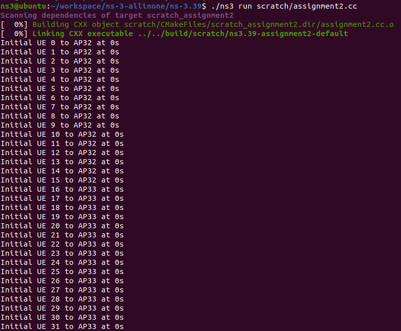

# Multimedia Wireless Networks Assignment 2
---
- **Title**: ns-3 Network Simulator
- **Deadline**: 11th April 2025, 23.59 A.M.

**1. Submission Guidelines**  

- Installation guide:
    1. **Commands**: List terminal commands used for installation.
    2. **Verification**: Copy and paste the terminal logs confirming each step's success.
    3. **Final Check**: Run [`hello-simulator.cc`](https://www.nsnam.org/docs/release/3.19/doxygen/hello-simulator_8cc_source.html) to verify installation.

    References for Installation guides:
  - [NVIDIA CUDA installation guide](https://docs.nvidia.com/cuda/cuda-installation-guide-linux/index.html)
  - [ns-3 installation guide](https://www.nsnam.org/docs/installation/html/linux.html)

- Source-code documentation
    1. Upload all source code under `./a2/src/`
    2. Include comments for each function.
  
- Assignment report (`assignment-2.md`):
    1. **Section 1**: Installation guide for ns-3
    2. **Section 2**: Simulation explanation:
       1. Explain how you execute each milestone (include source code snippet/hyperlink for the `line of code`).
       2. Show figures & explanation for result analysis part.

- **Video simmulation**: Record How simulation your simulation run & attach the hyperlink in the final report on `assignment-2md`)

>[!CAUTION]
>Source code without report in `assignment-2.md` will not count as point.

**2. Objectives**  

1. **NS-3 Installation (`1-points`)**:
    <br> Installation guide report requirements:

2. **LTE / WiFi Simulation (`2-points`)**:
   - **Submission Requirements**: Upload your simulation source code under `./a2/src/` in your branch. For each milestone, provide:
      1. **Input**: Commands or source code (attach hyperlinks from `./a2/src/`).  
      2. **Output**: Figures, results, and explanations.

3. **Analysis reports** (`8-points`)

4. **Peer review** (`1-point`)

5. **Extra Credit (`up to 3-points`)**:
   - **Peer Review Bonus:** Top 3 students based on peer reviews receive extra credit:
     - **Top 1:** (`3-points`)
     - **Top 2:** (`2-points`)
     - **Top 3:** (`1-points`)


**3. Milestones & Grading**  

1. **Deploy 2 nodes and assign users** (`1-points`):
   1. Deploy 2 nodes as Node A & B;
   2. Assign 16 users for each node:
      - For LTE is called User Equipment (UE)
      - For WiFi is called Station (STA)
   3. Provide a user table (e.g., MAC addresses or STA/UE IDs).  

   This setup can be formulated as follow:
   - **Formula:**  
       $$X_0 = Y_0 = 16$$  
   - **Definitions:**
     - ($X_0$) = Initial Users in Node A
     - ($Y_0$) = Initial Users in Node B

2. **Full-Queue Model Transmission**
  
    Implement a [full-queue model](https://www.nsnam.org/doxygen/d9/db7/fcfs-wifi-queue-scheduler_8cc_source.html). Ensure each STA/UE continuously transmits to AP/BS. (`1-point`)

   - **Simulation Duration:** 1 minute.  
   - **User Movement:**  
     - **At second 20:** 25% of users move from Node A → Node B, and 50% from Node B → Node A.  
     - **At second 40:** 50% of users move from Node A → Node B, and 50% from Node B → Node A.
     - For each movement, describe which users that moved from A --> B and B --> A in your .
   - **Formulas:**  
     - **Time slot 1/3 (20 seconds):**  
            $X_1 = X_0 \times p$ , $\quad Y_1 = Y_0 \times q$  
     - **Time slot 2/3 (40 seconds):**  
            $X_2 = X_1 \times p$, $\quad Y_2 = Y_1 \times q$  
   - **Definitions:**  
     - ($p$ = 25\%) → Users moving from Node A to Node B.  
     - ($q$ = 50\% ) → Users moving from Node B to Node A.  
     - ($X_1, X_2$) → Users in Node A after each movement.  
     - ($Y_1, Y_2$) → Users in Node B after each movement.  

3. **Analysis Report**:
   1. What is the final users distribution (value of $X_2$ & $Y_2$)? Show the users table for each movement. (`2-points`)
   2. Show & analyze the figures of the aggregated throughput in Node-A & Node-B through time (`3-points`):
      - X-axis = time & Y-axis = throughput.
      - Analyze & explain your results.

4. Show the 5-minutes video simulation (`3-points`)

**4. References**  

- [ns-3](https://www.nsnam.org/)  
- [ns-3 Tutorial](https://www.nsnam.org/docs/tutorial/html/)  
- [The ns-3 Network Simulator](https://intronetworks.cs.luc.edu/current/html/ns3.html)  
- [ns-3 LTE Module](https://www.nsnam.org/docs/models/html/lte-user.html)  
- [ns-3 WiFi Module](https://www.nsnam.org/docs/models/html/wifi-design.html)  
- [3GPP NR ns-3 Module](https://github.com/QiuYukang/5G-LENA)  
---

## :notebook_with_decorative_cover: <i>1. Introduction</i>
:arrow_forward: *Reference: [ns-3 introduction](https://www.nsnam.org/docs/tutorial/html/introduction.html)*


### **About ns-3:**
- **The ns-3 simulator is a discrete-event network simulator** targeted primarily for research and educational use and typically run from the command line. 
	- It is written directly in C++
	- It has been developed to provide an open, extensible network simulation platform, for networking research and education. In brief, **ns-3 provides models of how packet data networks work and perform, and provides a simulation engine for users to conduct simulation experiments.**
- A few key points are worth noting at the onset:
	- ns-3 is open-source, and the project strives to maintain an open environment for researchers to contribute and share their software.
	- **ns-3 is not a backwards-compatible extension of ns-2.** It is a new simulator. The two simulators are both written in C++ but ns-3 is a new simulator that does not support the ns-2 APIs.

### **Advantage:**
- It is difficult or not possible to perform with real systems for studying. Thus, useing ns-3 to study system behavior in a highly controlled, reproducible environment, and to learn about how networks work is better.
- The following is different features between ns-3 other simulation tools.
	- **ns-3 is designed as a set of libraries that can be combined together and also with other external software libraries.**
	- Some simulation platforms provide users with a single, while ns-3 is more modular in this regard.
	- Several external animators and data analysis and visualization tools can be used with ns-3. However, users should expect to work at the command line and with C++ and/or Python software development tools.
	- **ns-3 is primarily used on Linux or macOS systems. Windows users may also use a Linux virtual machine.**
- ns-3 is a research and educational simulator, by and for the research community. It will rely on the ongoing contributions of the community to develop new models, debug or maintain existing ones, and share results.
---
##  :package: <i>2. Requirement</i>
### **2.1 Used Language**
:arrow_forward: *Reference: [ns-3 quick-start](https://www.nsnam.org/docs/tutorial/html/quick-start.html#prerequisites)*
-  The main features of ns-3 just require a C++ compiler (g++ or clang++), Python (version 3.6 or above), CMake and a build-system (e.g. make, ninja, Xcode).
#### **:arrow_right: Linux**
- For Linux, use either **g++ or clang++** compilers. 
#### **:arrow_right: macOS**
- For macOS, use **clang++** (available in Xcode or Xcode Command Line Tools). 
#### **:arrow_right: Windows**
- For Windows, Msys2 tools with the MinGW64 toolchain can be used (since ns-3.37) for most use cases. 
- For releases earlier than ns-3.37, or for use of emulation modes or Python bindings, we recommend to either use a Linux virtual machine, or the Windows Subsystem for Linux.

### **2.2 Prerequisites**
:arrow_forward: *Reference: [ns-3 Getting Started](https://www.nsnam.org/docs/tutorial/html/getting-started.html#prerequisites)*


---
## :page_facing_up: <i>3. Installation</i>
:arrow_forward: *Reference: [ns-3 Getting Started](https://www.nsnam.org/docs/tutorial/html/getting-started.html#getting-started), [ns-3 installation](https://www.nsnam.org/docs/installation/html/linux.html)*
### **3.1 Environment**
- Using VMware in Windows 

|        Ubuntu Version        | Disk | Memory |  CPU   |
|:----------------------------:|:----:|:------:|:------:|
| ubuntu-20.04.5-desktop-amd64 | 40G  |   4G   | 4 core |

### **3.2 ns-3 install step**
#### **3.2.1 Install the Dependent Tools**
```shell=
sudo apt-get update
# ns-3 prerequisites
sudo apt-get install -y git vim g++ python3-pip cmake     
# NR   prerequisites
sudo apt-get install -y libc6-dev sqlite sqlite3 libsqlite3-dev 
# gnuplot tool
sudo apt-get install -y gnuplot-x11
# PyViz visualizer prerequisites
sudo apt-get install -y gir1.2-goocanvas-2.0 python3-gi python3-gi-cairo python3-pygraphviz gir1.2-gtk-3.0 ipython3
# Python bindings prerequisites
python3 -m pip install --user cppyy
```
**Check the version of g++ and python.**
|  tool  | version |  command   | Result            |
|:------:| ------- |:----------:| ----------------- |
| python | 3.8.10  | python3 -V | Python 3.8.10     |
|  g++   | 9.4.0   |   g++ -v   | gcc version 9.4.0 |
#### **3.2.2 Download source code from github** and **fetch the ns-3.39 related sourcecode.**
```shell=
cd
mkdir workspace
cd workspace
git clone https://gitlab.com/nsnam/ns-3-allinone.git
cd ns-3-allinone
python3 download.py -n ns-3.39
```


#### **3.2.3 Building ns-3**
```shell=
./build.py
```

#### **3.2.4 Download the NR module(version 5g-lena-v2.5.y).**
```shell=
cd ns-3.39/contrib
git clone https://gitlab.com/cttc-lena/nr.git
cd nr
git checkout 5g-lena-v2.5.y
```

#### **3.2.5 Configuration**
```shell=
cd ../..
./ns3 configure --enable-examples --enable-tests --enable-python-bindings
```

#### **3.2.6 Build all targets**
```shell=
./ns3 build
```


#### **3.2.7 Run NR example for test**
```shell=
./ns3 run hello-simulator.cc --vis
```


### **3.3 NetAnim tool install step**
#### **3.3.1 Install the Dependent Tools**
```shell=
# NetAnim prerequisites
sudo apt install -y qtbase5-dev qtchooser qt5-qmake qtbase5-dev-tools
```

#### **3.3.2 Build NetAnim tool**
```shell=
cd ..
cd netanim-3.109
make clean
qmake NetAnim.pro
make
```

#### **3.3.3 Execute NetAnim tool**
```shell=
./NetAnim
```


---
## :package: <i>4. Simulation</i>
:arrow_forward: *Reference: [ns-3 LTE models](https://www.nsnam.org/docs/models/html/lte-user.html), [利用NS3部署一个LTE网络](https://blog.csdn.net/Shmily1107/article/details/110919007?ops_request_misc=&request_id=&biz_id=102&spm=1018.2226.3001.4187)* 

### 4.1 Initial configuration
| AP   | Connect UE List(ID) | AP Position | UE Position (i = UE iD)                       |
| ---- | ------------------- | ----------- | --------------------------------------------- |
| AP32 | 0 ~ 15              | (0, 0, 0)   | (17*(i%4)+5, 17*(int((i+16)/4))+5 -60, 0)     |
| AP33 | 16 ~ 31             | (200, 0, 0) | (200 + 17*(i%4) +5, 17*(int(i/4)) +5 - 60, 0) |


### 4.2 Start simulation
```bash=
cd ~/workspace/ns-3-allinone/ns-3.39
vim scratch/assignment2.cc
```
```cpp=
#include <ns3/core-module.h>
#include "ns3/internet-module.h"
#include <ns3/network-module.h>
#include <ns3/mobility-module.h>
#include <ns3/wifi-module.h>
#include "ns3/netanim-module.h"
#include "ns3/flow-monitor-module.h"
#include "ns3/applications-module.h"

#include <fstream>

using namespace ns3;

std::ofstream throughputLog("throughput.csv");
std::ofstream ueLog("ue_count.csv");
static std::map<FlowId, uint64_t> lastRxBytes;

void MoveUsers(NodeContainer& ueNodes, std::vector<int> moveAtoB, std::vector<int> moveBtoA, double xA, double xB) {
    Ptr<MobilityModel> mobility;
    for (int i : moveAtoB) {
        mobility = ueNodes.Get(i)->GetObject<MobilityModel>();
        mobility->SetPosition(Vector(200 - (17*(i%4) + 5), 17*(int((i+16)/4)) + 10 - 61, 0));  // Move to Node B
    }
    for (int i : moveBtoA) {
        mobility = ueNodes.Get(i)->GetObject<MobilityModel>();
        mobility->SetPosition(Vector((17*(i%4)+5)*(-1) - 10, 17*(int((i+16)/4))+5 - 120, 0));  // Move to Node A
    }
}

void LogStats(FlowMonitorHelper* flowHelper, Ptr<FlowMonitor> monitor, NodeContainer ueNodes,
              double xA, double xB, double range, double interval) {
    monitor->CheckForLostPackets();
    FlowMonitor::FlowStatsContainer stats = monitor->GetFlowStats();

    double ap0_rx = 0, ap1_rx = 0;

    for (auto& stat : stats) {
        Ptr<Ipv4FlowClassifier> classifier = DynamicCast<Ipv4FlowClassifier>(flowHelper->GetClassifier());
        Ipv4FlowClassifier::FiveTuple t = classifier->FindFlow(stat.first);
        uint64_t last = lastRxBytes[stat.first];
        uint64_t current = stat.second.rxBytes;
        double deltaBits = (current - last) * 8.0;

        lastRxBytes[stat.first] = current;
        if (t.destinationAddress == Ipv4Address("192.168.1.1"))
            ap0_rx += deltaBits / interval / 1e6;
        else
            ap1_rx += deltaBits / interval / 1e6;
    }

    int ap0_ue = 0, ap1_ue = 0;
    for (uint32_t i = 0; i < ueNodes.GetN(); ++i) {
        Vector pos = ueNodes.Get(i)->GetObject<MobilityModel>()->GetPosition();
        if (std::abs(pos.x - xA) < range)
            ap0_ue++;
        else if (std::abs(pos.x - xB) < range)
            ap1_ue++;
    }

    double time = Simulator::Now().GetSeconds();
    throughputLog << time << "," << ap0_rx << "," << ap1_rx << "\n";
    ueLog << time << "," << ap0_ue << "," << ap1_ue << "\n";

    Simulator::Schedule(Seconds(interval), [=]() {
      LogStats(flowHelper, monitor, ueNodes, xA, xB, range, interval);
    });
}

std::vector<int> ueToApMap;
std::vector<ApplicationContainer> ueApps;

void UpdateTrafficTarget(NodeContainer& ueNodes,
                         NodeContainer& wifiApNodes,
                         std::vector<Ipv4Address> apAddresses,
                         uint16_t port, double interval)
{
    for (uint32_t i = 0; i < ueNodes.GetN(); ++i) {
        Ptr<Node> ue = ueNodes.Get(i);
        Vector uePos = ue->GetObject<MobilityModel>()->GetPosition();

        // Find closest AP
        double minDist = std::numeric_limits<double>::max();
        int nearestAp = -1;
        for (uint32_t j = 0; j < wifiApNodes.GetN(); ++j) {
            Vector apPos = wifiApNodes.Get(j)->GetObject<MobilityModel>()->GetPosition();
            double dist = CalculateDistance(uePos, apPos);
            if (dist < minDist) {
                minDist = dist;
                nearestAp = j;
            }
        }

        // Handover to another AP（If connection is changed）
        if (nearestAp != ueToApMap[i]) {
          if (ueToApMap[i] == -1) {
            std::cout << "Initial UE " << i << " to AP" << nearestAp + 32 << " at " << Simulator::Now().GetSeconds() << "s\n";
          }
          else {
            std::cout << "UE " << i << " handover from AP" << ueToApMap[i] + 32 << " to AP" << nearestAp + 32 << " at " << Simulator::Now().GetSeconds() << "s\n";
          }
          
          // Stop the old App
          ueApps[i].Stop(Simulator::Now());

          Address targetAddress(InetSocketAddress(apAddresses[nearestAp], port));
          Simulator::Schedule(Seconds(0.1), [=]() {
            BulkSendHelper bulkSend("ns3::TcpSocketFactory", targetAddress);
            bulkSend.SetAttribute("MaxBytes", UintegerValue(0));
            ueApps[i] = bulkSend.Install(ue);
            ueApps[i].Start(Simulator::Now() + Seconds(0.1));
            ueApps[i].Stop(Seconds(60.0));
          });

          ueToApMap[i] = nearestAp;
        }
    }

    // Schedule next update
    Simulator::Schedule(Seconds(interval), &UpdateTrafficTarget,
                        std::ref(ueNodes), std::ref(wifiApNodes), apAddresses, port, interval);
}


int main (int argc, char *argv[]) {
  CommandLine cmd;
    int ap_num = 2;       // 2 APs: Node A & Node B
    int ue_num = 32;      // 16 UEs per AP

  NodeContainer ueNodes;
  ueNodes.Create(ue_num);

  NodeContainer wifiApNodes;
  wifiApNodes.Create(ap_num);

  // ---------------- WiFi setup ---------------- //
  WifiHelper wifi;
  wifi.SetStandard(WIFI_STANDARD_80211n);

  WifiMacHelper mac;
  mac.SetType("ns3::AdhocWifiMac", "QosSupported", BooleanValue(true));

  YansWifiPhyHelper phy;
  phy.SetPcapDataLinkType (WifiPhyHelper::DLT_IEEE802_11_RADIO);

  YansWifiChannelHelper channel = YansWifiChannelHelper::Default();
  phy.SetChannel(channel.Create());

  NetDeviceContainer apDevices = wifi.Install(phy, mac, wifiApNodes);
  NetDeviceContainer ueDevices = wifi.Install(phy, mac, ueNodes);

  // ---------------- Set mobility ---------------- //
  MobilityHelper mobility;

  // Set AP position
  mobility.SetMobilityModel("ns3::ConstantPositionMobilityModel");
  mobility.Install(wifiApNodes);
  wifiApNodes.Get(0)->GetObject<MobilityModel>()->SetPosition(Vector(0, 0, 0));   // Node A 位置
  wifiApNodes.Get(1)->GetObject<MobilityModel>()->SetPosition(Vector(200, 0, 0)); // Node B 位置

  // Set UEs initial position
  mobility.SetMobilityModel("ns3::ConstantPositionMobilityModel");
  mobility.Install(ueNodes);
  for (int i = 0; i < 16; i++) {
      ueNodes.Get(i)->GetObject<MobilityModel>()->SetPosition(Vector(17*(i%4)+5, 17*(int((i+16)/4))+5 -60, 0));  // 初始在 Node A
  }
  for (int i = 16; i < 32; i++) {
      ueNodes.Get(i)->GetObject<MobilityModel>()->SetPosition(Vector(200 + 17*(i%4) +5, 17*(int(i/4)) +5 - 60, 0)); // 初始在 Node B
  }

  // ---------------- User movement ---------------- //
  // 20 seconds
  std::vector<int> moveAtoB_3min = {0, 1, 2, 3};               // 25% 的 16 人 (4 人)
  std::vector<int> moveBtoA_3min = {16, 17, 18, 19, 20, 21, 22, 23};  // 50% 的 16 人 (8 人)
  Simulator::Schedule(Seconds(20), &MoveUsers, ueNodes, moveAtoB_3min, moveBtoA_3min, 0, 200);
  // AP1: {  4,  5,  6,  7,  8,  9, 10, 11, 12, 13, 14, 15, 16, 17, 18, 19, 20, 21, 22, 23} => 20
  // AP2: {  0,  1,  2,  3, 24, 25, 26, 27, 28, 29, 30, 31}                                 => 12

  // 40 seconds
  std::vector<int> moveAtoB_6min = {4,  5,  6,  7,  8,  9, 10, 11, 12, 13};  // 50% 的 20 人 (10 人)
  std::vector<int> moveBtoA_6min = {24, 25, 26, 27, 28, 29};  // 50% 的 12 人 (6 人)
  Simulator::Schedule(Seconds(40), &MoveUsers, ueNodes, moveAtoB_6min, moveBtoA_6min, 0, 200);
  // AP1: { 14, 15, 16, 17, 18, 19, 20, 21, 22, 23, 24, 25, 26, 27, 28, 29} => 16
  // AP2: {  0,  1,  2,  3,  4,  5,  6,  7,  8,  9, 10, 11, 12, 13, 30, 31} => 16

  // ---------------- Network stack & traffic ---------------- //
  InternetStackHelper stack;
  stack.Install(ueNodes);
  stack.Install(wifiApNodes);

  Ipv4AddressHelper address;
  address.SetBase("192.168.1.0", "255.255.255.0");
  Ipv4InterfaceContainer apInterfaces = address.Assign(apDevices);
  Ipv4InterfaceContainer ueInterfaces = address.Assign(ueDevices);

  // Set Full-Queue Model
  uint16_t port = 9;

  std::vector<Ipv4Address> apAddresses;
  for (int i = 0; i < ap_num; ++i) {
      apAddresses.push_back(apInterfaces.GetAddress(i));
      PacketSinkHelper sink("ns3::TcpSocketFactory", InetSocketAddress(Ipv4Address::GetAny(), port));
      ApplicationContainer sinkApp = sink.Install(wifiApNodes.Get(i));
      sinkApp.Start(Seconds(0.0));
      sinkApp.Stop(Seconds(60.0));
  }

  ueToApMap.resize(ue_num, -1);
  ueApps.resize(ue_num);
  UpdateTrafficTarget(std::ref(ueNodes), std::ref(wifiApNodes), apAddresses, port, 1.0);

  Simulator::Schedule(Seconds(1), &UpdateTrafficTarget,
                      std::ref(ueNodes), std::ref(wifiApNodes), apAddresses, port, 1.0);

  // ---------------- 設Animation settings ---------------- //

  AnimationInterface anim("wifi_mobility.xml");

  uint32_t ap_img = anim.AddResource("/home/ns3/workspace/ns-3-allinone/ns-3.39/scratch/AP.png");
  uint32_t sta_img = anim.AddResource("/home/ns3/workspace/ns-3-allinone/ns-3.39/scratch/sta.png");

  for (int i = 0; i < ue_num; i++) {
    anim.UpdateNodeImage(i, sta_img);
    anim.UpdateNodeSize(i, 7, 7);
  }

  for (int i = ue_num; i < ap_num + ue_num; i++) {
    anim.UpdateNodeImage(i, ap_img);
    anim.UpdateNodeSize(i, 25, 25);
  }

  anim.SetMobilityPollInterval(Seconds(10.00));
  anim.SetMaxPktsPerTraceFile(100000000000);
  
  FlowMonitorHelper flowHelper;
  Ptr<FlowMonitor> monitor = flowHelper.InstallAll();

  throughputLog << "Time(s),AP0_Throughput(Mbps),AP1_Throughput(Mbps)\n";
  ueLog << "Time(s),AP0_UEs,AP1_UEs\n";
  
  Simulator::Schedule(Seconds(1.0), [&]() {
    LogStats(&flowHelper, monitor, ueNodes, 0, 200, 100.0, 1.0);
  });

  Simulator::Stop(Seconds(60));
  Simulator::Run();
  Simulator::Destroy();

  throughputLog.close();
  ueLog.close();

  return 0;
}
```
- Run Simulation
```bash=
./ns3 run scratch/assignment2.cc
```
- Output log
  



- Output file
  - `throughput.csv`
  - `ue_count.csv`
  - `wifi_mobility.xml`
### 4.3 Program explanation and segment
1. Deploy 2 nodes as Node A(AP32) & B (AP33)
```cpp=
NodeContainer wifiApNodes;
wifiApNodes.Create(ap_num);

// Set APs (Fixed Position)
mobility.SetMobilityModel("ns3::ConstantPositionMobilityModel");
mobility.Install(wifiApNodes);
wifiApNodes.Get(0)->GetObject<MobilityModel>()->SetPosition(Vector(0, 0, 0));   // Node A Position
wifiApNodes.Get(1)->GetObject<MobilityModel>()->SetPosition(Vector(200, 0, 0)); // Node B Position

```
2. Assign 16 users for each node
```cpp=
NodeContainer ueNodes;
ueNodes.Create(ue_num);  // ue_num = 32

// UEs Initial Position
for (int i = 0; i < 16; i++) {
    ueNodes.Get(i)->GetObject<MobilityModel>()->SetPosition(Vector(17*(i%4)+5, 17*(int((i+16)/4))+5 -60, 0));  // Initially at Node A
}
for (int i = 16; i < 32; i++) {
    ueNodes.Get(i)->GetObject<MobilityModel>()->SetPosition(Vector(200 + 17*(i%4) +5, 17*(int(i/4)) +5 - 60, 0)); // Initially at Node B
}
```
3. Full-Queue Model Transmission
```cpp=
// Configure **Full-Queue Model** persistent traffic
uint16_t port = 9;
std::vector<Ipv4Address> apAddresses;
for (int i = 0; i < ap_num; ++i) {
    apAddresses.push_back(apInterfaces.GetAddress(i));
    PacketSinkHelper sink("ns3::TcpSocketFactory", InetSocketAddress(Ipv4Address::GetAny(), port));
    ApplicationContainer sinkApp = sink.Install(wifiApNodes.Get(i));
    sinkApp.Start(Seconds(0.0));
    sinkApp.Stop(Seconds(60.0));
}
```
4. User Movement
    - At second 20: 25% of users from A → B, 50% from B → A
    ```cpp=
    std::vector<int> moveAtoB_3min = {0, 1, 2, 3};               // 25% of 16 users (4 users)
    std::vector<int> moveBtoA_3min = {16, 17, 18, 19, 20, 21, 22, 23};  // 50% of 16 users (8 users)
    Simulator::Schedule(Seconds(20), &MoveUsers, ueNodes, moveAtoB_3min, moveBtoA_3min, 0, 200);
    ```
    - At second 40: 50% of users from A → B, 50% from B → A
    ```cpp=
    std::vector<int> moveAtoB_6min = {4, 5, 6, 7, 8, 9, 10, 11, 12, 13};  // 50% of 20 users (10 users)
    std::vector<int> moveBtoA_6min = {24, 25, 26, 27, 28, 29};  // 50% of 12 users (6 users)
    Simulator::Schedule(Seconds(40), &MoveUsers, ueNodes, moveAtoB_6min, moveBtoA_6min, 0, 200);
    ```

### 4.4 Results and Analysis
- This section presents the throughput and user association dynamics in a dual-node WiFi setup under a full-queue traffic model. The results are depicted across three figures: throughput over time, average throughput per AP, and user association per AP over time.
1. Throughput Dynamics Over Time
	  - As shown in Figure 1, the throughput of AP32 and AP33 varies significantly across the simulation period. During the initial phase (0–20 seconds), both APs handle their assigned 16 STAs, resulting in relatively stable throughput: approximately 24–30 Mbps for both APs. At the 20-second mark, consistent with the scenario specification, 25% of users (4 users) migrate from AP32 to AP33, while 50% of users (8 users) move from AP33 to AP32. This user redistribution leads to an immediate and noticeable shift in throughput:
	    - AP32: The throughput initially drops due to the sudden influx of users, reaching a minimum before stabilizing in the 30–40 Mbps range.
	    - AP33: The throughput plummets to nearly zero as the user count decreases significantly. It remains suppressed until the next mobility event.
	  - At 40 seconds, another shift occurs: 50% of users from each AP move to the other. This event rebalances the load more evenly, and throughput for both APs improves accordingly. Notably, AP33's throughput sharply increases, exceeding 45 Mbps due to a sudden increase in users, while AP32 stabilizes slightly lower, indicating relatively balanced load sharing but still some resource contention.
	  - The green dashed line represents the system-wide average throughput. It dips during periods of transition (notably at 20s and 40s), indicating that user mobility events momentarily degrade overall efficiency before recovery.
	  - AP throughput over time

		

2. Average Throughput per Access Point
	  - Figure 2 displays the average throughput per AP over the entire 60-second period. The throughput for AP32 is slightly higher (29.17 Mbps) compared to AP33 (24.98 Mbps). This discrepancy is consistent with the observed stability and higher number of connected users for AP32 across most of the simulation timeline. The lower average of AP33 can be attributed to the period of low or near-zero throughput following the first user migration event.
  	- Average throughput of two AP

		

3. User Association Dynamics
	  - In Figure 3, the number of users connected to each AP is plotted over time. Initially, both APs have 16 connected users. 
	  - At 20 seconds, user redistribution occurs according to the defined mobility rule (25% from Node A to B, 50% from B to A), leading to:
	    - AP32: 16 + 8 (from AP33) - 4 (to AP33) = 20 users
	    - AP33: 16 - 8 + 4 = 12 users
	  - At 40 seconds, both APs exchange 50% of their users (10 from AP32 and 6 from AP33, based on previous user counts). After this:
	    - AP32: 20 - 10 + 6 = 16 users
	    - AP33: 12 - 6 + 10 = 16 users
	  - This results in rebalancing both APs back to 16 users, matching the initial distribution. The user fluctuation directly correlates with throughput dynamics, confirming the impact of load balancing on network performance.
	  - Number of UE in two AP
	
	    
	  - UE distribution after 20 seconds
	
	    
	  - UE distribution after 40 seconds
	
	    
    
### 4.5 Summary of Findings
- The simulation results demonstrate that:
  - Throughput performance is tightly coupled with the number of associated users.
  - Imbalanced user distribution (as seen after the first migration) leads to inefficient resource utilization, particularly affecting the AP with fewer users.
  - After rebalancing at 40 seconds, network performance stabilizes, confirming that equitable user distribution enhances system throughput.
  - These results validate the importance of dynamic user association strategies in dense WiFi environments, especially under a full-queue traffic model.


