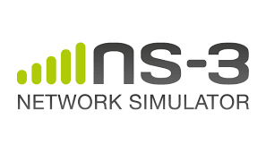
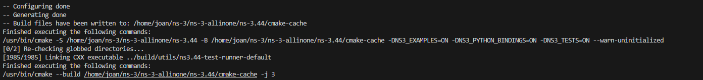
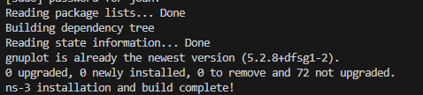
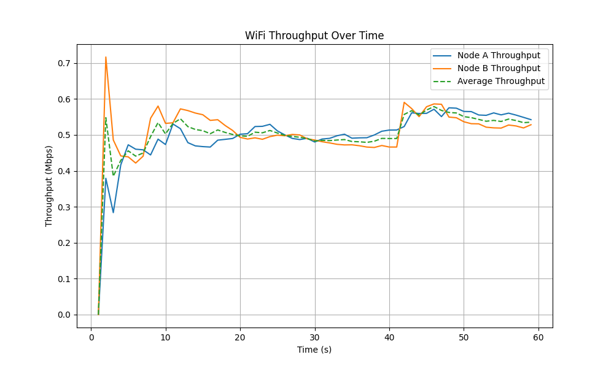
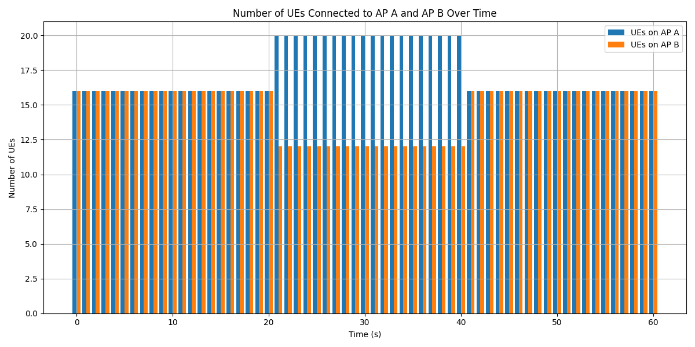

# **Multimedia Wireless Network A2**

- [**Multimedia Wireless Network A2**](#multimedia-wireless-network-a2)
  - [1. Introduction](#1-introduction)
  - [2. NS-3 Installation](#2-ns-3-installation)
    - [2.1 Prerequisites](#21-prerequisites)
    - [2.2 Create the ns-3 directory and download the source code](#22-create-the-ns-3-directory-and-download-the-source-code)
    - [2.3 Compile and build ns-3](#23-compile-and-build-ns-3)
    - [2.4 Test ns-3](#24-test-ns-3)
  - [3. WiFi Simulation](#3-wifi-simulation)
    - [3.1 Deploy 2 nodes and assign users](#31-deploy-2-nodes-and-assign-users)
  - [4. Analysis of the Simulation Results](#4-analysis-of-the-simulation-results)
    - [4.1. Objective](#41-objective)
    - [4.2. Simulation Setup](#42-simulation-setup)
    - [4.3. Results & Figure Analysis](#43-results--figure-analysis)
      - [4.3.1 Initial stability phase (0s~20s)](#431-initial-stability-phase-0s20s)
      - [4.3.2 first mobility event (20s)](#432-first-mobility-event-20s)
      - [4.3.3 Second Mobility Event (40s)](#433-second-mobility-event-40s)
      - [4.3.4 Overall Trend](#434-overall-trend)
      - [4.4. Conclusions](#44-conclusions)


## 1. Introduction

NS-3 is a discrete-event network simulator, primarily used for research and educational purposes. It is an open-source project that provides a flexible and extensible platform for simulating various network protocols and scenarios. NS-3 is widely used in academia and industry for network research, performance evaluation, and protocol development.

## 2. NS-3 Installation
### 2.1 Prerequisites
* The NS-3 is installed in a virtual machine running on VirtualBox with the following specifications:
  
    | Operating System | Processor | Memory | Disk Space
    |----------|----------|----------|----------|
    |   Ubuntu 20.04 LTS   |   4 vCPU   |   8 GB   | 20 GB   |

* Install prerequisites for NS-3 on Ubuntu 20.04 LTS:
```bash
sudo apt-get install -y git vim g++ python3-pip cmake ninja-build
sudo apt-get install -y gir1.2-goocanvas-2.0 python3-gi python3-gi-cairo python3-pygraphviz gir1.2-gtk-3.0 ipython3
python3 -m pip install --user cppyy
```
output:

```bash
Reading package lists... Done
Building dependency tree       
Reading state information... Done
g++ is already the newest version (4:9.3.0-1ubuntu2).
make is already the newest version (4.2.1-1.2).
python3 is already the newest version (3.8.2-0ubuntu2).
cmake is already the newest version (3.16.3-1ubuntu1.20.04.1).
The following packages were automatically installed and are no longer required:
  cabextract fuseiso
Use 'sudo apt autoremove' to remove them.
0 upgraded, 0 newly installed, 0 to remove and 408 not upgraded.Reading package lists... Done
Building dependency tree       
Reading state information... Done
g++ is already the newest version (4:9.3.0-1ubuntu2).
ninja-build is already the newest version (1.10.0-1build1).
cmake is already the newest version (3.16.3-1ubuntu1.20.04.1).
git is already the newest version (1:2.25.1-1ubuntu3.14).
vim is already the newest version (2:8.1.2269-1ubuntu5.32).
python3-pip is already the newest version (20.0.2-5ubuntu1.11).
0 upgraded, 0 newly installed, 0 to remove and 72 not upgraded.
```
```bash
Collecting cppyy
  Downloading cppyy-3.5.0.tar.gz (29 kB)
  Installing build dependencies ... done
  Getting requirements to build wheel ... done
  Installing backend dependencies ... done
    Preparing wheel metadata ... done
Collecting cppyy-cling==6.32.8
  Using cached cppyy_cling-6.32.8-py2.py3-none-manylinux2014_x86_64.whl (47.8 MB)
Collecting CPyCppyy==1.13.0
  Downloading CPyCppyy-1.13.0.tar.gz (216 kB)
     |████████████████████████████████| 216 kB 3.8 MB/s 
  Installing build dependencies ... done
  Getting requirements to build wheel ... done
    Preparing wheel metadata ... done
Processing ./.cache/pip/wheels/8d/a9/4e/ef8ce39007723c7592059a552f1e3af71d6b82979fd2b0192c/cppyy_backend-1.15.3-py2.py3-none-linux_x86_64.whl
Building wheels for collected packages: cppyy, CPyCppyy
  Building wheel for cppyy (PEP 517) ... done
  Created wheel for cppyy: filename=cppyy-3.5.0-py3-none-any.whl size=16652585 sha256=89c1138c9347b4b7c14e23c601de61c4e17229d42d6e7d69521e937b995c7a29
  Stored in directory: /home/joan/.cache/pip/wheels/5b/58/31/7f525c4222c114cee8a55890b4f6ec1edddc3a4eeb3a629810
  Building wheel for CPyCppyy (PEP 517) ... done
  Created wheel for CPyCppyy: filename=cpycppyy-1.13.0-cp38-cp38-linux_x86_64.whl size=5393901 sha256=9516a554697d862760ab8eb488fc082ab9d15010455318a74a04a2d8b32da121
  Stored in directory: /home/joan/.cache/pip/wheels/b4/ed/9c/e2ccd65a81553e5a4c2ff059e4de577acb242dd5be7e8d6d88
Successfully built cppyy CPyCppyy
Installing collected packages: cppyy-cling, cppyy-backend, CPyCppyy, cppyy
  WARNING: The scripts cling-config, cppyy-generator, genreflex and rootcling are installed in '/home/joan/.local/bin' which is not on PATH.
  Consider adding this directory to PATH or, if you prefer to suppress this warning, use --no-warn-script-location.
Successfully installed CPyCppyy-1.13.0 cppyy-3.5.0 cppyy-backend-1.15.3 cppyy-cling-6.32.8
```
All of the prerequisites are already installed

### 2.2 Create the ns-3 directory and download the source code

```bash
mkdir ns-3
cd ns-3
git clone https://gitlab.com/nsnam/ns-3-allinone.git
cd ns-3-allinone
python3 download.py -n ns-3.44
```
output:
```bash
[0/2] Re-checking globbed directories...
[1027/1027] Linking CXX executable ../build/utils/ns3.44-print-introspected-doxygen-default
Finished executing the following commands:
/usr/bin/cmake --build /home/joan/ns-3/ns-3-allinone/ns-3.44/cmake-cache -j 3
Leaving directory `./ns-3.44'     
```
### 2.3 Compile and build ns-3

```bash
./build.py
cd ns-3.44
./ns3 configure --enable-examples --enable-tests --enable-python-bindings
./ns3 build
# Install gnuplot(Optional)
sudo apt-get install -y gnuplot
``` 
output:



### 2.4 Test ns-3
```bash
./ns3 run examples/tutorial/hello-simulator.cc
```
output:

```bash
[0/2] Re-checking globbed directories...
ninja: no work to do.
Hello Simulator
```

## 3. WiFi Simulation
### 3.1 Deploy 2 nodes and assign users
- Deploy 2 nodes as Node A & B;
- Assign 16 users for each node:
- For WiFi is called Station (STA)
```bash
#include "ns3/core-module.h"
#include "ns3/network-module.h"
#include "ns3/internet-module.h"
#include "ns3/wifi-module.h"
#include "ns3/mobility-module.h"
#include "ns3/applications-module.h"

using namespace ns3;

NS_LOG_COMPONENT_DEFINE("WifiTwoApExample");

int main(int argc, char *argv[]) {
    // Logging
    LogComponentEnable("WifiTwoApExample", LOG_LEVEL_INFO);

    // Create AP Nodes
    NodeContainer apNodes;
    apNodes.Create(2); // Node A and Node B

    // Create STA Nodes (16 for each AP)
    NodeContainer staNodesA, staNodesB;
    staNodesA.Create(16);
    staNodesB.Create(16);

    // Setup WiFi
    WifiHelper wifi;
    wifi.SetStandard(WIFI_STANDARD_80211g); //WiFI 3 (2.4 GHz，最大傳輸速率 54 Mbps）

    YansWifiChannelHelper channel = YansWifiChannelHelper::Default();
    Ptr<YansWifiChannel> wifiChannel = channel.Create();
    
    YansWifiPhyHelper phy;
    phy.SetChannel(wifiChannel);
    WifiMacHelper mac;
    Ssid ssidA = Ssid("Node-A-SSID");
    Ssid ssidB = Ssid("Node-B-SSID");

    // Install WiFi Devices for STA A
    mac.SetType("ns3::StaWifiMac",
                "Ssid", SsidValue(ssidA),
                "ActiveProbing", BooleanValue(false));
    NetDeviceContainer staDevicesA = wifi.Install(phy, mac, staNodesA);

    // Install WiFi Devices for STA B
    mac.SetType("ns3::StaWifiMac",
                "Ssid", SsidValue(ssidB),
                "ActiveProbing", BooleanValue(false));
    NetDeviceContainer staDevicesB = wifi.Install(phy, mac, staNodesB);

    // Install WiFi Devices for APs
    mac.SetType("ns3::ApWifiMac", "Ssid", SsidValue(ssidA));
    NetDeviceContainer apDeviceA = wifi.Install(phy, mac, apNodes.Get(0));

    mac.SetType("ns3::ApWifiMac", "Ssid", SsidValue(ssidB));
    NetDeviceContainer apDeviceB = wifi.Install(phy, mac, apNodes.Get(1));

    // Mobility
    MobilityHelper mobility;
    Ptr<ListPositionAllocator> positionAlloc = CreateObject<ListPositionAllocator>();

    // Position APs
    positionAlloc->Add(Vector(0.0, 0.0, 0.0));   // AP A
    positionAlloc->Add(Vector(50.0, 0.0, 0.0));  // AP B

    // Position STAs A
    for (uint32_t i = 0; i < 16; ++i) {
        positionAlloc->Add(Vector(0 + i, 5.0, 0.0));
    }

    // Position STAs B
    for (uint32_t i = 0; i < 16; ++i) {
        positionAlloc->Add(Vector(50 + i, 5.0, 0.0));
    }

    mobility.SetPositionAllocator(positionAlloc);
    mobility.SetMobilityModel("ns3::ConstantPositionMobilityModel");

    // Install on all nodes
    NodeContainer allNodes;
    allNodes.Add(apNodes);
    allNodes.Add(staNodesA);
    allNodes.Add(staNodesB);
    mobility.Install(allNodes);

    // Install Internet Stack
    InternetStackHelper stack;
    stack.Install(allNodes);

    // Assign IP addresses
    Ipv4AddressHelper address;
    address.SetBase("192.168.1.0", "255.255.255.0");
    address.Assign(staDevicesA);
    address.Assign(apDeviceA);

    address.SetBase("192.168.2.0", "255.255.255.0");
    address.Assign(staDevicesB);
    address.Assign(apDeviceB);

    // Output user table (MAC addresses)
    std::cout << "User Table - Node A (STA MACs):" << std::endl;
    for (uint32_t i = 0; i < staDevicesA.GetN(); ++i) {
        Ptr<NetDevice> dev = staDevicesA.Get(i);
        Mac48Address mac = Mac48Address::ConvertFrom(dev->GetAddress());
        std::cout << "STA A-" << i << ": " << mac << std::endl;
    }

    std::cout << "User Table - Node B (STA MACs):" << std::endl;
    for (uint32_t i = 0; i < staDevicesB.GetN(); ++i) {
        Ptr<NetDevice> dev = staDevicesB.Get(i);
        Mac48Address mac = Mac48Address::ConvertFrom(dev->GetAddress());
        std::cout << "STA B-" << i << ": " << mac << std::endl;
    }

    Simulator::Stop(Seconds(10.0));
    Simulator::Run();
    Simulator::Destroy();

    return 0;
}
```
- Provide a user table (e.g., MAC addresses or STA/UE IDs).
```bash
User Table - Node A (STA MACs):
STA A-0: 00:00:00:00:00:01
STA A-1: 00:00:00:00:00:02
STA A-2: 00:00:00:00:00:03
STA A-3: 00:00:00:00:00:04
STA A-4: 00:00:00:00:00:05
STA A-5: 00:00:00:00:00:06
STA A-6: 00:00:00:00:00:07
STA A-7: 00:00:00:00:00:08
STA A-8: 00:00:00:00:00:09
STA A-9: 00:00:00:00:00:0a
STA A-10: 00:00:00:00:00:0b
STA A-11: 00:00:00:00:00:0c
STA A-12: 00:00:00:00:00:0d
STA A-13: 00:00:00:00:00:0e
STA A-14: 00:00:00:00:00:0f
STA A-15: 00:00:00:00:00:10
User Table - Node B (STA MACs):
STA B-0: 00:00:00:00:00:11
STA B-1: 00:00:00:00:00:12
STA B-2: 00:00:00:00:00:13
STA B-3: 00:00:00:00:00:14
STA B-4: 00:00:00:00:00:15
STA B-5: 00:00:00:00:00:16
STA B-6: 00:00:00:00:00:17
STA B-7: 00:00:00:00:00:18
STA B-8: 00:00:00:00:00:19
STA B-9: 00:00:00:00:00:1a
STA B-10: 00:00:00:00:00:1b
STA B-11: 00:00:00:00:00:1c
STA B-12: 00:00:00:00:00:1d
STA B-13: 00:00:00:00:00:1e
STA B-14: 00:00:00:00:00:1f
STA B-15: 00:00:00:00:00:20
```

```#include "ns3/core-module.h"
#include "ns3/network-module.h"
#include "ns3/internet-module.h"
#include "ns3/wifi-module.h"
#include "ns3/mobility-module.h"
#include "ns3/applications-module.h"
#include "ns3/flow-monitor-module.h"
#include <fstream>
#include <map>

using namespace ns3;

NS_LOG_COMPONENT_DEFINE("FullQueueMobility");

// 儲存使用者群組
std::vector<Ptr<Node>> staGroupA;
std::vector<Ptr<Node>> staGroupB;
std::map<uint32_t, std::string> nodeIdToGroup;
std::map<uint32_t, Ptr<Node>> nodeMap;
std::ofstream out("throughput.csv");
std::map<uint32_t, int> StaToApMap;

std::vector<double> throughputA_record, throughputB_record;

// 使用者在 A/B 間交換
void SwapUsers(std::vector<Ptr<Node>> &A, std::vector<Ptr<Node>> &B, double p, double q) {
  uint32_t moveAtoB = std::round(A.size() * p);
  uint32_t moveBtoA = std::round(B.size() * q);
  std::vector<Ptr<Node>> fromA(A.begin(), A.begin() + moveAtoB);
  std::vector<Ptr<Node>> fromB(B.begin(), B.begin() + moveBtoA);
  A.erase(A.begin(), A.begin() + moveAtoB);
  B.erase(B.begin(), B.begin() + moveBtoA);
  A.insert(A.end(), fromB.begin(), fromB.end());
  B.insert(B.end(), fromA.begin(), fromA.end());
}

// 印出目前 A/B 人數
void PrintUserTable() {
  NS_LOG_UNCOND("Time: " << Simulator::Now().GetSeconds() << "s");
  NS_LOG_UNCOND("Node A: " << staGroupA.size() << " users");
  NS_LOG_UNCOND("Node B: " << staGroupB.size() << " users");
}

// 建立使用者對應表
void TagNodes() {
  for (auto node : staGroupA) {
    nodeIdToGroup[node->GetId()] = "A";
    nodeMap[node->GetId()] = node;
  }
  for (auto node : staGroupB) {
    nodeIdToGroup[node->GetId()] = "B";
    nodeMap[node->GetId()] = node;
  }
}

// 每秒記錄 throughput + UE 數量
void CheckThroughput(Ptr<FlowMonitor> monitor, Ptr<Ipv4FlowClassifier> classifier) {
  monitor->CheckForLostPackets();
  FlowMonitor::FlowStatsContainer stats = monitor->GetFlowStats();

  double throughputA = 0, throughputB = 0;
  double now = Simulator::Now().GetSeconds();

  for (auto& flow : stats) {
    Ipv4FlowClassifier::FiveTuple t = classifier->FindFlow(flow.first);
    Ipv4Address dstAddr = t.destinationAddress;
    std::string group = "Unknown";

    for (auto& pair : nodeMap) {
      Ptr<Ipv4> ipv4 = pair.second->GetObject<Ipv4>();
      for (uint32_t i = 0; i < ipv4->GetNInterfaces(); ++i) {
        for (uint32_t j = 0; j < ipv4->GetNAddresses(i); ++j) {
          if (ipv4->GetAddress(i, j).GetLocal() == dstAddr) {
            group = nodeIdToGroup[pair.first];
          }
        }
      }
    }

    uint64_t bits = flow.second.rxBytes * 8;
    double duration = flow.second.timeLastRxPacket.GetSeconds() - flow.second.timeFirstTxPacket.GetSeconds();
    double tp = (duration > 0) ? bits / duration / 1e6 : 0;

    if (group == "A") throughputA += tp;
    else if (group == "B") throughputB += tp;
  }

  throughputA_record.push_back(throughputA);
  throughputB_record.push_back(throughputB);

  out << now << "," << throughputA << "," << throughputB << "," << staGroupA.size() << "," << staGroupB.size() << "\n";

  if (now < 60.0) {
    Simulator::Schedule(Seconds(1.0), &CheckThroughput, monitor, classifier);
  } else {
    double avgA = 0, avgB = 0;
    for (double val : throughputA_record) avgA += val;
    for (double val : throughputB_record) avgB += val;
    avgA /= throughputA_record.size();
    avgB /= throughputB_record.size();

    std::cout << "[Result] Avg Throughput A = " << avgA << " Mbps" << std::endl;
    std::cout << "[Result] Avg Throughput B = " << avgB << " Mbps" << std::endl;
  }
}
void StopAllClients() {
    for (auto node : staGroupA) {
      for (uint32_t i = 0; i < node->GetNApplications(); ++i) {
        node->GetApplication(i)->SetStopTime(Seconds(Simulator::Now().GetSeconds() + 0.001));
      }
    }
    for (auto node : staGroupB) {
      for (uint32_t i = 0; i < node->GetNApplications(); ++i) {
        node->GetApplication(i)->SetStopTime(Seconds(Simulator::Now().GetSeconds() + 0.001));
      }
    }
  }
  
// Uplink to AP  
void ReconnectClients(Ipv4Address apA, Ipv4Address apB) {
  UdpEchoClientHelper clientA(apA, 9);
  clientA.SetAttribute("MaxPackets", UintegerValue(1000000));
  clientA.SetAttribute("Interval", TimeValue(MilliSeconds(10)));
  clientA.SetAttribute("PacketSize", UintegerValue(1024));

  UdpEchoClientHelper clientB(apB, 9);
  clientB.SetAttribute("MaxPackets", UintegerValue(1000000));
  clientB.SetAttribute("Interval", TimeValue(MilliSeconds(10)));
  clientB.SetAttribute("PacketSize", UintegerValue(1024));

  for (auto node : staGroupA) {
    uint32_t staId = node->GetId();
    if (StaToApMap.find(staId) == StaToApMap.end() || StaToApMap[staId] == -1) {
      std::cout << "Initial STA " << staId << " to AP" << (32) << " at " << Simulator::Now().GetSeconds() << "s\n";
    } else if (StaToApMap[staId] != 0) {
      std::cout << "STA " << staId << " handover from AP" << StaToApMap[staId] + 32 << " to AP" << 32 << " at " << Simulator::Now().GetSeconds() << "s\n";
    }
    StaToApMap[staId] = 0;
    ApplicationContainer app = clientA.Install(node);
    app.Start(Simulator::Now());
    
  }

  for (auto node : staGroupB) {
    uint32_t staId = node->GetId();
    if (StaToApMap.find(staId) == StaToApMap.end() || StaToApMap[staId] == -1) {
      std::cout << "Initial STA " << staId << " to AP" << (33) << " at " << Simulator::Now().GetSeconds() << "s\n";
    } else if (StaToApMap[staId] != 1) {
      std::cout << "STA " << staId << " handover from AP" << StaToApMap[staId] + 32 << " to AP" << 33 << " at " << Simulator::Now().GetSeconds() << "s\n";
    }
    StaToApMap[staId] = 1;
    ApplicationContainer app = clientB.Install(node);
    app.Start(Simulator::Now());

  }
}

void PrintUserTableAtStart(NetDeviceContainer staDevs, NetDeviceContainer apDevs) {
    std::cout << "\n=== [Initial STA-to-AP Assignment Table] ===\n";
    std::cout << "STA ID\tSTA MAC\t\t\t→ AP MAC\n";
  
    for (uint32_t i = 0; i < staDevs.GetN(); ++i) {
      Ptr<NetDevice> staDev = staDevs.Get(i);
      Mac48Address staMac = Mac48Address::ConvertFrom(staDev->GetAddress());
  
      std::ostringstream ossSta;
      ossSta << staMac;
      std::string staMacStr = ossSta.str();
  
      Ptr<Node> staNode = staDev->GetNode();
      uint32_t staId = staNode->GetId();
  
      std::string apMacStr = "Unknown";
      if (StaToApMap.find(staId) != StaToApMap.end()) {
        int apIndex = StaToApMap[staId];
        if (apIndex >= 0 && apIndex < (int)apDevs.GetN()) {
          Mac48Address apMac = Mac48Address::ConvertFrom(apDevs.Get(apIndex)->GetAddress());
          std::ostringstream ossAp;
          ossAp << apMac;
          apMacStr = ossAp.str();
        }
      }
  
      std::cout << staId << "\t" << staMacStr << " → " << apMacStr << "\n";
    }
  
    std::cout << "===========================================\n";
  }
    
int main(int argc, char *argv[]) {
  NodeContainer aps;
  aps.Create(2);

  NodeContainer allStas;
  allStas.Create(32);
  for (uint32_t i = 0; i < 16; ++i) staGroupA.push_back(allStas.Get(i));
  for (uint32_t i = 16; i < 32; ++i) staGroupB.push_back(allStas.Get(i));

  YansWifiChannelHelper channel = YansWifiChannelHelper::Default();
  YansWifiPhyHelper phy;
  phy.SetChannel(channel.Create());

  WifiHelper wifi;
  wifi.SetStandard(WIFI_STANDARD_80211g);
  WifiMacHelper mac;
  NetDeviceContainer staDevs;

  for (auto node : staGroupA) {
    mac.SetType("ns3::StaWifiMac", "Ssid", SsidValue(Ssid("A")));
    staDevs.Add(wifi.Install(phy, mac, node));
  }
  for (auto node : staGroupB) {
    mac.SetType("ns3::StaWifiMac", "Ssid", SsidValue(Ssid("B")));
    staDevs.Add(wifi.Install(phy, mac, node));
  }

  mac.SetType("ns3::ApWifiMac", "Ssid", SsidValue(Ssid("A")));
  NetDeviceContainer apDevs;
  apDevs.Add(wifi.Install(phy, mac, aps.Get(0)));

  mac.SetType("ns3::ApWifiMac", "Ssid", SsidValue(Ssid("B")));
  apDevs.Add(wifi.Install(phy, mac, aps.Get(1)));

  MobilityHelper mobility;
  //Set Position for Ap
  mobility.SetMobilityModel("ns3::ConstantPositionMobilityModel"); 
  mobility.Install(aps);
  // Set random position for Sta
  mobility.SetMobilityModel("ns3::RandomWalk2dMobilityModel"); 
  mobility.Install(allStas);

  InternetStackHelper stack;
  stack.Install(aps);
  stack.Install(allStas);

  Ipv4AddressHelper addr;
  addr.SetBase("10.1.1.0", "255.255.255.0");
  addr.Assign(apDevs);
  addr.Assign(staDevs);

  // FULL-QUEUE 模型：每個 STA 都會持續送封包
  UdpEchoServerHelper server(9); //9 是這個 Echo Server 要監聽的 UDP 埠號
  ApplicationContainer serverA = server.Install(aps.Get(0));
  ApplicationContainer serverB = server.Install(aps.Get(1));  // Node B 的 AP

  serverA.Start(Seconds(0.0));
  serverB.Start(Seconds(0.0));

  Ipv4Address apA = Ipv4Address("10.1.1.1");
  Ipv4Address apB = Ipv4Address("10.1.1.2");

  UdpEchoClientHelper clientA(apA, 9); // STA A
  clientA.SetAttribute("MaxPackets", UintegerValue(1000000)); //Max throughput: 100(一秒有幾個)x 1024bytes x 8 x 16個
  clientA.SetAttribute("Interval", TimeValue(MilliSeconds(10)));
  clientA.SetAttribute("PacketSize", UintegerValue(1024));

  UdpEchoClientHelper clientB(apB, 9); // STA B
  clientB.SetAttribute("MaxPackets", UintegerValue(1000000));
  clientB.SetAttribute("Interval", TimeValue(MilliSeconds(10)));
  clientB.SetAttribute("PacketSize", UintegerValue(1024));

  for (auto node : staGroupA) {
    ApplicationContainer app = clientA.Install(node);
    app.Start(Seconds(1.0));
    StaToApMap[node->GetId()] = 0;  // 初始化 STA 對應 AP
  }
  
  for (auto node : staGroupB) {
    ApplicationContainer app = clientB.Install(node);
    app.Start(Seconds(1.0));
    StaToApMap[node->GetId()] = 1;
  }
  
  
  // 初始化節點分組資訊
  TagNodes();

  // 建立 FlowMonitor 與分類器
  FlowMonitorHelper flowmon;
  Ptr<FlowMonitor> monitor = flowmon.InstallAll();
  Ptr<Ipv4FlowClassifier> classifier = DynamicCast<Ipv4FlowClassifier>(flowmon.GetClassifier());

  out << "Time,NodeA_Throughput_Mbps,NodeB_Throughput_Mbps,NumUE_A,NumUE_B\n";
  PrintUserTableAtStart(staDevs, apDevs);

  Simulator::Schedule(Seconds(1.0), &CheckThroughput, monitor, classifier);

  // 使用者移動事件
//   Simulator::Schedule(Seconds(20.0), &SwapUsers, std::ref(staGroupA), std::ref(staGroupB), 0.25, 0.5);
//   Simulator::Schedule(Seconds(20.1), &PrintUserTable);
//   Simulator::Schedule(Seconds(40.0), &SwapUsers, std::ref(staGroupA), std::ref(staGroupB), 0.25, 0.5);
//   Simulator::Schedule(Seconds(40.1), &PrintUserTable);
  Simulator::Schedule(Seconds(20.0), &SwapUsers, std::ref(staGroupA), std::ref(staGroupB), 0.25, 0.5);
  Simulator::Schedule(Seconds(20.1), &StopAllClients);
  Simulator::Schedule(Seconds(20.2), &ReconnectClients, apA, apB);
  Simulator::Schedule(Seconds(20.3), &PrintUserTable);
  Simulator::Schedule(Seconds(40.0), &SwapUsers, std::ref(staGroupA), std::ref(staGroupB), 0.5, 0.5);
  Simulator::Schedule(Seconds(40.1), &StopAllClients);
  Simulator::Schedule(Seconds(40.2), &ReconnectClients, apA, apB);
  Simulator::Schedule(Seconds(40.3), &PrintUserTable);

  Simulator::Stop(Seconds(60.0));
  Simulator::Run();
  Simulator::Destroy();
  out.close();
  return 0;
}
```
## 4. Analysis of the Simulation Results


### 4.1. Objective

This report presents a detailed analysis of the simulated throughput behavior of two WiFi access nodes (Node A and Node B) under a full-queue uplink traffic model, incorporating dynamic user mobility. The goal is to examine how mobility events and traffic congestion affect network throughput over time.

---

### 4.2. Simulation Setup

| Parameter             | Value                                 |
|----------------------|---------------------------------------|
| Total Simulation Time| 60 seconds                            |
| Access Points (APs)  | 2 (AP32 for Node A, AP33 for Node B) |
| Stations (STAs)      | 32 (16 per node initially)            |
| Traffic Model        | Full-queue UDP Echo (uplink)          |
| Packet Size          | 1024 bytes                            |
| Interval             | 10 ms                                 |
| STA Mobility         | RandomWalk2D                          |
| AP Mobility          | Static                                |
| Events               | User swapping at 20s and 40s          |

Two groups of 16 STAs were initially associated with their respective APs. Periodic user handovers were scheduled to analyze throughput adaptation and handover efficiency.

---

### 4.3. Results & Figure Analysis


#### Figure: Aggregated Throughput Over Time

- **X-axis:** Time (seconds)  
- **Y-axis:** Throughput (Mbps)  
- **Legend:**
  - Blue: Node A Throughput  
  - Orange: Node B Throughput  
  - Green Dashed: Average Throughput




#### Figure: Number of UEs Connected to AP A and AP B Over Time
**Graph Description:**
- **X-axis:** Time (seconds), ranging from 0 to 60s.

- **Y-axis:** Number of User Equipments (UEs) connected to each Access Point (AP), ranging from 0 to 20.

- **Legend:**
  - Blue bars: Number of UEs connected to AP A
  - Orange bars: Number of UEs connected to AP B


---

#### 4.3.1 Initial Stability Phase (0s–20s)

During the first 20 seconds, both Node A and Node B handled 16 STAs each.  
The throughput for both nodes stabilized between **0.45 and 0.55 Mbps**, showing balanced load distribution and consistent packet transmission.

---

#### 4.3.2 First Mobility Event (20s)

At 20 seconds:
- 25% of Group A users (4 STAs) moved to Group B
- 50% of Group B users (8 STAs) moved to Group A

**Impact:**
- `StopAllClients()` temporarily halted traffic
- `ReconnectClients()` rebuilt the uplink streams
- Node B experienced a sharp throughput drop
- Node A’s throughput increased due to user influx
- Throughput stabilized with asymmetric distribution

---

#### 4.3.3 Second Mobility Event (40s)

At 40 seconds:
- 50% of users in both groups were swapped

**Impact:**
- Similar disconnection/reconnection behavior
- Both APs showed brief drops
- Eventually re-balanced and converged to ~0.52 Mbps

---

#### 4.3.4 Overall Trend

Despite the mobility-induced interruptions, both nodes maintained a stable **average throughput above 0.5 Mbps**.  
The **green dashed line** shows system-level stability and quick recovery.

---

### 4.4. Conclusions

- **Mobility-Aware Design:**  
  Effective reconnection mechanisms ensured minimal performance impact during user handovers.

- **Load Balancing:**  
  Uneven STA distribution directly affected throughput; strategic user reassignment can optimize AP load.

- **System Responsiveness:**  
  Fast throughput recovery post-mobility confirms robustness of the application and transport layer design.

## 5. Demo Video
https://youtu.be/D3DplDCm9ME
