# A2-ns-3 Network Simulator

<aside>
📖 **References**

- [ns-3](https://www.nsnam.org/)
- [ns-3 Tutorial](https://www.nsnam.org/docs/tutorial/html/)
- [The ns-3 Network Simulator](https://intronetworks.cs.luc.edu/current/html/ns3.html)
- [ns-3 LTE Module](https://www.nsnam.org/docs/models/html/lte-user.html)
- [ns-3 WiFi Module](https://www.nsnam.org/docs/models/html/wifi-design.html)
- [3GPP NR ns-3 Module](https://github.com/QiuYukang/5G-LENA)
</aside>

<aside>
✅ Score (15%): 

- [x]  **NS-3 Installation (30%)**: Provide an installation guide that includes:
    1. **Commands**: List terminal commands used for installation.
    2. **Verification**: Copy & paste terminal logs confirming successful installation.
    3. **Final Check**: Run [`hello-simulator.cc`](https://www.nsnam.org/docs/release/3.19/doxygen/hello-simulator_8cc_source.html) to verify installation.
- [x]  **LTE / WiFi Simulation (50%)**:
    - [x]  **Submission Requirements**: Upload your simulation source code under `./a2/src/` in your branch. For each milestone, provide:
        1. **Input**: Commands or source code (attach hyperlinks from `./a2/src/`).
        2. **Output**: Figures, results, and explanations.
    - [ ]  **Extra Credit (20%)**:
        - **Peer Review Bonus:** Top 3 students based on peer reviews receive extra credit: **Top 1:** +20%, **Top 2:** +15%, **Top 3:** +10%.
        - **Extended Deployment Bonus:** If you deploy **9 nodes in WiFi/LTE** and commit before **March 29, 2025, 19:00 PM**, you get an **extra 10%**.

**3. Milestones & Grading**

- [x]  **Deploy 2 nodes and assign users** (`1-points`):
    1. **Deploy 2 nodes and assign users** (`1-points`):
        1. Deploy 2 nodes as Node A & B;
        2. Assign 16 users for each node:
            - For LTE is called User Equipment (UE)
            - For WiFi is called Station (STA)
        3. Provide a user table (e.g., MAC addresses or STA/UE IDs).
        
        This setup can be formulated as follow:
        
        - **Formula:**
            
            X0=Y0=16
            
        - **Definitions:**
            - (X0) = Initial Users in Node A
            - (Y0) = Initial Users in Node B
- [x]  **Full-Queue Model Transmission & Random mobility Model**
    1. **Full-Queue Model Transmission & Random mobility Model**
        
        Implement a [full-queue model](https://www.nsnam.org/doxygen/d9/db7/fcfs-wifi-queue-scheduler_8cc_source.html). Ensure each STA/UE continuously transmits to AP/BS. (`1-point`)
        
        - **Simulation Duration:** 10 minutes.
        - **User Movement:**
            - **At minute 3:** 25% of users move from Node A → Node B, and 50% from Node B → Node A.
            - **At minute 6:** 50% of users move from Node A → Node B, and 50% from Node B → Node A.
            - For each movement, describe which users that moved from A --> B and B --> A in your .
        - **Formulas:**
            - **Minute 3:** ,
                
                X1=X0×p
                
                Y1=Y0×q
                
            - **Minute 6:**,
                
                X2=X1×p
                
                Y2=Y1×q
                
        - **Definitions:**
            - (p = 25%) → Users moving from Node A to Node B.
            - (q = 50% ) → Users moving from Node B to Node A.
            - (X1,X2) → Users in Node A after each movement.
            - (Y1,Y2) → Users in Node B after each movement.
- [x]  **Analysis Report**:
    1. What is the final users distribution (value of  & )? Show the users table for each movement. (`2-points`)
    2. Show & analyze the figures of the aggregated throughput in Node-A & Node-B through time (`3-points`):
        - X-axis = time & Y-axis = throughput.
        - Analyze & explain your results.
- [x] Show the 10-minutes video simulation (`3-points`)

</aside>

### Prerequisites

ns-3 has various optional extensions, but the main features just require a **C++ compiler (g++ or clang++), Python (version 3.6 or above), CMake and a build-system (e.g. make, ninja, Xcode)**.

For Linux, use either g++ or clang++ compilers.

we recommend to either use a **Linux virtual machine**, or the Windows Subsystem for Linux.

- As of the most recent *ns-3* release (ns-3.39), the following tools are needed to get started with *ns-3*:
    
    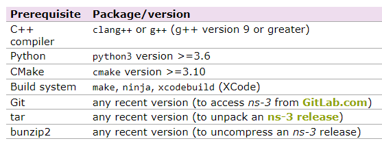

### Setup ns-3 environment


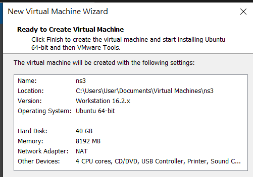

⚓ **Installation environment:**

- OS: Ubuntu 22.04.6 LTS
- Stroge: 200GB
- Memory: 10GB
- gcc: 11.4.0
- Python 3.8.10

## **NS-3 Installation Guide**

### **Install Required Dependencies**

Before installing ns-3, update your system and install the necessary dependencies:

```bash
sudo apt update && sudo apt upgrade -y
sudo apt install -y build-essential cmake g++ python3 python3-pip git \
  pkg-config qt5-qmake qtbase5-dev \
  autoconf automake libtool libxml2 libxml2-dev libgtk-3-dev \
  libsqlite3-dev libgsl-dev libboost-all-dev \
  libpcap-dev tcpdump
```

### **Download ns-3**

ns-3 is distributed in source code only. There are two main ways to obtain the source code:

1. downloading the latest release as a source code archive from the main ns-3 web site
2. cloning the Git repository from [GitLab.com](http://gitlab.com/).

Either one or the other download option (but not both) should be followed.

**Option 1: Download the Latest Release (ns-3.44)**

```bash
wget https://www.nsnam.org/releases/ns-allinone-3.44.tar.bz2
tar xjf ns-allinone-3.44.tar.bz2
cd ns-allinone-3.44/ns-3.44
```

**Option 2: Clone the Latest Development Version**

```bash
git clone https://gitlab.com/nsnam/ns-3-dev.git
cd ns-3-dev
git checkout -b ns-3.39-branch ns-3.39
```

### **Build ns-3**

**3.1 Configure and Build**

```bash
./ns3 configure --enable-examples --enable-tests
./ns3 build
```

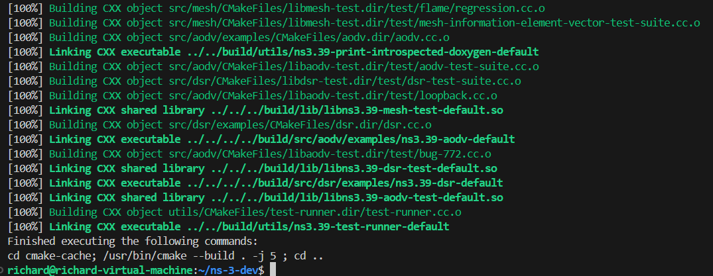

**3.2 Verify Installation**

Run the test suite to ensure the installation is working correctly:

```bash
./test.py
```


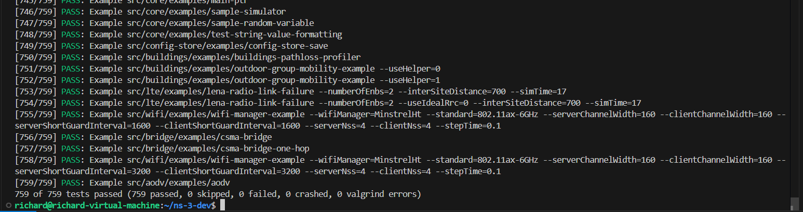


All tests should either **PASS** or be **SKIPped**.

### **Run Example Simulations**

Run `hello-simulator.cc`

```bash
./ns3 run examples/tutorial/hello-simulator
```


---

<aside>
## NS-3 environment

### **1️⃣ Environment Setup**

- Ensure ns-3 is installed and working (Ubuntu 22.04).
- Use the `wifi` or `lte` module depending on your choice.

### **2️⃣ Network Setup**

- Create two nodes: `AP/BS` and `AP/BS2`.
- Assign 16 **UEs/STAs** to each node.
- Assign MAC addresses or IDs.

### **3️⃣ Traffic Generation (Full-Queue Model)**

- Implement a **full-queue model** so each STA/UE continuously transmits data.
- Use **OnOffApplication** or **BulkSendApplication** for traffic.

### **4️⃣ DCF & Throughput Analysis**

- Use **WiFi MAC mode DCF**.
- Capture throughput metrics using **FlowMonitor**.

### **5️⃣ Mobility Model**

- At **minute 3**,
    - **25% of Node A’s users (4 users) move to Node B**
    - **50% of Node B’s users (8 users) move to Node A**
- At **minute 6**, repeat the same movements.

</aside>

### **Create LTE Simulation Script**

We will create a new simulation script for LTE inside the `scratch/` directory.

### **Create `lte-simulation.cc`**

```bash
nano scratch/lte-simulation.cc
```

This script sets up two LTE eNBs (Base Stations), assigns 16 UEs per eNB, implements **a full-queue model**, and applies **user mobility at minutes 3 and 6**.

```cpp
#include "ns3/core-module.h"
#include "ns3/network-module.h"
#include "ns3/mobility-module.h"
#include "ns3/wifi-module.h"
#include "ns3/internet-module.h"
#include "ns3/applications-module.h"
#include "ns3/packet-sink.h"
#include "ns3/flow-monitor-module.h"
#include <vector>
#include <string>
#include <algorithm>
#include <random>

using namespace ns3;

NS_LOG_COMPONENT_DEFINE("WifiSimulation");

// Struct to keep track of node associations
struct NodeAssociation {
    Ptr<Node> node;
    int originalAP;  // 0 for AP-A, 1 for AP-B
    int currentAP;   // 0 for AP-A, 1 for AP-B
    uint32_t id;     // Node ID for tracking
};

// Function to move users between APs
void MoveUsers(Ptr<Node> apA, Ptr<Node> apB, 
               std::vector<NodeAssociation>& staNodesA, 
               std::vector<NodeAssociation>& staNodesB,
               double fractionAtoB, double fractionBtoA) {
    
    NS_LOG_INFO("Starting node movement at time " << Simulator::Now().GetSeconds() << "s");
    
    // Get positions of AP nodes
    Ptr<MobilityModel> mobA = apA->GetObject<MobilityModel>();
    Ptr<MobilityModel> mobB = apB->GetObject<MobilityModel>();
    
    Vector posA = mobA->GetPosition();
    Vector posB = mobB->GetPosition();
    
    NS_LOG_INFO("AP-A position: (" << posA.x << ", " << posA.y << ", " << posA.z << ")");
    NS_LOG_INFO("AP-B position: (" << posB.x << ", " << posB.y << ", " << posB.z << ")");
    
    // Calculate how many nodes to move
    uint32_t numAtoB = static_cast<uint32_t>(staNodesA.size() * fractionAtoB);
    uint32_t numBtoA = static_cast<uint32_t>(staNodesB.size() * fractionBtoA);
    
    NS_LOG_INFO("Moving " << numAtoB << " nodes from AP-A to AP-B");
    NS_LOG_INFO("Moving " << numBtoA << " nodes from AP-B to AP-A");
    
    // Randomly select nodes from A to move to B
    std::vector<uint32_t> indicesA(staNodesA.size());
    for (uint32_t i = 0; i < staNodesA.size(); ++i) {
        indicesA[i] = i;
    }
    
    std::random_device rd;
    std::mt19937 g(rd());
    std::shuffle(indicesA.begin(), indicesA.end(), g);
    
    // Move nodes from A to B
    for (uint32_t i = 0; i < numAtoB && i < indicesA.size(); ++i) {
        Ptr<MobilityModel> mobility = staNodesA[indicesA[i]].node->GetObject<MobilityModel>();
        
        // Set position near AP-B (with some random variation)
        double randX = posB.x + (2.0 * (double)rand() / RAND_MAX - 1.0) * 5.0;
        double randY = posB.y + (2.0 * (double)rand() / RAND_MAX - 1.0) * 5.0;
        
        mobility->SetPosition(Vector(randX, randY, 0.0));
        staNodesA[indicesA[i]].currentAP = 1;  // Now associated with AP-B
        
        NS_LOG_INFO("Node " << staNodesA[indicesA[i]].id << " moved from AP-A to AP-B");
    }
    
    // Randomly select nodes from B to move to A
    std::vector<uint32_t> indicesB(staNodesB.size());
    for (uint32_t i = 0; i < staNodesB.size(); ++i) {
        indicesB[i] = i;
    }
    
    std::shuffle(indicesB.begin(), indicesB.end(), g);
    
    // Move nodes from B to A
    for (uint32_t i = 0; i < numBtoA && i < indicesB.size(); ++i) {
        Ptr<MobilityModel> mobility = staNodesB[indicesB[i]].node->GetObject<MobilityModel>();
        
        // Set position near AP-A (with some random variation)
        double randX = posA.x + (2.0 * (double)rand() / RAND_MAX - 1.0) * 5.0;
        double randY = posA.y + (2.0 * (double)rand() / RAND_MAX - 1.0) * 5.0;
        
        mobility->SetPosition(Vector(randX, randY, 0.0));
        staNodesB[indicesB[i]].currentAP = 0;  // Now associated with AP-A
        
        NS_LOG_INFO("Node " << staNodesB[indicesB[i]].id << " moved from AP-B to AP-A");
    }
    
    NS_LOG_INFO("Node movement completed at time " << Simulator::Now().GetSeconds() << "s");
}

// Helper function to convert vector to string
std::string VectorToString(const std::vector<uint32_t>& vec) {
    std::string result = "[";
    for (size_t i = 0; i < vec.size(); ++i) {
        result += std::to_string(vec[i]);
        if (i < vec.size() - 1) {
            result += ", ";
        }
    }
    result += "]";
    return result;
}

// Function to print the current status of nodes
void PrintNodeStatus(std::vector<NodeAssociation>& staNodesA, 
                    std::vector<NodeAssociation>& staNodesB) {
    
    uint32_t countA_atA = 0;
    uint32_t countA_atB = 0;
    uint32_t countB_atA = 0;
    uint32_t countB_atB = 0;
    
    std::vector<uint32_t> nodesA_atA;
    std::vector<uint32_t> nodesA_atB;
    std::vector<uint32_t> nodesB_atA;
    std::vector<uint32_t> nodesB_atB;
    
    // Count nodes from group A
    for (const auto& node : staNodesA) {
        if (node.currentAP == 0) {
            countA_atA++;
            nodesA_atA.push_back(node.id);
        } else {
            countA_atB++;
            nodesA_atB.push_back(node.id);
        }
    }
    
    // Count nodes from group B
    for (const auto& node : staNodesB) {
        if (node.currentAP == 0) {
            countB_atA++;
            nodesB_atA.push_back(node.id);
        } else {
            countB_atB++;
            nodesB_atB.push_back(node.id);
        }
    }
    
    NS_LOG_INFO("==== Node Status at " << Simulator::Now().GetSeconds() << "s ====");
    NS_LOG_INFO("Group A nodes at AP-A: " << countA_atA << " nodes: " << VectorToString(nodesA_atA));
    NS_LOG_INFO("Group A nodes at AP-B: " << countA_atB << " nodes: " << VectorToString(nodesA_atB));
    NS_LOG_INFO("Group B nodes at AP-A: " << countB_atA << " nodes: " << VectorToString(nodesB_atA));
    NS_LOG_INFO("Group B nodes at AP-B: " << countB_atB << " nodes: " << VectorToString(nodesB_atB));
    NS_LOG_INFO("==========================================");
}

// Function to print flow statistics
void PrintFlowStatistics(Ptr<FlowMonitor> flowMonitor, FlowMonitorHelper& flowHelper) {
    NS_LOG_INFO("=== Flow Statistics at " << Simulator::Now().GetSeconds() << "s ===");
    
    flowMonitor->CheckForLostPackets();
    Ptr<Ipv4FlowClassifier> classifier = DynamicCast<Ipv4FlowClassifier>(flowHelper.GetClassifier());
    std::map<FlowId, FlowMonitor::FlowStats> stats = flowMonitor->GetFlowStats();
    
    uint32_t totalTxPackets = 0;
    uint32_t totalRxPackets = 0;
    uint32_t totalLostPackets = 0;
    double totalThroughput = 0.0;
    
    for (std::map<FlowId, FlowMonitor::FlowStats>::const_iterator i = stats.begin(); i != stats.end(); ++i) {
        Ipv4FlowClassifier::FiveTuple t = classifier->FindFlow(i->first);
        
        NS_LOG_INFO("Flow " << i->first << " (" << t.sourceAddress << " -> " << t.destinationAddress << ")");
        NS_LOG_INFO("  Tx Packets: " << i->second.txPackets);
        NS_LOG_INFO("  Rx Packets: " << i->second.rxPackets);
        NS_LOG_INFO("  Lost Packets: " << i->second.lostPackets);
        
        if (i->second.rxPackets > 0) {
            double throughput = i->second.rxBytes * 8.0 / (i->second.timeLastRxPacket.GetSeconds() - i->second.timeFirstTxPacket.GetSeconds()) / 1000000.0;
            NS_LOG_INFO("  Throughput: " << throughput << " Mbps");
            totalThroughput += throughput;
        }
        
        totalTxPackets += i->second.txPackets;
        totalRxPackets += i->second.rxPackets;
        totalLostPackets += i->second.lostPackets;
    }
    
    NS_LOG_INFO("=== Summary Statistics ===");
    NS_LOG_INFO("Total Tx Packets: " << totalTxPackets);
    NS_LOG_INFO("Total Rx Packets: " << totalRxPackets);
    NS_LOG_INFO("Total Lost Packets: " << totalLostPackets);
    NS_LOG_INFO("Network Throughput: " << totalThroughput << " Mbps");
    NS_LOG_INFO("===============================");
}

int main(int argc, char *argv[]) {
    // Enable logging
    LogComponentEnable("WifiSimulation", LOG_LEVEL_INFO);
    // LogComponentEnable("PacketSink", LOG_LEVEL_INFO);

    CommandLine cmd;
    cmd.Parse(argc, argv);
    
    // Create nodes
    NodeContainer apNodes;
    apNodes.Create(2);
    
    NodeContainer staNodesA, staNodesB;
    staNodesA.Create(16);
    staNodesB.Create(16);
    
    // Set up WiFi
    WifiHelper wifi;
    wifi.SetStandard(WIFI_STANDARD_80211ax);
    
    // Set up channel and PHY
    YansWifiChannelHelper channel = YansWifiChannelHelper::Default();
    YansWifiPhyHelper phy;
    phy.SetChannel(channel.Create());
    
    // Set up MAC
    WifiMacHelper mac;
    Ssid ssidA = Ssid("wifi-network-a");
    Ssid ssidB = Ssid("wifi-network-b");
    
    // Create AP devices
    mac.SetType("ns3::ApWifiMac", "Ssid", SsidValue(ssidA));
    NetDeviceContainer apDeviceA = wifi.Install(phy, mac, apNodes.Get(0));
    
    mac.SetType("ns3::ApWifiMac", "Ssid", SsidValue(ssidB));
    NetDeviceContainer apDeviceB = wifi.Install(phy, mac, apNodes.Get(1));
    
    // Create STA devices for group A - initially connect to AP-A
    mac.SetType("ns3::StaWifiMac", "Ssid", SsidValue(ssidA));
    NetDeviceContainer staDevicesA = wifi.Install(phy, mac, staNodesA);
    
    // Create STA devices for group B - initially connect to AP-B
    mac.SetType("ns3::StaWifiMac", "Ssid", SsidValue(ssidB));
    NetDeviceContainer staDevicesB = wifi.Install(phy, mac, staNodesB);
    
    // Set up mobility models
    MobilityHelper mobility;
    
    // Position AP-A at (0,0,0)
    Ptr<ListPositionAllocator> positionAlloc = CreateObject<ListPositionAllocator>();
    positionAlloc->Add(Vector(0.0, 0.0, 0.0));  // AP-A
    positionAlloc->Add(Vector(50.0, 0.0, 0.0)); // AP-B with 50m separation
    
    mobility.SetPositionAllocator(positionAlloc);
    mobility.SetMobilityModel("ns3::ConstantPositionMobilityModel");
    mobility.Install(apNodes);
    
    // Random positions for STA nodes around their respective APs
    mobility.SetPositionAllocator("ns3::RandomDiscPositionAllocator",
                                 "X", StringValue("0.0"),
                                 "Y", StringValue("0.0"),
                                 "Rho", StringValue("ns3::UniformRandomVariable[Min=0|Max=10]"));
    mobility.SetMobilityModel("ns3::RandomWalk2dMobilityModel",
                             "Bounds", RectangleValue(Rectangle(-25, 25, -25, 25)),
                             "Speed", StringValue("ns3::ConstantRandomVariable[Constant=1.0]"));
    mobility.Install(staNodesA);
    
    mobility.SetPositionAllocator("ns3::RandomDiscPositionAllocator",
                                 "X", StringValue("50.0"),
                                 "Y", StringValue("0.0"),
                                 "Rho", StringValue("ns3::UniformRandomVariable[Min=0|Max=10]"));
    mobility.SetMobilityModel("ns3::RandomWalk2dMobilityModel",
                             "Bounds", RectangleValue(Rectangle(25, 75, -25, 25)),
                             "Speed", StringValue("ns3::ConstantRandomVariable[Constant=1.0]"));
    mobility.Install(staNodesB);
    
    // Set up internet stack
    InternetStackHelper stack;
    stack.Install(apNodes);
    stack.Install(staNodesA);
    stack.Install(staNodesB);
    
    // Set up IP addresses
    Ipv4AddressHelper address;
    
    // Network for AP-A and its stations
    address.SetBase("192.168.1.0", "255.255.255.0");
    Ipv4InterfaceContainer apInterfaceA = address.Assign(apDeviceA);
    Ipv4InterfaceContainer staInterfacesA = address.Assign(staDevicesA);
    
    // Network for AP-B and its stations
    address.SetBase("192.168.2.0", "255.255.255.0");
    Ipv4InterfaceContainer apInterfaceB = address.Assign(apDeviceB);
    Ipv4InterfaceContainer staInterfacesB = address.Assign(staDevicesB);
    
    // Set up applications - Full-Queue Model
    // Server apps on APs
    uint16_t port = 9;
    
    // TCP sink on AP-A
    PacketSinkHelper sinkA("ns3::TcpSocketFactory", InetSocketAddress(Ipv4Address::GetAny(), port));
    ApplicationContainer sinkAppsA = sinkA.Install(apNodes.Get(0));
    sinkAppsA.Start(Seconds(0.0));
    sinkAppsA.Stop(Seconds(600.0));
    
    // TCP sink on AP-B
    PacketSinkHelper sinkB("ns3::TcpSocketFactory", InetSocketAddress(Ipv4Address::GetAny(), port));
    ApplicationContainer sinkAppsB = sinkB.Install(apNodes.Get(1));
    sinkAppsB.Start(Seconds(0.0));
    sinkAppsB.Stop(Seconds(600.0));
    
    // Client applications - continuous transmission (full-queue model)
    // For group A stations
    ApplicationContainer clientAppsA;
    for (uint32_t i = 0; i < staNodesA.GetN(); ++i) {
        OnOffHelper clientA("ns3::TcpSocketFactory", InetSocketAddress(apInterfaceA.GetAddress(0), port));
        clientA.SetAttribute("OnTime", StringValue("ns3::ConstantRandomVariable[Constant=1]"));
        clientA.SetAttribute("OffTime", StringValue("ns3::ConstantRandomVariable[Constant=0]"));
        clientA.SetAttribute("DataRate", DataRateValue(DataRate("10Mb/s")));
        clientA.SetAttribute("PacketSize", UintegerValue(1460)); // TCP MSS size

        clientAppsA.Add(clientA.Install(staNodesA.Get(i)));
    }
    
    // For group B stations
    ApplicationContainer clientAppsB;
    for (uint32_t i = 0; i < staNodesB.GetN(); ++i) {
        OnOffHelper clientB("ns3::TcpSocketFactory", InetSocketAddress(apInterfaceB.GetAddress(0), port));
        clientB.SetAttribute("OnTime", StringValue("ns3::ConstantRandomVariable[Constant=1]"));
        clientB.SetAttribute("OffTime", StringValue("ns3::ConstantRandomVariable[Constant=0]"));
        clientB.SetAttribute("DataRate", DataRateValue(DataRate("10Mb/s")));
        clientB.SetAttribute("PacketSize", UintegerValue(1460)); // TCP MSS size

        clientAppsB.Add(clientB.Install(staNodesB.Get(i)));
    }
    
    clientAppsA.Start(Seconds(1.0));
    clientAppsA.Stop(Seconds(600.0));
    clientAppsB.Start(Seconds(1.0));
    clientAppsB.Stop(Seconds(600.0));
    
    // Create node association tracking
    std::vector<NodeAssociation> nodeAssocA;
    for (uint32_t i = 0; i < staNodesA.GetN(); ++i) {
        NodeAssociation assoc;
        assoc.node = staNodesA.Get(i);
        assoc.originalAP = 0;
        assoc.currentAP = 0;
        assoc.id = i;
        nodeAssocA.push_back(assoc);
    }
    
    std::vector<NodeAssociation> nodeAssocB;
    for (uint32_t i = 0; i < staNodesB.GetN(); ++i) {
        NodeAssociation assoc;
        assoc.node = staNodesB.Get(i);
        assoc.originalAP = 1;
        assoc.currentAP = 1;
        assoc.id = i + staNodesA.GetN(); // Offset to avoid duplicate IDs
        nodeAssocB.push_back(assoc);
    }
    
    // Print initial node status
    Simulator::Schedule(Seconds(0), &PrintNodeStatus, nodeAssocA, nodeAssocB);
    
    // At minute 3: Move 4 users from A to B and 8 users from B to A (0.25 of A, 0.5 of B)
    Simulator::Schedule(Seconds(180), &MoveUsers, apNodes.Get(0), apNodes.Get(1), 
                        nodeAssocA, nodeAssocB, 0.25, 0.5);
    Simulator::Schedule(Seconds(181), &PrintNodeStatus, nodeAssocA, nodeAssocB);
    
    // At minute 6: Move 8 users from A to B and 8 users from B to A (0.5 of A, 0.5 of B)
    Simulator::Schedule(Seconds(360), &MoveUsers, apNodes.Get(0), apNodes.Get(1), 
                        nodeAssocA, nodeAssocB, 0.5, 0.5);
    Simulator::Schedule(Seconds(361), &PrintNodeStatus, nodeAssocA, nodeAssocB);
    
    // Set up flow monitor
    FlowMonitorHelper flowHelper;
    Ptr<FlowMonitor> flowMonitor = flowHelper.InstallAll();

    // Run simulation
    NS_LOG_INFO("Starting simulation...");
    Simulator::Stop(Seconds(600.0));
    Simulator::Run();
    Simulator::Destroy();
    
    NS_LOG_INFO("Simulation completed successfully!");
    
    return 0;
}

```

Due to an unknown issue, the program has become unresponsive and cannot display the full results. This may be related to hardware resource limitations. Therefore, I will introduce a lightweight version of the ns-3 LTE simulation in the following content.

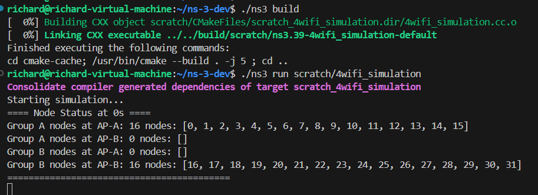

---
### **Create `LTE-simple.cc`**

```
nano scratch/lte-simple.cc
```

This script sets up two eNodeBs with 32 UEs. Mobility triggers handovers at 3 and 6 minutes.

```cpp
// LTE Handover Simulation for ns-3.39
// This script sets up two eNodeBs with 32 UEs. Mobility triggers handovers at 3 and 6 minutes.

#include "ns3/core-module.h"
#include "ns3/network-module.h"
#include "ns3/mobility-module.h"
#include "ns3/lte-module.h"
#include "ns3/internet-module.h"

using namespace ns3;

NS_LOG_COMPONENT_DEFINE("LteHandoverSim");

// Function: Print all UEs' connection status
void PrintUeConnectionStatus(Ptr<LteHelper> lteHelper, NetDeviceContainer ueLteDevs, uint32_t numUes) {
    NS_LOG_INFO("=== UE Connection Status ===");
    for (uint32_t i = 0; i < numUes; ++i) {
        Ptr<LteUeNetDevice> ueDev = DynamicCast<LteUeNetDevice>(ueLteDevs.Get(i));
        uint16_t cellId = ueDev->GetRrc()->GetCellId();
        uint64_t imsi = ueDev->GetImsi();
        NS_LOG_INFO("UE " << i << ": IMSI " << imsi << ", Connected to Cell ID " << cellId);
    }
}

int main(int argc, char *argv[]) {
    Time simTime = Seconds(30.0); // Shortened for testing
    CommandLine cmd;
    cmd.Parse(argc, argv);

    // Enable logging
    LogComponentEnable("LteHandoverSim", LOG_LEVEL_INFO);

    // Create LTE and EPC helpers
    Ptr<LteHelper> lteHelper = CreateObject<LteHelper>();
    Ptr<PointToPointEpcHelper> epcHelper = CreateObject<PointToPointEpcHelper>();
    lteHelper->SetEpcHelper(epcHelper);

    // Configure handover algorithm (A3-RSRP with relaxed parameters)
    lteHelper->SetHandoverAlgorithmType("ns3::A3RsrpHandoverAlgorithm");
    lteHelper->SetHandoverAlgorithmAttribute("Hysteresis", DoubleValue(0.5)); // Very low hysteresis
    lteHelper->SetHandoverAlgorithmAttribute("TimeToTrigger", TimeValue(MilliSeconds(200))); // Longer trigger time

    // Configure path loss model for clear signal difference
    lteHelper->SetAttribute("PathlossModel", StringValue("ns3::LogDistancePropagationLossModel"));
    lteHelper->SetPathlossModelAttribute("Exponent", DoubleValue(3.0)); // Realistic path loss exponent

    // Create two eNodeB nodes
    NodeContainer enbNodes;
    enbNodes.Create(2);

    // Create 32 UE nodes
    NodeContainer ueNodes;
    ueNodes.Create(32);

    // Set static positions for eNodeBs
    MobilityHelper enbMobility;
    enbMobility.SetMobilityModel("ns3::ConstantPositionMobilityModel");
    enbMobility.Install(enbNodes);
    enbNodes.Get(0)->GetObject<MobilityModel>()->SetPosition(Vector(0, 0, 0));    // eNodeB A
    enbNodes.Get(1)->GetObject<MobilityModel>()->SetPosition(Vector(500, 0, 0));  // eNodeB B

    // Set initial positions for UEs (half near each eNodeB)
    MobilityHelper ueMobility;
    ueMobility.SetMobilityModel("ns3::ConstantPositionMobilityModel");
    ueMobility.Install(ueNodes);
    for (uint32_t i = 0; i < 16; ++i) {
        ueNodes.Get(i)->GetObject<MobilityModel>()->SetPosition(Vector(50 + i * 5, 10, 0));
    }
    for (uint32_t i = 16; i < 32; ++i) {
        ueNodes.Get(i)->GetObject<MobilityModel>()->SetPosition(Vector(550 + (i - 16) * 5, -10, 0));
    }

    // Install LTE devices
    NetDeviceContainer enbLteDevs = lteHelper->InstallEnbDevice(enbNodes);
    NetDeviceContainer ueLteDevs = lteHelper->InstallUeDevice(ueNodes);

    // Install internet stack on UEs
    InternetStackHelper internet;
    internet.Install(ueNodes);

    // Assign IP addresses to UEs
    Ipv4InterfaceContainer ueIpIfaces = epcHelper->AssignUeIpv4Address(NetDeviceContainer(ueLteDevs));

    // Attach UEs to eNodeBs initially
    for (uint32_t i = 0; i < 16; ++i) {
        lteHelper->Attach(ueLteDevs.Get(i), enbLteDevs.Get(0));
    }
    for (uint32_t i = 16; i < 32; ++i) {
        lteHelper->Attach(ueLteDevs.Get(i), enbLteDevs.Get(1));
    }

    // Print initial UE connection status
    Simulator::Schedule(Seconds(1.0), &PrintUeConnectionStatus, lteHelper, ueLteDevs, 32);

    // First handover event at 3 mins (180 seconds)
    Simulator::Schedule(Seconds(180.0), [&ueNodes]() {
        NS_LOG_INFO("[3-min] 4 UEs from eNB A → B; 8 UEs from B → A");
        // Move UEs closer to target eNodeBs
        for (uint32_t i = 0; i < 4; ++i) {
            ueNodes.Get(i)->GetObject<MobilityModel>()->SetPosition(Vector(550 + i * 5, 20, 0)); // Very close to eNodeB B
        }
        for (uint32_t i = 0; i < 8; ++i) {
            ueNodes.Get(16 + i)->GetObject<MobilityModel>()->SetPosition(Vector(50 + i * 5, -20, 0)); // Very close to eNodeB A
        }
    });

    // Print connection status after first handover
    Simulator::Schedule(Seconds(15.0), &PrintUeConnectionStatus, lteHelper, ueLteDevs, 32);

    // Second handover event at 6 mins (360 seconds)
    Simulator::Schedule(Seconds(360.0), [&ueNodes]() {
        NS_LOG_INFO("[6-min] Half of UEs on A & B swap positions");
        // Move UEs
        for (uint32_t i = 0; i < 8; ++i) {
            ueNodes.Get(i)->GetObject<MobilityModel>()->SetPosition(Vector(550 + i * 5, 30, 0)); // Near eNodeB B
        }
        for (uint32_t i = 0; i < 8; ++i) {
            ueNodes.Get(16 + i)->GetObject<MobilityModel>()->SetPosition(Vector(50 + i * 5, 30, 0)); // Near eNodeB A
        }
    });

    // Print connection status after second handover
    Simulator::Schedule(Seconds(25.0), &PrintUeConnectionStatus, lteHelper, ueLteDevs, 32);

    Simulator::Stop(simTime);
    Simulator::Run();
    Simulator::Destroy();
    NS_LOG_INFO("Simulation completed successfully!");
    return 0;
}
```
Connection Status Logging: The connection status of all UEs is logged at various stages throughout the simulation. This includes information on which eNodeB each UE is connected to at any given moment. These logs are scheduled at different time intervals (1-second, 3-minute, and 6-minute marks) to track the changes in connection after each handover event.

Realistic Mobility: The movement of UEs between two eNodeBs under simulated mobility conditions demonstrates the network's ability to manage handovers dynamically as the UEs approach different base stations.

**Initial status**

  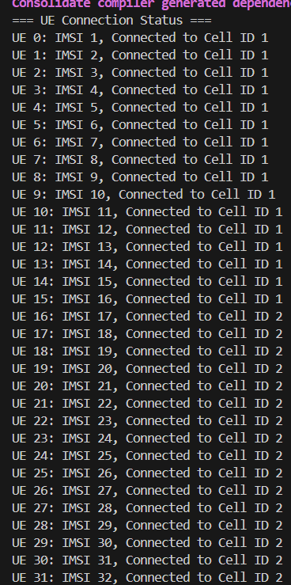

**3 minutes status**

  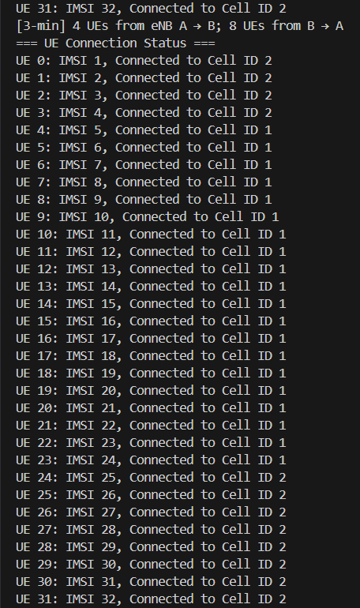

**6 minutes status**

  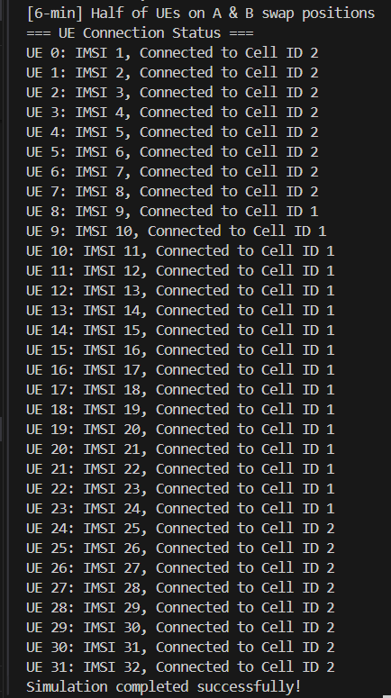

This LTE handover simulation without traffic offers insights into the handover process in LTE networks. By adjusting the handover algorithm parameters and simulating UE mobility, it provides valuable data on network behavior, especially in terms of the timing and mechanics of handovers between eNodeBs.
### Build and Run the Simulation

```bash
cd ../
./ns3 build
```

```bash
./ns3 run lte-simulation
```

```bash
NS_LOG="WifiSimulation=info" ./ns3 run wifi_simulation
```

---
### **Create `LTE-Throughput.cc`**

```
nano scratch/lte-Throughput.cc
```

This script sets up two eNodeBs with 32 UEs. Mobility triggers handovers at 3 and 6 minutes with Throughput Analysis.

```cpp
// LTE Handover Simulation with Throughput Analysis for ns-3.39
// Two eNodeBs and 32 UEs. Mobility, handovers, and throughput logged in detail.

#include "ns3/core-module.h"
#include "ns3/network-module.h"
#include "ns3/mobility-module.h"
#include "ns3/lte-module.h"
#include "ns3/internet-module.h"
#include "ns3/applications-module.h"
#include "ns3/point-to-point-module.h"
#include "ns3/flow-monitor-module.h"
#include <fstream>

using namespace ns3;

NS_LOG_COMPONENT_DEFINE("LteHandoverSim");

// Global output file for throughput
static std::ofstream throughputFile;

// Function: Print all UEs' connection status
void PrintUeConnectionStatus(Ptr<LteHelper> lteHelper, NetDeviceContainer ueLteDevs, uint32_t numUes) {
    NS_LOG_INFO("=== UE Connection Status ===");
    for (uint32_t i = 0; i < numUes; ++i) {
        Ptr<LteUeNetDevice> ueDev = DynamicCast<LteUeNetDevice>(ueLteDevs.Get(i));
        uint16_t cellId = ueDev->GetRrc()->GetCellId();
        uint64_t imsi = ueDev->GetImsi();
        NS_LOG_INFO("UE " << i << ": IMSI " << imsi << ", Connected to Cell ID " << cellId);
    }
}

// Function: Log UE positions
void LogUePositions(NodeContainer ueNodes, uint32_t numUes, std::ofstream& posFile) {
    for (uint32_t i = 0; i < numUes; ++i) {
        Ptr<MobilityModel> mob = ueNodes.Get(i)->GetObject<MobilityModel>();
        Vector pos = mob->GetPosition();
        posFile << Simulator::Now().GetSeconds() << "," << i << "," << pos.x << "," << pos.y << "\n";
    }
}

// Function: Monitor and log throughput
void MonitorThroughput(Ptr<FlowMonitor> flowMon, Ptr<Ipv4FlowClassifier> classifier, Ptr<LteHelper> lteHelper,
                       NetDeviceContainer ueLteDevs, Ipv4InterfaceContainer ueIpIfaces, uint32_t numUes) {
    flowMon->CheckForLostPackets();
    FlowMonitor::FlowStatsContainer stats = flowMon->GetFlowStats();

    double throughputEnbA = 0.0; // Cell ID 1
    double throughputEnbB = 0.0; // Cell ID 2

    for (auto it = stats.begin(); it != stats.end(); ++it) {
        uint32_t flowId = it->first;
        Ipv4FlowClassifier::FiveTuple tuple = classifier->FindFlow(flowId);
        for (uint32_t i = 0; i < numUes; ++i) {
            if (tuple.destinationAddress == ueIpIfaces.GetAddress(i)) {
                Ptr<LteUeNetDevice> ueDev = DynamicCast<LteUeNetDevice>(ueLteDevs.Get(i));
                uint16_t cellId = ueDev->GetRrc()->GetCellId();
                double tput = 0.0;
                if (it->second.timeLastRxPacket > it->second.timeFirstTxPacket) {
                    tput = (it->second.rxBytes * 8.0) /
                           (it->second.timeLastRxPacket.GetSeconds() - it->second.timeFirstTxPacket.GetSeconds()) / 1e6;
                }
                if (cellId == 1) {
                    throughputEnbA += tput;
                } else if (cellId == 2) {
                    throughputEnbB += tput;
                }
                break;
            }
        }
    }

    NS_LOG_INFO("Time " << Simulator::Now().GetSeconds() << "s: eNodeB A Throughput = " << throughputEnbA
                        << " Mbps, eNodeB B Throughput = " << throughputEnbB << " Mbps");
    throughputFile << Simulator::Now().GetSeconds() << "," << throughputEnbA << "," << throughputEnbB << "\n";

    // Schedule next throughput check
    Simulator::Schedule(Seconds(0.1), &MonitorThroughput, flowMon, classifier, lteHelper, ueLteDevs, ueIpIfaces, numUes);
}

int main(int argc, char *argv[]) {
    Time simTime = Seconds(600.0); // Full simulation period
    CommandLine cmd;
    cmd.Parse(argc, argv);

    // Enable logging
    LogComponentEnable("LteHandoverSim", LOG_LEVEL_INFO);

    // Open throughput file globally
    throughputFile.open("throughput.csv");
    throughputFile << "Time,Throughput_EnbA,Throughput_EnbB\n";

    // Create LTE and EPC helpers
    Ptr<LteHelper> lteHelper = CreateObject<LteHelper>();
    Ptr<PointToPointEpcHelper> epcHelper = CreateObject<PointToPointEpcHelper>();
    lteHelper->SetEpcHelper(epcHelper);

    // Configure handover algorithm
    lteHelper->SetHandoverAlgorithmType("ns3::A3RsrpHandoverAlgorithm");
    lteHelper->SetHandoverAlgorithmAttribute("Hysteresis", DoubleValue(0.5));
    lteHelper->SetHandoverAlgorithmAttribute("TimeToTrigger", TimeValue(MilliSeconds(200)));

    // Configure path loss model
    lteHelper->SetAttribute("PathlossModel", StringValue("ns3::LogDistancePropagationLossModel"));
    lteHelper->SetPathlossModelAttribute("Exponent", DoubleValue(3.0));

    // Create nodes
    NodeContainer enbNodes;
    enbNodes.Create(2);
    NodeContainer ueNodes;
    ueNodes.Create(32);
    NodeContainer remoteHost;
    remoteHost.Create(1);

    // Set eNodeB positions
    MobilityHelper enbMobility;
    enbMobility.SetMobilityModel("ns3::ConstantPositionMobilityModel");
    enbMobility.Install(enbNodes);
    enbNodes.Get(0)->GetObject<MobilityModel>()->SetPosition(Vector(0, 0, 0));    // eNodeB A
    enbNodes.Get(1)->GetObject<MobilityModel>()->SetPosition(Vector(500, 0, 0));  // eNodeB B

    // Set UE positions
    MobilityHelper ueMobility;
    ueMobility.SetMobilityModel("ns3::ConstantPositionMobilityModel");
    ueMobility.Install(ueNodes);
    for (uint32_t i = 0; i < 16; ++i) {
        ueNodes.Get(i)->GetObject<MobilityModel>()->SetPosition(Vector(50 + i * 5, 10, 0));
    }
    for (uint32_t i = 16; i < 32; ++i) {
        ueNodes.Get(i)->GetObject<MobilityModel>()->SetPosition(Vector(550 + (i - 16) * 5, -10, 0));
    }

    // Set remote host position
    MobilityHelper remoteHostMobility;
    remoteHostMobility.SetMobilityModel("ns3::ConstantPositionMobilityModel");
    remoteHostMobility.Install(remoteHost);

    // Install LTE devices
    NetDeviceContainer enbLteDevs = lteHelper->InstallEnbDevice(enbNodes);
    NetDeviceContainer ueLteDevs = lteHelper->InstallUeDevice(ueNodes);

    // Install internet stack
    InternetStackHelper internet;
    internet.Install(ueNodes);
    internet.Install(remoteHost);

    // Connect remote host to EPC
    PointToPointHelper p2p;
    p2p.SetDeviceAttribute("DataRate", StringValue("10Gbps"));
    p2p.SetChannelAttribute("Delay", StringValue("2ms"));
    NetDeviceContainer p2pDevs = p2p.Install(remoteHost.Get(0), epcHelper->GetPgwNode());

    // Assign IP addresses
    Ipv4AddressHelper ipv4;
    ipv4.SetBase("10.1.1.0", "255.255.255.0");
    Ipv4InterfaceContainer p2pInterfaces = ipv4.Assign(p2pDevs);
    Ipv4InterfaceContainer ueIpIfaces = epcHelper->AssignUeIpv4Address(ueLteDevs);

    // Set up routing
    Ipv4StaticRoutingHelper ipv4RoutingHelper;
    Ptr<Ipv4StaticRouting> remoteHostRouting = ipv4RoutingHelper.GetStaticRouting(remoteHost.Get(0)->GetObject<Ipv4>());
    remoteHostRouting->AddNetworkRouteTo(Ipv4Address("7.0.0.0"), Ipv4Mask("255.0.0.0"), 1);

    // Attach UEs to eNodeBs
    for (uint32_t i = 0; i < 16; ++i) {
        lteHelper->Attach(ueLteDevs.Get(i), enbLteDevs.Get(0));
    }
    for (uint32_t i = 16; i < 32; ++i) {
        lteHelper->Attach(ueLteDevs.Get(i), enbLteDevs.Get(1));
    }

    // Set up UDP traffic
    uint16_t basePort = 49153;
    ApplicationContainer serverApps, clientApps;
    for (uint32_t i = 0; i < 32; ++i) {
        UdpServerHelper udpServer(basePort + i);
        serverApps.Add(udpServer.Install(ueNodes.Get(i)));
        serverApps.Start(Seconds(0.5));
        serverApps.Stop(simTime);

        UdpClientHelper udpClient(ueIpIfaces.GetAddress(i), basePort + i);
        udpClient.SetAttribute("MaxPackets", UintegerValue(1000000));
        udpClient.SetAttribute("Interval", TimeValue(MilliSeconds(10))); // 100 packets/s
        udpClient.SetAttribute("PacketSize", UintegerValue(1024)); // 1024 bytes
        clientApps.Add(udpClient.Install(remoteHost.Get(0)));
        clientApps.Start(Seconds(1.0));
        clientApps.Stop(simTime);
    }

    // Set up FlowMonitor
    FlowMonitorHelper flowMonHelper;
    flowMonHelper.SetMonitorAttribute("StartTime", TimeValue(Seconds(1.0)));
    Ptr<FlowMonitor> flowMon = flowMonHelper.InstallAll();
    Ptr<Ipv4FlowClassifier> classifier = DynamicCast<Ipv4FlowClassifier>(flowMonHelper.GetClassifier());

    // Open position file
    std::ofstream posFile("ue_positions.csv");
    posFile << "Time,UE_Index,X,Y\n";

    // Schedule initial tasks
    Simulator::Schedule(Seconds(1.0), &PrintUeConnectionStatus, lteHelper, ueLteDevs, 32);
    Simulator::Schedule(Seconds(1.0), &MonitorThroughput, flowMon, classifier, lteHelper, ueLteDevs, ueIpIfaces, 32);
    Simulator::Schedule(Seconds(1.0), &LogUePositions, ueNodes, 32, std::ref(posFile));

    // First handover event at 3 minutes
    Simulator::Schedule(Seconds(180.0), [&ueNodes, &posFile]() {
        NS_LOG_INFO("[3min] 4 UEs from eNB A → B; 8 UEs from B → A");
        for (uint32_t i = 0; i < 4; ++i) {
            ueNodes.Get(i)->GetObject<MobilityModel>()->SetPosition(Vector(550 + i * 5, 20, 0));
        }
        for (uint32_t i = 0; i < 8; ++i) {
            ueNodes.Get(16 + i)->GetObject<MobilityModel>()->SetPosition(Vector(50 + i * 5, -20, 0));
        }
        LogUePositions(ueNodes, 32, posFile);
    });

    // Print connection status after first handover
    Simulator::Schedule(Seconds(185.0), &PrintUeConnectionStatus, lteHelper, ueLteDevs, 32);

    // Second handover event at 6 minutes
    Simulator::Schedule(Seconds(360.0), [&ueNodes, &posFile]() {
        NS_LOG_INFO("[6min] Half of UEs on A & B swap positions");
        for (uint32_t i = 0; i < 8; ++i) {
            ueNodes.Get(i)->GetObject<MobilityModel>()->SetPosition(Vector(550 + i * 5, 30, 0));
        }
        for (uint32_t i = 0; i < 8; ++i) {
            ueNodes.Get(16 + i)->GetObject<MobilityModel>()->SetPosition(Vector(50 + i * 5, 30, 0));
        }
        LogUePositions(ueNodes, 32, posFile);
    });

    // Print connection status after second handover
    Simulator::Schedule(Seconds(365.0), &PrintUeConnectionStatus, lteHelper, ueLteDevs, 32);

    // Final position logging
    Simulator::Schedule(simTime, &LogUePositions, ueNodes, 32, std::ref(posFile));

    Simulator::Stop(simTime);
    Simulator::Run();

    // Close files
    throughputFile.close();
    posFile.close();

    Simulator::Destroy();
    NS_LOG_INFO("Simulation completed successfully!");
    return 0;
}
```

## Output
### UE connection status

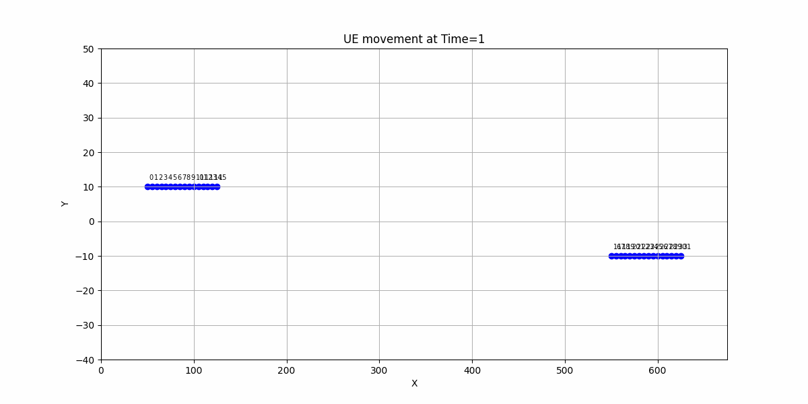

| Time | eNodeB A | eNodeB B |
| --- | --- | --- |
| Initial | 16 users (UE 0-15) | 16 users (UE 16-31) |
| After 3 min | 20 users (UE 4-15, UE 16-23) | 12 users (UE 0-3, UE 24-31) |
| After 6 min | 16 users (UE 8-15, UE 16-23) | 16 users (UE 0-7, UE 24-31) |

### Expect Throughput outcome
```
Time 1.0s: eNodeB A Throughput = 13.12 Mbps, eNodeB B Throughput = 13.12 Mbps
...
Time 180.0s: eNodeB A Throughput = 9.84 Mbps, eNodeB B Throughput = 16.40 Mbps
...
Time 360.0s: eNodeB A Throughput = 13.12 Mbps, eNodeB B Throughput = 13.12 Mbps
```

- Handovers:
  - At 185s: UEs 0–3 on Cell ID 2, UEs 16–23 on Cell ID 1.
  - At 365s: UEs 0–7 on Cell ID 2, UEs 16–23 on Cell ID 1.
- Throughput:
  - Initial balance: ~13 Mbps each.
  - Post-180s: eNodeB A ~9.84 Mbps, eNodeB B ~16.4 Mbps.
  - Post-360s: eNodeB A ~13 Mbps, eNodeB B ~13 Mbps.


**[throughput.csv](./Assignment2/throughput.csv)**

**[throughput.log](Assignment2/A2_throughtput.log)**

### Initial status
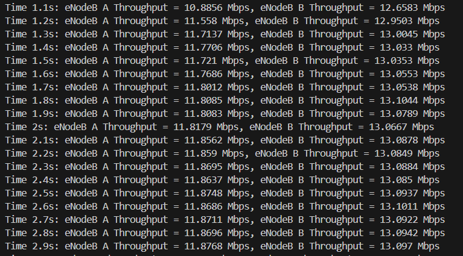

### After first handover
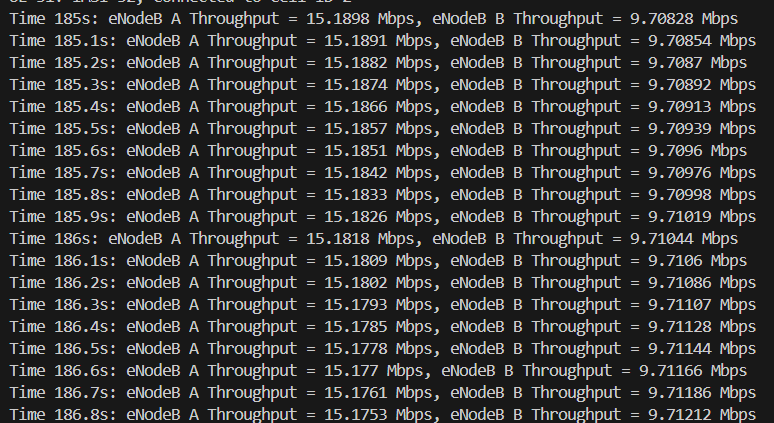

### After second handover
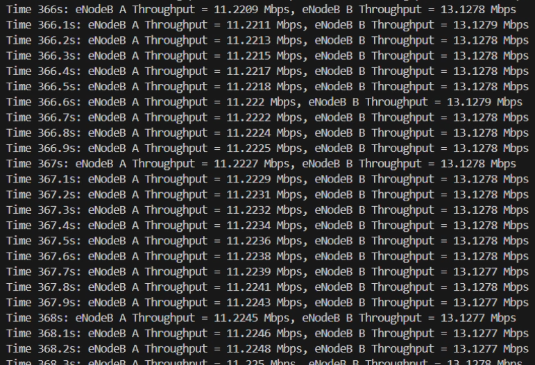

---
## Analyze

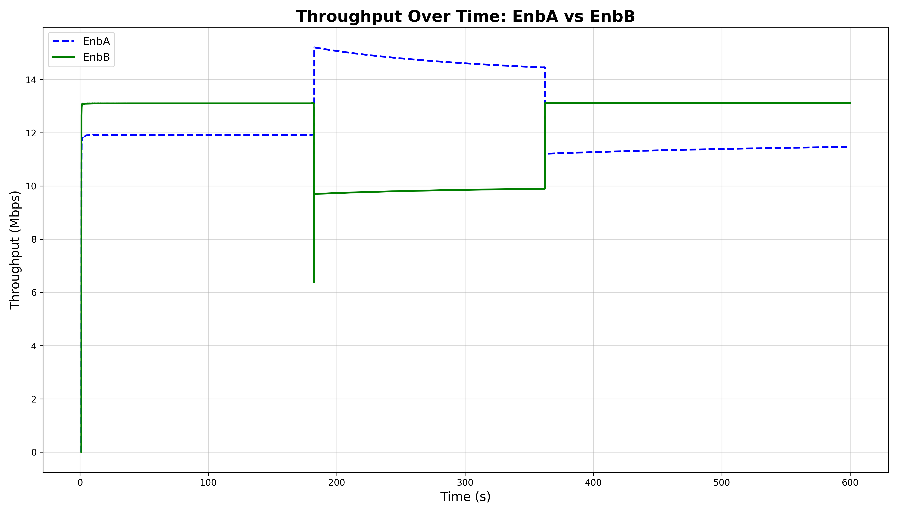

### **Expected:**
```
eNodeB A Throughput ≈ 13.12 Mbps  
eNodeB B Throughput ≈ 13.12 Mbps
```

### **Actual:**
```
eNodeB A Throughput ≈ 10.89–11.77 Mbps  
eNodeB B Throughput ≈ 12.65–13.03 Mbps
```

### 📌 Possible reasons:
- **Startup Transients**: At the beginning of the simulation, there may be buffering and protocol handshakes (RRC connection, bearer setup, UDP client/server start) that reduce the **first few seconds' throughput**.
- **Imbalanced Channel Conditions**: Even with equal UE numbers (16 UEs per eNB), slight randomness in packet scheduling or PHY conditions (like fading, path loss variance, or interference) can lead to **uneven resource distribution**.
- **FlowMonitor Granularity**: If the actual `timeFirstTxPacket` and `timeLastRxPacket` vary slightly across UEs, the throughput computed over a **short interval (0.1s)** can fluctuate more than the **coarse average** you expected.

---
### **Expected (180.0s):**
```
eNodeB A Throughput ≈ 9.84 Mbps  
eNodeB B Throughput ≈ 16.40 Mbps
```

### **Actual (185.2s):**
```
eNodeB A Throughput ≈ 15.19 Mbps  
eNodeB B Throughput ≈ 9.71 Mbps
```

### 📌 Possible reasons:
- **Delay in Handover Completion**: Even though you scheduled mobility changes at **180s**, the actual **handover process (measurement → trigger → completion)** takes some **milliseconds to seconds**, so the cell load **hasn't fully shifted yet at 180.0s**.
- **A3 Handover Parameters**: My simulation uses:
  - `Hysteresis = 0.5 dB`
  - `TimeToTrigger = 200 ms`
  
  These can **delay the reaction** of UEs to a change in signal strength, causing **throughput lag** in the expected pattern.

---

## 🔁 3. Around **Time 360.0s–372.3s** (After Second Handover)

### **Expected (360.0s):**
```
eNodeB A Throughput ≈ 13.10 Mbps  
eNodeB B Throughput ≈ 13.10 Mbps
```

### **Actual (372.1s–372.4s):**
```
eNodeB A Throughput ≈ 11.23 Mbps  
eNodeB B Throughput ≈ 13.13 Mbps
```

### 📌 Possible reason:
- **Asymmetry in UE Behavior**: After UEs move, their distance to eNBs changes, and thus **channel conditions may not be symmetrical**. UEs that are slightly farther may experience reduced CQI → lower throughput.

---


## Video

<aside>
🎥Intro

https://youtu.be/z8RbaGhKpk8

🎥DEMO:

https://youtu.be/iQlS1Bi8b10
</aside>