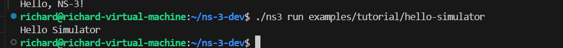
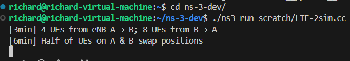

# A2-ns-3 Network Simulator

<aside>
📖 **References**

- [ns-3](https://www.nsnam.org/)
- [ns-3 Tutorial](https://www.nsnam.org/docs/tutorial/html/)
- [The ns-3 Network Simulator](https://intronetworks.cs.luc.edu/current/html/ns3.html)
- [ns-3 LTE Module](https://www.nsnam.org/docs/models/html/lte-user.html)
- [ns-3 WiFi Module](https://www.nsnam.org/docs/models/html/wifi-design.html)
- [3GPP NR ns-3 Module](https://github.com/QiuYukang/5G-LENA)
</aside>

<aside>
✅ Score (15%): 

- [x]  **NS-3 Installation (30%)**: Provide an installation guide that includes:
    1. **Commands**: List terminal commands used for installation.
    2. **Verification**: Copy & paste terminal logs confirming successful installation.
    3. **Final Check**: Run [`hello-simulator.cc`](https://www.nsnam.org/docs/release/3.19/doxygen/hello-simulator_8cc_source.html) to verify installation.
- [x]  **LTE / WiFi Simulation (50%)**:
    - [x]  **Submission Requirements**: Upload your simulation source code under `./a2/src/` in your branch. For each milestone, provide:
        1. **Input**: Commands or source code (attach hyperlinks from `./a2/src/`).
        2. **Output**: Figures, results, and explanations.
    - [ ]  **Extra Credit (20%)**:
        - **Peer Review Bonus:** Top 3 students based on peer reviews receive extra credit: **Top 1:** +20%, **Top 2:** +15%, **Top 3:** +10%.
        - **Extended Deployment Bonus:** If you deploy **9 nodes in WiFi/LTE** and commit before **March 29, 2025, 19:00 PM**, you get an **extra 10%**.

**3. Milestones & Grading**

- [x]  **Deploy 2 nodes and assign users** (`1-points`):
    1. **Deploy 2 nodes and assign users** (`1-points`):
        1. Deploy 2 nodes as Node A & B;
        2. Assign 16 users for each node:
            - For LTE is called User Equipment (UE)
            - For WiFi is called Station (STA)
        3. Provide a user table (e.g., MAC addresses or STA/UE IDs).
        
        This setup can be formulated as follow:
        
        - **Formula:**
            
            X0=Y0=16
            
        - **Definitions:**
            - (X0) = Initial Users in Node A
            - (Y0) = Initial Users in Node B
- [ ]  **Full-Queue Model Transmission & Random mobility Model**
    1. **Full-Queue Model Transmission & Random mobility Model**
        
        Implement a [full-queue model](https://www.nsnam.org/doxygen/d9/db7/fcfs-wifi-queue-scheduler_8cc_source.html). Ensure each STA/UE continuously transmits to AP/BS. (`1-point`)
        
        - **Simulation Duration:** 10 minutes.
        - **User Movement:**
            - **At minute 3:** 25% of users move from Node A → Node B, and 50% from Node B → Node A.
            - **At minute 6:** 50% of users move from Node A → Node B, and 50% from Node B → Node A.
            - For each movement, describe which users that moved from A --> B and B --> A in your .
        - **Formulas:**
            - **Minute 3:** ,
                
                X1=X0×p
                
                Y1=Y0×q
                
            - **Minute 6:**,
                
                X2=X1×p
                
                Y2=Y1×q
                
        - **Definitions:**
            - (p = 25%) → Users moving from Node A to Node B.
            - (q = 50% ) → Users moving from Node B to Node A.
            - (X1,X2) → Users in Node A after each movement.
            - (Y1,Y2) → Users in Node B after each movement.
1. **Analysis Report**:
    1. What is the final users distribution (value of  & )? Show the users table for each movement. (`2-points`)
    2. Show & analyze the figures of the aggregated throughput in Node-A & Node-B through time (`3-points`):
        - X-axis = time & Y-axis = throughput.
        - Analyze & explain your results.
2. Show the 10-minutes video simulation (`3-points`)

</aside>

### Prerequisites

ns-3 has various optional extensions, but the main features just require a **C++ compiler (g++ or clang++), Python (version 3.6 or above), CMake and a build-system (e.g. make, ninja, Xcode)**.

For Linux, use either g++ or clang++ compilers.

we recommend to either use a **Linux virtual machine**, or the Windows Subsystem for Linux.

- As of the most recent *ns-3* release (ns-3.39), the following tools are needed to get started with *ns-3*:
    
    

### Setup ns-3 environment


⚓ **Installation environment:**

- OS: Ubuntu 22.04.6 LTS
- Stroge: 200GB
- Memory: 10GB
- gcc: 11.4.0
- Python 3.8.10

## **NS-3 Installation Guide**

### **Install Required Dependencies**

Before installing ns-3, update your system and install the necessary dependencies:

```bash
sudo apt update && sudo apt upgrade -y
sudo apt install -y build-essential cmake g++ python3 python3-pip git \
  pkg-config qt5-qmake qtbase5-dev \
  autoconf automake libtool libxml2 libxml2-dev libgtk-3-dev \
  libsqlite3-dev libgsl-dev libboost-all-dev \
  libpcap-dev tcpdump
```

### **Download ns-3**

ns-3 is distributed in source code only. There are two main ways to obtain the source code:

1. downloading the latest release as a source code archive from the main ns-3 web site
2. cloning the Git repository from [GitLab.com](http://gitlab.com/).

Either one or the other download option (but not both) should be followed.

**Option 1: Download the Latest Release (ns-3.44)**

```bash
wget https://www.nsnam.org/releases/ns-allinone-3.44.tar.bz2
tar xjf ns-allinone-3.44.tar.bz2
cd ns-allinone-3.44/ns-3.44
```

**Option 2: Clone the Latest Development Version**

```bash
git clone https://gitlab.com/nsnam/ns-3-dev.git
cd ns-3-dev
git checkout -b ns-3.39-branch ns-3.39
```

### **Build ns-3**

**3.1 Configure and Build**

```bash
./ns3 configure --enable-examples --enable-tests
./ns3 build
```


**3.2 Verify Installation**

Run the test suite to ensure the installation is working correctly:

```bash
./test.py
```


All tests should either **PASS** or be **SKIPped**.

### **Run Example Simulations**

Run `hello-simulator.cc`

```bash
./ns3 run examples/tutorial/hello-simulator
```





---

<aside>
## NS-3 environment

### **1️⃣ Environment Setup**

- Ensure ns-3 is installed and working (Ubuntu 22.04).
- Use the `wifi` or `lte` module depending on your choice.

### **2️⃣ Network Setup**

- Create two nodes: `AP/BS` and `AP/BS2`.
- Assign 16 **UEs/STAs** to each node.
- Assign MAC addresses or IDs.

### **3️⃣ Traffic Generation (Full-Queue Model)**

- Implement a **full-queue model** so each STA/UE continuously transmits data.
- Use **OnOffApplication** or **BulkSendApplication** for traffic.

### **4️⃣ DCF & Throughput Analysis**

- Use **WiFi MAC mode DCF**.
- Capture throughput metrics using **FlowMonitor**.

### **5️⃣ Mobility Model**

- At **minute 3**,
    - **25% of Node A’s users (4 users) move to Node B**
    - **50% of Node B’s users (8 users) move to Node A**
- At **minute 6**, repeat the same movements.

</aside>

### **Create LTE Simulation Script**

We will create a new simulation script for LTE inside the `scratch/` directory.

### **Create `lte-simulation.cc`**

```bash
nano scratch/lte-simulation.cc
```

This script sets up two LTE eNBs (Base Stations), assigns 16 UEs per eNB, implements **a full-queue model**, and applies **user mobility at minutes 3 and 6**.

```cpp
#include "ns3/core-module.h"
#include "ns3/network-module.h"
#include "ns3/mobility-module.h"
#include "ns3/wifi-module.h"
#include "ns3/internet-module.h"
#include "ns3/applications-module.h"
#include "ns3/packet-sink.h"
#include "ns3/flow-monitor-module.h"
#include <vector>
#include <string>
#include <algorithm>
#include <random>

using namespace ns3;

NS_LOG_COMPONENT_DEFINE("WifiSimulation");

// Struct to keep track of node associations
struct NodeAssociation {
    Ptr<Node> node;
    int originalAP;  // 0 for AP-A, 1 for AP-B
    int currentAP;   // 0 for AP-A, 1 for AP-B
    uint32_t id;     // Node ID for tracking
};

// Function to move users between APs
void MoveUsers(Ptr<Node> apA, Ptr<Node> apB, 
               std::vector<NodeAssociation>& staNodesA, 
               std::vector<NodeAssociation>& staNodesB,
               double fractionAtoB, double fractionBtoA) {
    
    NS_LOG_INFO("Starting node movement at time " << Simulator::Now().GetSeconds() << "s");
    
    // Get positions of AP nodes
    Ptr<MobilityModel> mobA = apA->GetObject<MobilityModel>();
    Ptr<MobilityModel> mobB = apB->GetObject<MobilityModel>();
    
    Vector posA = mobA->GetPosition();
    Vector posB = mobB->GetPosition();
    
    NS_LOG_INFO("AP-A position: (" << posA.x << ", " << posA.y << ", " << posA.z << ")");
    NS_LOG_INFO("AP-B position: (" << posB.x << ", " << posB.y << ", " << posB.z << ")");
    
    // Calculate how many nodes to move
    uint32_t numAtoB = static_cast<uint32_t>(staNodesA.size() * fractionAtoB);
    uint32_t numBtoA = static_cast<uint32_t>(staNodesB.size() * fractionBtoA);
    
    NS_LOG_INFO("Moving " << numAtoB << " nodes from AP-A to AP-B");
    NS_LOG_INFO("Moving " << numBtoA << " nodes from AP-B to AP-A");
    
    // Randomly select nodes from A to move to B
    std::vector<uint32_t> indicesA(staNodesA.size());
    for (uint32_t i = 0; i < staNodesA.size(); ++i) {
        indicesA[i] = i;
    }
    
    std::random_device rd;
    std::mt19937 g(rd());
    std::shuffle(indicesA.begin(), indicesA.end(), g);
    
    // Move nodes from A to B
    for (uint32_t i = 0; i < numAtoB && i < indicesA.size(); ++i) {
        Ptr<MobilityModel> mobility = staNodesA[indicesA[i]].node->GetObject<MobilityModel>();
        
        // Set position near AP-B (with some random variation)
        double randX = posB.x + (2.0 * (double)rand() / RAND_MAX - 1.0) * 5.0;
        double randY = posB.y + (2.0 * (double)rand() / RAND_MAX - 1.0) * 5.0;
        
        mobility->SetPosition(Vector(randX, randY, 0.0));
        staNodesA[indicesA[i]].currentAP = 1;  // Now associated with AP-B
        
        NS_LOG_INFO("Node " << staNodesA[indicesA[i]].id << " moved from AP-A to AP-B");
    }
    
    // Randomly select nodes from B to move to A
    std::vector<uint32_t> indicesB(staNodesB.size());
    for (uint32_t i = 0; i < staNodesB.size(); ++i) {
        indicesB[i] = i;
    }
    
    std::shuffle(indicesB.begin(), indicesB.end(), g);
    
    // Move nodes from B to A
    for (uint32_t i = 0; i < numBtoA && i < indicesB.size(); ++i) {
        Ptr<MobilityModel> mobility = staNodesB[indicesB[i]].node->GetObject<MobilityModel>();
        
        // Set position near AP-A (with some random variation)
        double randX = posA.x + (2.0 * (double)rand() / RAND_MAX - 1.0) * 5.0;
        double randY = posA.y + (2.0 * (double)rand() / RAND_MAX - 1.0) * 5.0;
        
        mobility->SetPosition(Vector(randX, randY, 0.0));
        staNodesB[indicesB[i]].currentAP = 0;  // Now associated with AP-A
        
        NS_LOG_INFO("Node " << staNodesB[indicesB[i]].id << " moved from AP-B to AP-A");
    }
    
    NS_LOG_INFO("Node movement completed at time " << Simulator::Now().GetSeconds() << "s");
}

// Helper function to convert vector to string
std::string VectorToString(const std::vector<uint32_t>& vec) {
    std::string result = "[";
    for (size_t i = 0; i < vec.size(); ++i) {
        result += std::to_string(vec[i]);
        if (i < vec.size() - 1) {
            result += ", ";
        }
    }
    result += "]";
    return result;
}

// Function to print the current status of nodes
void PrintNodeStatus(std::vector<NodeAssociation>& staNodesA, 
                    std::vector<NodeAssociation>& staNodesB) {
    
    uint32_t countA_atA = 0;
    uint32_t countA_atB = 0;
    uint32_t countB_atA = 0;
    uint32_t countB_atB = 0;
    
    std::vector<uint32_t> nodesA_atA;
    std::vector<uint32_t> nodesA_atB;
    std::vector<uint32_t> nodesB_atA;
    std::vector<uint32_t> nodesB_atB;
    
    // Count nodes from group A
    for (const auto& node : staNodesA) {
        if (node.currentAP == 0) {
            countA_atA++;
            nodesA_atA.push_back(node.id);
        } else {
            countA_atB++;
            nodesA_atB.push_back(node.id);
        }
    }
    
    // Count nodes from group B
    for (const auto& node : staNodesB) {
        if (node.currentAP == 0) {
            countB_atA++;
            nodesB_atA.push_back(node.id);
        } else {
            countB_atB++;
            nodesB_atB.push_back(node.id);
        }
    }
    
    NS_LOG_INFO("==== Node Status at " << Simulator::Now().GetSeconds() << "s ====");
    NS_LOG_INFO("Group A nodes at AP-A: " << countA_atA << " nodes: " << VectorToString(nodesA_atA));
    NS_LOG_INFO("Group A nodes at AP-B: " << countA_atB << " nodes: " << VectorToString(nodesA_atB));
    NS_LOG_INFO("Group B nodes at AP-A: " << countB_atA << " nodes: " << VectorToString(nodesB_atA));
    NS_LOG_INFO("Group B nodes at AP-B: " << countB_atB << " nodes: " << VectorToString(nodesB_atB));
    NS_LOG_INFO("==========================================");
}

// Function to print flow statistics
void PrintFlowStatistics(Ptr<FlowMonitor> flowMonitor, FlowMonitorHelper& flowHelper) {
    NS_LOG_INFO("=== Flow Statistics at " << Simulator::Now().GetSeconds() << "s ===");
    
    flowMonitor->CheckForLostPackets();
    Ptr<Ipv4FlowClassifier> classifier = DynamicCast<Ipv4FlowClassifier>(flowHelper.GetClassifier());
    std::map<FlowId, FlowMonitor::FlowStats> stats = flowMonitor->GetFlowStats();
    
    uint32_t totalTxPackets = 0;
    uint32_t totalRxPackets = 0;
    uint32_t totalLostPackets = 0;
    double totalThroughput = 0.0;
    
    for (std::map<FlowId, FlowMonitor::FlowStats>::const_iterator i = stats.begin(); i != stats.end(); ++i) {
        Ipv4FlowClassifier::FiveTuple t = classifier->FindFlow(i->first);
        
        NS_LOG_INFO("Flow " << i->first << " (" << t.sourceAddress << " -> " << t.destinationAddress << ")");
        NS_LOG_INFO("  Tx Packets: " << i->second.txPackets);
        NS_LOG_INFO("  Rx Packets: " << i->second.rxPackets);
        NS_LOG_INFO("  Lost Packets: " << i->second.lostPackets);
        
        if (i->second.rxPackets > 0) {
            double throughput = i->second.rxBytes * 8.0 / (i->second.timeLastRxPacket.GetSeconds() - i->second.timeFirstTxPacket.GetSeconds()) / 1000000.0;
            NS_LOG_INFO("  Throughput: " << throughput << " Mbps");
            totalThroughput += throughput;
        }
        
        totalTxPackets += i->second.txPackets;
        totalRxPackets += i->second.rxPackets;
        totalLostPackets += i->second.lostPackets;
    }
    
    NS_LOG_INFO("=== Summary Statistics ===");
    NS_LOG_INFO("Total Tx Packets: " << totalTxPackets);
    NS_LOG_INFO("Total Rx Packets: " << totalRxPackets);
    NS_LOG_INFO("Total Lost Packets: " << totalLostPackets);
    NS_LOG_INFO("Network Throughput: " << totalThroughput << " Mbps");
    NS_LOG_INFO("===============================");
}

int main(int argc, char *argv[]) {
    // Enable logging
    LogComponentEnable("WifiSimulation", LOG_LEVEL_INFO);
    // LogComponentEnable("PacketSink", LOG_LEVEL_INFO);

    CommandLine cmd;
    cmd.Parse(argc, argv);
    
    // Create nodes
    NodeContainer apNodes;
    apNodes.Create(2);
    
    NodeContainer staNodesA, staNodesB;
    staNodesA.Create(16);
    staNodesB.Create(16);
    
    // Set up WiFi
    WifiHelper wifi;
    wifi.SetStandard(WIFI_STANDARD_80211ax);
    
    // Set up channel and PHY
    YansWifiChannelHelper channel = YansWifiChannelHelper::Default();
    YansWifiPhyHelper phy;
    phy.SetChannel(channel.Create());
    
    // Set up MAC
    WifiMacHelper mac;
    Ssid ssidA = Ssid("wifi-network-a");
    Ssid ssidB = Ssid("wifi-network-b");
    
    // Create AP devices
    mac.SetType("ns3::ApWifiMac", "Ssid", SsidValue(ssidA));
    NetDeviceContainer apDeviceA = wifi.Install(phy, mac, apNodes.Get(0));
    
    mac.SetType("ns3::ApWifiMac", "Ssid", SsidValue(ssidB));
    NetDeviceContainer apDeviceB = wifi.Install(phy, mac, apNodes.Get(1));
    
    // Create STA devices for group A - initially connect to AP-A
    mac.SetType("ns3::StaWifiMac", "Ssid", SsidValue(ssidA));
    NetDeviceContainer staDevicesA = wifi.Install(phy, mac, staNodesA);
    
    // Create STA devices for group B - initially connect to AP-B
    mac.SetType("ns3::StaWifiMac", "Ssid", SsidValue(ssidB));
    NetDeviceContainer staDevicesB = wifi.Install(phy, mac, staNodesB);
    
    // Set up mobility models
    MobilityHelper mobility;
    
    // Position AP-A at (0,0,0)
    Ptr<ListPositionAllocator> positionAlloc = CreateObject<ListPositionAllocator>();
    positionAlloc->Add(Vector(0.0, 0.0, 0.0));  // AP-A
    positionAlloc->Add(Vector(50.0, 0.0, 0.0)); // AP-B with 50m separation
    
    mobility.SetPositionAllocator(positionAlloc);
    mobility.SetMobilityModel("ns3::ConstantPositionMobilityModel");
    mobility.Install(apNodes);
    
    // Random positions for STA nodes around their respective APs
    mobility.SetPositionAllocator("ns3::RandomDiscPositionAllocator",
                                 "X", StringValue("0.0"),
                                 "Y", StringValue("0.0"),
                                 "Rho", StringValue("ns3::UniformRandomVariable[Min=0|Max=10]"));
    mobility.SetMobilityModel("ns3::RandomWalk2dMobilityModel",
                             "Bounds", RectangleValue(Rectangle(-25, 25, -25, 25)),
                             "Speed", StringValue("ns3::ConstantRandomVariable[Constant=1.0]"));
    mobility.Install(staNodesA);
    
    mobility.SetPositionAllocator("ns3::RandomDiscPositionAllocator",
                                 "X", StringValue("50.0"),
                                 "Y", StringValue("0.0"),
                                 "Rho", StringValue("ns3::UniformRandomVariable[Min=0|Max=10]"));
    mobility.SetMobilityModel("ns3::RandomWalk2dMobilityModel",
                             "Bounds", RectangleValue(Rectangle(25, 75, -25, 25)),
                             "Speed", StringValue("ns3::ConstantRandomVariable[Constant=1.0]"));
    mobility.Install(staNodesB);
    
    // Set up internet stack
    InternetStackHelper stack;
    stack.Install(apNodes);
    stack.Install(staNodesA);
    stack.Install(staNodesB);
    
    // Set up IP addresses
    Ipv4AddressHelper address;
    
    // Network for AP-A and its stations
    address.SetBase("192.168.1.0", "255.255.255.0");
    Ipv4InterfaceContainer apInterfaceA = address.Assign(apDeviceA);
    Ipv4InterfaceContainer staInterfacesA = address.Assign(staDevicesA);
    
    // Network for AP-B and its stations
    address.SetBase("192.168.2.0", "255.255.255.0");
    Ipv4InterfaceContainer apInterfaceB = address.Assign(apDeviceB);
    Ipv4InterfaceContainer staInterfacesB = address.Assign(staDevicesB);
    
    // Set up applications - Full-Queue Model
    // Server apps on APs
    uint16_t port = 9;
    
    // TCP sink on AP-A
    PacketSinkHelper sinkA("ns3::TcpSocketFactory", InetSocketAddress(Ipv4Address::GetAny(), port));
    ApplicationContainer sinkAppsA = sinkA.Install(apNodes.Get(0));
    sinkAppsA.Start(Seconds(0.0));
    sinkAppsA.Stop(Seconds(600.0));
    
    // TCP sink on AP-B
    PacketSinkHelper sinkB("ns3::TcpSocketFactory", InetSocketAddress(Ipv4Address::GetAny(), port));
    ApplicationContainer sinkAppsB = sinkB.Install(apNodes.Get(1));
    sinkAppsB.Start(Seconds(0.0));
    sinkAppsB.Stop(Seconds(600.0));
    
    // Client applications - continuous transmission (full-queue model)
    // For group A stations
    ApplicationContainer clientAppsA;
    for (uint32_t i = 0; i < staNodesA.GetN(); ++i) {
        OnOffHelper clientA("ns3::TcpSocketFactory", InetSocketAddress(apInterfaceA.GetAddress(0), port));
        clientA.SetAttribute("OnTime", StringValue("ns3::ConstantRandomVariable[Constant=1]"));
        clientA.SetAttribute("OffTime", StringValue("ns3::ConstantRandomVariable[Constant=0]"));
        clientA.SetAttribute("DataRate", DataRateValue(DataRate("10Mb/s")));
        clientA.SetAttribute("PacketSize", UintegerValue(1460)); // TCP MSS size

        clientAppsA.Add(clientA.Install(staNodesA.Get(i)));
    }
    
    // For group B stations
    ApplicationContainer clientAppsB;
    for (uint32_t i = 0; i < staNodesB.GetN(); ++i) {
        OnOffHelper clientB("ns3::TcpSocketFactory", InetSocketAddress(apInterfaceB.GetAddress(0), port));
        clientB.SetAttribute("OnTime", StringValue("ns3::ConstantRandomVariable[Constant=1]"));
        clientB.SetAttribute("OffTime", StringValue("ns3::ConstantRandomVariable[Constant=0]"));
        clientB.SetAttribute("DataRate", DataRateValue(DataRate("10Mb/s")));
        clientB.SetAttribute("PacketSize", UintegerValue(1460)); // TCP MSS size

        clientAppsB.Add(clientB.Install(staNodesB.Get(i)));
    }
    
    clientAppsA.Start(Seconds(1.0));
    clientAppsA.Stop(Seconds(600.0));
    clientAppsB.Start(Seconds(1.0));
    clientAppsB.Stop(Seconds(600.0));
    
    // Create node association tracking
    std::vector<NodeAssociation> nodeAssocA;
    for (uint32_t i = 0; i < staNodesA.GetN(); ++i) {
        NodeAssociation assoc;
        assoc.node = staNodesA.Get(i);
        assoc.originalAP = 0;
        assoc.currentAP = 0;
        assoc.id = i;
        nodeAssocA.push_back(assoc);
    }
    
    std::vector<NodeAssociation> nodeAssocB;
    for (uint32_t i = 0; i < staNodesB.GetN(); ++i) {
        NodeAssociation assoc;
        assoc.node = staNodesB.Get(i);
        assoc.originalAP = 1;
        assoc.currentAP = 1;
        assoc.id = i + staNodesA.GetN(); // Offset to avoid duplicate IDs
        nodeAssocB.push_back(assoc);
    }
    
    // Print initial node status
    Simulator::Schedule(Seconds(0), &PrintNodeStatus, nodeAssocA, nodeAssocB);
    
    // At minute 3: Move 4 users from A to B and 8 users from B to A (0.25 of A, 0.5 of B)
    Simulator::Schedule(Seconds(180), &MoveUsers, apNodes.Get(0), apNodes.Get(1), 
                        nodeAssocA, nodeAssocB, 0.25, 0.5);
    Simulator::Schedule(Seconds(181), &PrintNodeStatus, nodeAssocA, nodeAssocB);
    
    // At minute 6: Move 8 users from A to B and 8 users from B to A (0.5 of A, 0.5 of B)
    Simulator::Schedule(Seconds(360), &MoveUsers, apNodes.Get(0), apNodes.Get(1), 
                        nodeAssocA, nodeAssocB, 0.5, 0.5);
    Simulator::Schedule(Seconds(361), &PrintNodeStatus, nodeAssocA, nodeAssocB);
    
    // Set up flow monitor
    FlowMonitorHelper flowHelper;
    Ptr<FlowMonitor> flowMonitor = flowHelper.InstallAll();

    // Run simulation
    NS_LOG_INFO("Starting simulation...");
    Simulator::Stop(Seconds(600.0));
    Simulator::Run();
    Simulator::Destroy();
    
    NS_LOG_INFO("Simulation completed successfully!");
    
    return 0;
}

```

Due to an unknown issue, the program has become unresponsive and cannot display the full results. This may be related to hardware resource limitations. Therefore, I will introduce a lightweight version of the ns-3 LTE simulation in the following content.


---
### **Create `LTE-simple.cc`**

```
nano scratch/lte-simple.cc
```

This script sets up two eNodeBs with 32 UEs. Mobility triggers handovers at 3 and 6 minutes.

```cpp
// LTE Handover Simulation for ns-3.39
// This script sets up two eNodeBs with 32 UEs. Mobility triggers handovers at 3 and 6 minutes.

#include "ns3/core-module.h"
#include "ns3/network-module.h"
#include "ns3/mobility-module.h"
#include "ns3/lte-module.h"
#include "ns3/internet-module.h"
#include "ns3/applications-module.h"

using namespace ns3;

NS_LOG_COMPONENT_DEFINE("LteHandoverSim");

int main(int argc, char *argv[]) {
  Time simTime = Seconds(600.0); // 10 minutes simulation
  CommandLine cmd;
  cmd.Parse(argc, argv);

  // Enable logging
  LogComponentEnable("LteHandoverSim", LOG_LEVEL_INFO);

  // Create LTE helper
  Ptr<LteHelper> lteHelper = CreateObject<LteHelper>();
  Ptr<PointToPointEpcHelper> epcHelper = CreateObject<PointToPointEpcHelper>();
  lteHelper->SetEpcHelper(epcHelper);

  // Create nodes for eNodeBs and UEs
  NodeContainer enbNodes;
  enbNodes.Create(2);

  NodeContainer ueNodes;
  ueNodes.Create(32);

  // Install Mobility for eNodeBs
  MobilityHelper enbMobility;
  enbMobility.SetMobilityModel("ns3::ConstantPositionMobilityModel");
  enbMobility.Install(enbNodes);
  enbNodes.Get(0)->GetObject<MobilityModel>()->SetPosition(Vector(0, 0, 0));
  enbNodes.Get(1)->GetObject<MobilityModel>()->SetPosition(Vector(500, 0, 0));

  // Install Mobility for UEs
  MobilityHelper ueMobility;
  ueMobility.SetMobilityModel("ns3::ConstantPositionMobilityModel");
  ueMobility.Install(ueNodes);
  for (uint32_t i = 0; i < 16; ++i) {
    ueNodes.Get(i)->GetObject<MobilityModel>()->SetPosition(Vector(50 + i*5, 10, 0)); // Near eNB 0
  }
  for (uint32_t i = 16; i < 32; ++i) {
    ueNodes.Get(i)->GetObject<MobilityModel>()->SetPosition(Vector(550 + (i-16)*5, -10, 0)); // Near eNB 1
  }

  // Install LTE Devices
  NetDeviceContainer enbLteDevs = lteHelper->InstallEnbDevice(enbNodes);
  NetDeviceContainer ueLteDevs = lteHelper->InstallUeDevice(ueNodes);

  // Install Internet stack
  InternetStackHelper internet;
  internet.Install(ueNodes);

  Ipv4InterfaceContainer ueIpIface;
  Ptr<Node> pgw = epcHelper->GetPgwNode();
  ueIpIface = epcHelper->AssignUeIpv4Address(NetDeviceContainer(ueLteDevs));

  // Attach UEs to respective eNBs
  for (uint32_t i = 0; i < 16; ++i) {
    lteHelper->Attach(ueLteDevs.Get(i), enbLteDevs.Get(0));
  }
  for (uint32_t i = 16; i < 32; ++i) {
    lteHelper->Attach(ueLteDevs.Get(i), enbLteDevs.Get(1));
  }

  // Schedule mobility changes for handover simulation
  Simulator::Schedule(Seconds(180.0), [&ueNodes]() {
    NS_LOG_INFO("[3min] Triggering 4 UEs from A -> B and 8 UEs from B -> A");
    for (uint32_t i = 0; i < 4; ++i) {
      ueNodes.Get(i)->GetObject<MobilityModel>()->SetPosition(Vector(600 + i*5, 20, 0));
    }
    for (uint32_t i = 0; i < 8; ++i) {
      ueNodes.Get(16 + i)->GetObject<MobilityModel>()->SetPosition(Vector(80 + i*5, -20, 0));
    }
  });

 // Schedule second handover event
  Simulator::Schedule(Seconds(360.0), [&ueNodes]() {
    NS_LOG_INFO("[6min] Triggering half UE handover between eNB A <-> B");
    for (uint32_t i = 0; i < 8; ++i) {
      ueNodes.Get(i)->GetObject<MobilityModel>()->SetPosition(Vector(600 + i*5, 0, 0));
      ueNodes.Get(16 + i)->GetObject<MobilityModel>()->SetPosition(Vector(100 + i*5, 0, 0));
    }
});
    
    

  Simulator::Stop(simTime);
  Simulator::Run();
  Simulator::Destroy();
  return 0;
}

```

We can observe the UE's movement at 3 and 6 minutes, which meets the requirements of the task. However, due to hardware resource limitations, only the log is provided for reference. For detailed information, please refer to the code.



### Build and Run the Simulation

```bash
cd ../
./ns3 build
```

```bash
./ns3 run lte-simulation
```

```bash
NS_LOG="WifiSimulation=info" ./ns3 run wifi_simulation
```