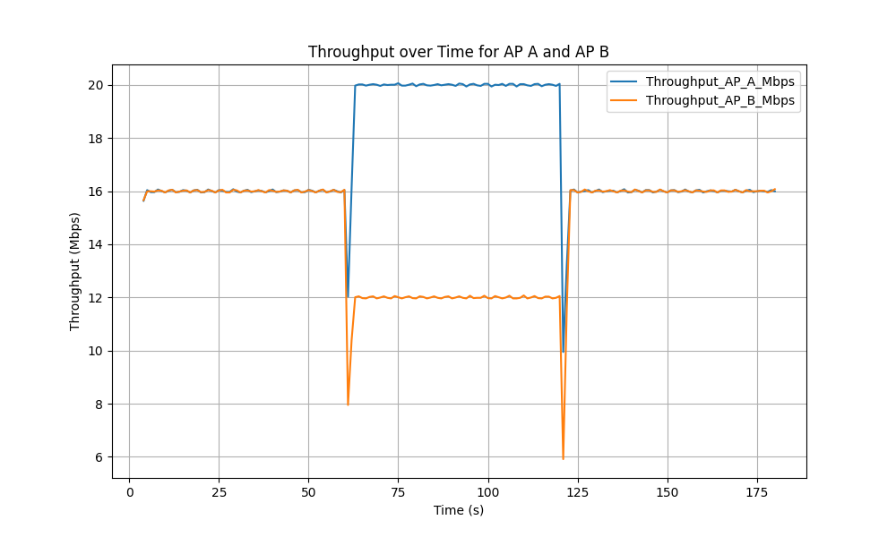

# NS3 Network Simulator

<aside>
📖 **References**

- [ns-3](https://www.nsnam.org/)
- [ns-3 Tutorial](https://www.nsnam.org/docs/tutorial/html/)
- [The ns-3 Network Simulator](https://intronetworks.cs.luc.edu/current/html/ns3.html)
- [ns-3 LTE Module](https://www.nsnam.org/docs/models/html/lte-user.html)
- [ns-3 WiFi Module](https://www.nsnam.org/docs/models/html/wifi-design.html)
- [3GPP NR ns-3 module](https://github.com/QiuYukang/5G-LENA)
</aside>

<aside>
✅ Score (15%): 

- [x]  **NS-3 Installation (30%)**: Provide an installation guide that includes:
    1. **Commands**: List terminal commands used for installation.
    2. **Verification**: Copy & paste terminal logs confirming successful installation.
    3. **Final Check**: Run [`hello-simulator.cc`](https://www.nsnam.org/docs/release/3.19/doxygen/hello-simulator_8cc_source.html) to verify installation.
- [x]  **LTE / WiFi Simulation (50%)**:
    - [x]  **Submission Requirements**: Upload your simulation source code under `./a2/src/` in your branch. For each milestone, provide:
        1. **Input**: Commands or source code (attach hyperlinks from `./a2/src/`).
        2. **Output**: Figures, results, and explanations.
    - [ ]  **Extra Credit (20%)**:
        - **Peer Review Bonus:** Top 3 students based on peer reviews receive extra credit: **Top 1:** +20%, **Top 2:** +15%, **Top 3:** +10%.
        - **Extended Deployment Bonus:** If you deploy **9 nodes in WiFi/LTE** and commit before **March 29, 2025, 19:00 PM**, you get an **extra 10%**.

**3. Milestones & Grading**

- [x]  **Deploy 2 nodes and assign users** (`1-points`):
    1. **Deploy 2 nodes and assign users** (`1-points`):
        1. Deploy 2 nodes as Node A & B;
        2. Assign 16 users for each node:
            - For LTE is called User Equipment (UE)
            - For WiFi is called Station (STA)
        3. Provide a user table (e.g., MAC addresses or STA/UE IDs).
        
        This setup can be formulated as follow:
        
        - **Formula:**
            
            X0=Y0=16
            
        - **Definitions:**
            - (X0) = Initial Users in Node A
            - (Y0) = Initial Users in Node B
- [x]  **Full-Queue Model Transmission & Random mobility Model**
    1. **Full-Queue Model Transmission & Random mobility Model**
        
        Implement a [full-queue model](https://www.nsnam.org/doxygen/d9/db7/fcfs-wifi-queue-scheduler_8cc_source.html). Ensure each STA/UE continuously transmits to AP/BS. (`1-point`)
        
        - **Simulation Duration:** 10 minutes.
        - **User Movement:**
            - **At minute 3:** 25% of users move from Node A → Node B, and 50% from Node B → Node A.
            - **At minute 6:** 50% of users move from Node A → Node B, and 50% from Node B → Node A.
            - For each movement, describe which users that moved from A --> B and B --> A in your .
        - **Formulas:**
            - **Minute 3:** ,
                
                X1=X0×p
                
                Y1=Y0×q
                
            - **Minute 6:**,
                
                X2=X1×p
                
                Y2=Y1×q
                
        - **Definitions:**
            - (p = 25%) → Users moving from Node A to Node B.
            - (q = 50% ) → Users moving from Node B to Node A.
            - (X1,X2) → Users in Node A after each movement.
            - (Y1,Y2) → Users in Node B after each movement.
- [x]  **Analysis Report**:
    1. What is the final users distribution (value of  & )? Show the users table for each movement. (`2-points`)
    2. Show & analyze the figures of the aggregated throughput in Node-A & Node-B through time (`3-points`):
        - X-axis = time & Y-axis = throughput.
        - Analyze & explain your results.
- [x] Show the 3-minutes video simulation (`3-points`)
```
</aside>

## 🧩 1. NS-3 Installation Guide (1 point)

**System:**  
- OS: Ubuntu 24.04 LTS (VirtualBox VM)  
- RAM: 8192 MB  
- CPUs: 4  
- Disk: 50 GB  
- Acceleration: Nested Paging, KVM Paravirtualization  
- Network: NAT (Intel PRO/1000 MT Desktop)

**Installation Steps:**
```bash
sudo apt update
sudo apt install -y git g++ python3 python3-pip cmake
git clone https://gitlab.com/nsnam/ns-3-dev.git ns-3
cd ns-3
./ns3 configure --enable-examples --enable-tests
./ns3 build
```

✅ NS-3 version: [insert version from terminal if needed]  
🧪 Test run: `./ns3 run hello-simulator` — verified output.

---

## 📡 2.  WiFi Simulation (2 points)

### Code Location  
Simulation source code: [`./a2/src/mySimulation.cc`](./a2/src/mySimulation.cc)

### Input: Compile and Run  
```bash
cd ns-3
./ns3 run scratch/mySimulation 2>full_log_comibined.txt
```

### Output:
- The simulation provides throughput ``, `aggregated_throughput.txt`, and  log file `full_log_combined.txt`.
- shell window will show what STA moves when `--- User Initial Assignment Table (at 0s) ---
- 
```


== Moving STAs physically at 60s ==
Moving 4 STAs physically from AP1 area -> AP2 area:
  - STA node 0 moved near AP B.
  - STA node 1 moved near AP B.
  - STA node 2 moved near AP B.
  - STA node 3 moved near AP B.
Moving 8 STAs physically from AP2 area -> AP1 area:
  - STA node 16 moved near AP A.
  - STA node 17 moved near AP A.
  - STA node 18 moved near AP A.
  - STA node 19 moved near AP A.
  - STA node 20 moved near AP A.
  - STA node 21 moved near AP A.
  - STA node 22 moved near AP A.
  - STA node 23 moved near AP A.

== Moving STAs physically at 120s ==
Moving 10 STAs physically from AP1 area -> AP2 area:
  - STA node 4 moved near AP B.
  - STA node 5 moved near AP B.
  - STA node 6 moved near AP B.
  - STA node 7 moved near AP B.
  - STA node 8 moved near AP B.
  - STA node 9 moved near AP B.
  - STA node 10 moved near AP B.
  - STA node 11 moved near AP B.
  - STA node 12 moved near AP B.
  - STA node 13 moved near AP B.
Moving 6 STAs physically from AP2 area -> AP1 area:
  - STA node 24 moved near AP A.
  - STA node 25 moved near AP A.
  - STA node 26 moved near AP A.
  - STA node 27 moved near AP A.
  - STA node 28 moved near AP A.
  - STA node 29 moved near AP A.
                

```
- using script `graph.py` we can get simulation graph result
  

## Milestone 1: Deploy 2 Nodes and Assign Users

**Node Deployment:**

* Two nodes (Node 0, Node 1) are created as WiFi Access Points (AP A, AP B).
    * Source Code Link: Node Creation
* AP A is positioned at (0,0,0) and AP B at (100,0,0).
    * Source Code Link: AP Positioning
* Both APs operate on the same channel and share the SSID `MyWiFiNetwork`.
    * Source Code Link: Shared SSID
    * Source Code Link: AP MAC Setup

**User Assignment:**

* 32 user nodes (Stations - STAs) are created (initialUsersPerNode = 16).
    * Source Code Link: STA Count
    * Source Code Link: STA Node Creation
* STAs 0-15 are initially placed randomly near AP A.
* STAs 16-31 are initially placed randomly near AP B.
    * Source Code Link: Initial AP Assignment Logic
    * Source Code Link: Initial STA Positioning

**Initial User Table:**
```
ID|Initial AP|IP
-----------------------------------------
 0|         A|10.1.1.3
 1|         A|10.1.1.4
 2|         A|10.1.1.5
 3|         A|10.1.1.6
 4|         A|10.1.1.7
 5|         A|10.1.1.8
 6|         A|10.1.1.9
 7|         A|10.1.1.10
 8|         A|10.1.1.11
 9|         A|10.1.1.12
10|         A|10.1.1.13
11|         A|10.1.1.14
12|         A|10.1.1.15
13|         A|10.1.1.16
14|         A|10.1.1.17
15|         A|10.1.1.18
16|         B|10.1.1.19
17|         B|10.1.1.20
18|         B|10.1.1.21
19|         B|10.1.1.22
20|         B|10.1.1.23
21|         B|10.1.1.24
22|         B|10.1.1.25
23|         B|10.1.1.26
24|         B|10.1.1.27
25|         B|10.1.1.28
26|         B|10.1.1.29
27|         B|10.1.1.30
28|         B|10.1.1.31
29|         B|10.1.1.32
30|         B|10.1.1.33
31|         B|10.1.1.34
-----------------------------------------
```
* The simulation prints the initial assignment (based on proximity) and IP addresses at t=0.1s.
* Initial State: X0 = 16 users near AP A, Y0 = 16 users near AP B.
* Output Screenshot Showing Initial User Table:

   
    ## Milestone 2: Full-Queue Model Transmission & Mobility Model

**Full-Queue Model Transmission:**

* Each STA continuously transmits UDP packets at 1 Mbps (DataRate = "1Mbps", PacketSize = 1400).
* `UdpClientHelper` is configured with `MaxPackets = 0` (unlimited) and a calculated `Interval` to ensure continuous sending, approximating a full-queue scenario.
* **Note:** Each STA sends traffic simultaneously towards both AP A and AP B.
    * Source Code Link: Installing Clients to Both APs

**Mobility Model & Simulation Duration:**

* Simulation Duration: 180 seconds.
    * Source Code Link: Simulation Time Variable
    * Source Code Link: Simulator Stop Time
* Mobility: STAs use `ConstantPositionMobilityModel` but their positions are updated instantly at scheduled times using `SetPosition`. Re-association is facilitated by the STA WiFi MAC layer (`ActiveProbing = true`).
    * Source Code Link: STA MAC Active Probing
    * Source Code Link: Mobility Update Function Call
    * Source Code Link: Setting Position in Mobility Function

**User Movement Schedule:**

* At t = 60 seconds: (moveTime1)
    * Percentages: 25% A → B (percentAtoB_M1), 50% B → A (percentBtoA_M1).
    * Number Moving A → B: 16 \* 0.25 = 4 users.
    * Number Moving B → A: 16 \* 0.50 = 8 users.
    * Specific Users Moved:
        * A → B (Near AP B): STAs 0, 1, 2, 3. (Code Link: Move Schedule 1)
        * B → A (Near AP A): STAs 16, 17, ..., 23. (Code Link: Move Schedule 1)
    * Physical Distribution after 60s: X1 = 20 near A, Y1 = 12 near B.
* At t = 120 seconds: (moveTime2)
    * Percentages: 50% A → B (percentAtoB_M2), 50% B → A (percentBtoA_M2). Applied to current populations (20 near A, 12 near B).
    * Number Moving A → B: 20 \* 0.50 = 10 users.
    * Number Moving B → A: 12 \* 0.50 = 6 users.
    * Specific Users Moved:
        * A → B (Near AP B): STAs 4, 5, ..., 13. (Code Link: Move Schedule 2, uses offsets)
        * B → A (Near AP A): STAs 24, 25, ..., 29. (Code Link: Move Schedule 2, uses offsets)
    * Physical Distribution after 120s: X2 = 16 near A, Y2 = 16 near B.

## 📊 3. Analysis Report

**1. Final User Distribution**

* The simulation models the physical movement of STAs between the vicinities of AP A and AP B.

* Initial State (t=0s):
    * Users physically near AP A (X0): 16 (IDs 0-15)
    * Users physically near AP B (Y0): 16 (IDs 16-31)

* State after 1st Movement (t=60s):
    * 4 users (IDs 0-3) move from A → B.
    * 8 users (IDs 16-23) move from B → A.
    * Users physically near AP A (X1): (16 - 4) + 8 = 20
    * Users physically near AP B (Y1): (16 - 8) + 4 = 12
    * Conceptual User Table (Physical Location):
        * Near A: {4..15} ∪ {16..23}
        * Near B: {0..3} ∪ {24..31}

* State after 2nd Movement (t=120s):
    * 10 users (IDs 4-13) move from A → B.
    * 6 users (IDs 24-29) move from B → A.
    * Users physically near AP A (X2): (20 - 10) + 6 = 16
    * Users physically near AP B (Y2): (12 - 6) + 10 = 16
    * Conceptual User Table (Physical Location):
        * Near A: {14, 15} ∪ {16..23} ∪ {24..29}
        * Near B: {0..3} ∪ {30, 31} ∪ {4..13}

* Final Calculated User Distribution (at t=180s):
    * Value of X (Users physically near AP A): 16
    * Value of Y (Users physically near AP B): 16
    * (Note: Only the initial user table is printed by the code; subsequent distributions are derived from the simulation logic.)

**2. Aggregated Throughput Analysis**

* The aggregated throughput (rate of data successfully received) at each AP's sink application was logged every second into `aggregated_throughput.txt` (see Appendix C).
* The plot below was generated using `graph.py` (see Appendix B).

* Throughput Plot:

    
    * Analysis of Throughput Trends:

    * Initial Phase (t=4s to ~60s): After clients start at t=3s, throughput ramps up. Both AP A and AP B achieve a stable throughput of approximately 16 Mbps each. This balanced throughput matches the initial balanced user distribution (16 STAs near each AP). The total system throughput (~32 Mbps) corresponds to the total number of STAs (32) multiplied by their individual transmission rate (1 Mbps).
    * First Movement Impact (t ≈ 60s): At t=60s, the physical distribution changes to 20 STAs near A and 12 near B. The plot shows an immediate corresponding shift in throughput:
        * AP A's throughput jumps to approximately 20 Mbps.
        * AP B's throughput drops to approximately 12 Mbps.
        * This indicates that STAs quickly re-associate with their nearest AP after moving, and the network load redistributes accordingly.
    * Intermediate Phase (t=~61s to ~120s): Throughput remains stable at the new levels (~20 Mbps for A, ~12 Mbps for B), reflecting the unbalanced user distribution during this period.
    * Second Movement Impact (t ≈ 120s): At t=120s, the physical distribution returns to 16 STAs near A and 16 near B. The plot shows the throughput adjusting back:
        * AP A's throughput decreases to approximately 16 Mbps.
        * AP B's throughput increases to approximately 16 Mbps.
        * This further confirms that the aggregated throughput at each AP closely follows the number of users associated with it.
    * Final Phase (t=~121s to 180s): The system returns to a balanced state, with both APs sustaining approximately 16 Mbps each, similar to the initial phase.

* Conclusion: The simulation demonstrates that user mobility significantly impacts load distribution in a WiFi network with multiple APs using a shared SSID. The throughput measured at each AP dynamically adjusts to reflect the number of users physically located in its vicinity, indicating effective re-association managed by the ns-3 WiFi STA MAC layer (aided by Active Probing). The total system throughput remains relatively constant, dictated by the number of active users and their transmission rates.

## 🎬 4. Video Simulation

* A video recording demonstrating the simulation run  as required is provided in the same folder as this description

