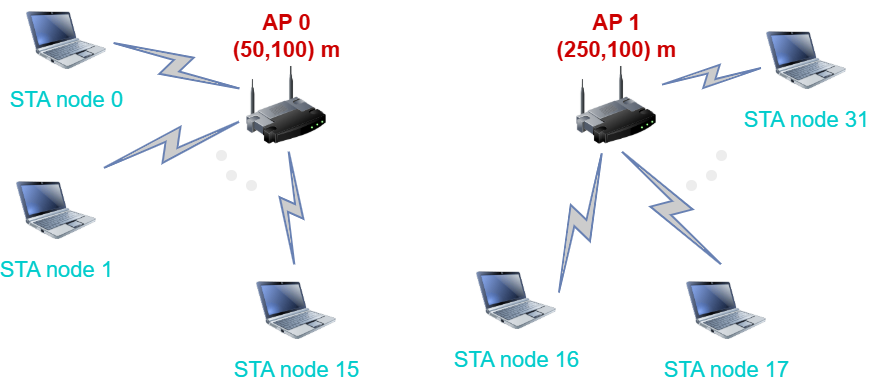
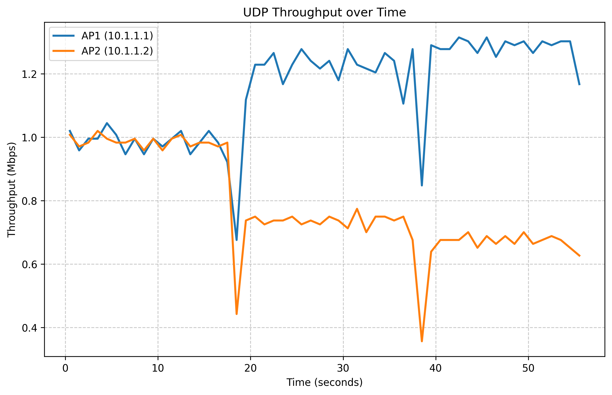

# A2 Study Notes (Deadline: 2025/04/11, 23.59).

## Table of contents.

- [Setting up ns-3.](#setting-up-ns-3)
  - [Requirements.](#requirements)
  - [Downloading ns-3.](#downloading-ns-3)
  - [Building ns-3.](#building-ns-3)
- [Basic concepts about ns-3.](#basic-concepts-about-ns-3)
  - [Key abstractions.](#key-abstractions)
    - [Nodes.](#nodes)
    - [Applications.](#applications)
    - [Channel.](#channel)
    - [Net device.](#net-device)
    - [Topology helpers.](#topology-helpers)
  - [Key modules for the simulation.](#key-modules-for-the-simulation)
    - [Internet module.](#internet-module)
    - [Application module.](#application-module)
    - [Mobility module.](#mobility-module)
    - [Wi-Fi module.](#wi-fi-module)
- [wifi-mobility-ass02.cc script.](#wifi-mobility-ass02-cc-script)
  - [How to run the script.](#how-to-run-the-script)
  - [ns-3 script description.](#ns-3-script-description)
- [throughput-plot.py script.](#throughput-plot-py-script)
  - [Requirements.](#requirements-1)
  - [Python script description.](#python-script-description)
  - [Running the script.](#running-the-script)
  - [Short analysis of the results.](#short-analysis-of-the-results)

---

## Setting up ns-3.

The following section will walk you through the steps to set up `ns-3.44` on your system. This is based on the official [nsnam.org](https://nsnam.org) tutorial, you can visit the link for other installation methods (from GitLab, etc.).

### Requirements.

I assume you are using a Linux-based system (e.g., Ubuntu). The following tools are required to get started:

| Prerequisite | Package/version                                 |
| ------------ | ----------------------------------------------- |
| C++ compiler | `clang++` or `g++` (`g++` version 9 or greater) |
| Python       | `python3` version >= 3.8                        |
| CMake        | `cmake` version >= 3.13                         |
| Build system | `make`                                          |
| tar          | any recent version of `tar`                     |

To facilitate this, I provided the `install.sh` script that will install the required packages for you. You can run it with the following command:

```bash
sudo ./install.sh
```

### Downloading ns-3.

To download ns-3 in a directory named `workspace` inside your root directory, you can use the following commands:

```bash
$ cd
$ mkdir workspace
$ cd workspace
$ wget https://www.nsnam.org/release/ns-allinone-3.44.tar.bz2
$ tar xjf ns-allinone-3.44.tar.bz2
```

You can choose a different location if that is what you prefer, just navigate to the desired directory and run the last two commands.

### Building ns-3.

If you downloaded ns-3 as described above, you can build it by executing the `build.py` script in the `ns-allinone-3.44` directory found after uncompressing the file downloaded in the previous step. Follow the snippet below:

```bash
$ ./build.py --enable-examples --enable-tests
```

The `--enable-examples` flag will build the examples, while the `--enable-tests` flag will build the tests. You can skip these flags if you don't need them.

---

## Basic concepts about ns-3.

> [!TLDR] **ns-3** is a discrete-event network simulator primarily used for research and educational purposes, allowing for the modeling and simulation of network systems.
> It's an open-source project written in C++, with Python bindings, designed to provide a realistic simulation environment for studying network protocols and behaviors.
> Essentially, it helps researchers test and analyze network designs in a controlled, virtual setting.

### Key abstractions.

#### Nodes.

- Equivalent to the Internet **host** or **end system**.
- Basic computing device, represented by C++ class `Node`.
- Think of it as computer to which you add functionalities like applications, protocol stacks or peripheral cards.

#### Applications.

- Applications in ns3 run on `Nodes` to drive the simulations.
- They are represented by the C++ class `Application`.
- Developers can specialize the `Application` class to create new applications.
- For example: `UdpEchoClientApplication` and `UdpEchoServerApplication` are specializations of the `Application` class that run on nodes, simulating a client/server application set to generate and echo network packets.

#### Channel.

- The media in which data flows from one `Node` to another.
- Represented by the C++ class `Channel`.
- We use specialized versions of the `Channel` class like `CsmaChannel`, `PointToPointChannel`, `WifiChannel`, etc.
- For example `CsmaChannel` models a version of Carrier Sense Multiple Access communication medium, giving us Ethernet-like functionality.

#### Net device.

- Net devices in ns-3 represent network interface cards (NICs) that facilitate communication between nodes.
- They abstract the lower layers of networking and interact with channels to transmit and receive packets.
- Key features:
  - Attach to a node to enable connectivity.
  - Connect to a channel to communicate with other devices.
  - Support attributes like data rate, MTU, and queue size.
  - Handle packet transmission and reception.
  - Integrate with protocol stacks (e.g., TCP/IP via `InternetStackHelper`).

#### Topology helpers.

- Topology helpers simplify the creation and configuration of network topologies by automating node placement, connections, and IP assignments.
- Types of Topology Helpers:
  - Basic Topology Helpers (e.g., `PointToPointHelper`, `CsmaHelper`).
    - Quickly establish simple networks (e.g., point-to-point or LAN setups).
  - Grid and Random Topology Helpers (e.g., `GridPositionAllocator`, `RandomBoxPositionAllocator`).
    - Automate node placement in structured or random layouts.
  - Internet Stack Helper (`InternetStackHelper`).
    - Installs the TCP/IP stack on nodes to enable communication.

### Key modules for the simulation.

#### Internet module.

The internet module of ns-3 is responsible for simulating internet protocols and devices. It provides a set of classes and functions that can be used to create and configure internet protocols, including TCP, UDP, IP, and others.

##### Key Classes and Functions

- `Ipv4`: Represents the IPv4 protocol.
- `Ipv6`: Represents the IPv6 protocol.
- `Tcp`: Represents the TCP protocol.
- `Udp`: Represents the UDP protocol.
- `InternetStack`: Represents an internet stack that includes TCP, UDP, IP, and other protocols.
- `Ipv4GlobalRouting`: Performs IPv4 global routing.
- `Ipv6GlobalRouting`: Performs IPv6 global routing.

##### Internet Stack

The internet stack is created using the `InternetStackHelper` class, which installs TCP, UDP, IP, and other protocols on a node. The `Ipv4AddressHelper` and `Ipv6AddressHelper` classes are used to allocate IP addresses to devices.

##### Routing

The internet module includes several routing classes, including `Ipv4GlobalRouting` and `Ipv6GlobalRouting`, which perform global routing for IPv4 and IPv6, respectively. The `DistanceVectorRoutingHelper` class is used to create distance-vector routing protocols.

##### Socket API

The internet module includes a socket API that allows applications to communicate with each other using TCP and UDP sockets. The `Socket` class represents a socket, and the `SocketFactory` class creates sockets.

#### Application module.

The application module of ns-3 is responsible for simulating user-level applications that interact with the network. It provides a set of classes and functions that can be used to create and configure applications, including network protocols, transport protocols, and upper-layer protocols.

##### Key Classes and Functions

- `Application`: Represents a user-level application.
- `PacketSink`: Represents a packet sink, which receives packets from the network.
- `PacketSource`: Represents a packet source, which sends packets into the network.
- `OnOffApplication`: Represents an on-off application, which sends packets at a constant rate.
- `V4PingApplication`: Represents a ping application that sends ICMP echo requests.
- `UdpEchoServerApplication`: Represents a UDP echo server application.
- `UdpEchoClientApplication`: Represents a UDP echo client application.

##### Application Types

The application module includes several types of applications, including:

- **Constant Bit Rate (CBR) applications**: Send packets at a constant rate.
- **Variable Bit Rate (VBR) applications**: Send packets at a variable rate.
- **On-off applications**: Send packets at a constant rate, but with a random on-off pattern.

##### Scheduling

The application module includes a scheduling mechanism that allows applications to schedule packet transmissions. The `PacketScheduler` class represents a packet scheduler, and the `ConstantRatePacketScheduler` class is a specific type of packet scheduler that schedules packets at a constant rate.

##### Event Handling

The application module includes an event handling mechanism that allows applications to respond to events such as packet arrivals and transmissions. The `Event` class represents an event, and the `EventHandler` class represents an event handler.

#### Mobility module.

The mobility module of ns-3 is responsible for simulating the movement of nodes in a wireless network. It provides a set of classes and functions that can be used to create and configure mobile nodes, including their movement patterns and trajectories.

##### Key Classes and Functions

- `MobilityModel`: Represents a mobility model, which describes the movement of a node.
- `WaypointMobilityModel`: Represents a mobility model that moves a node between a list of waypoints.
- `RandomWalk2dMobilityModel`: Represents a mobility model that moves a node in a random walk pattern.
- `RandomWalk3dMobilityModel`: Represents a mobility model that moves a node in a 3D random walk pattern.
- `ConstantPositionMobilityModel`: Represents a mobility model that keeps a node at a constant position.
- `BoxMobilityModel`: Represents a mobility model that moves a node within a rectangular box.

##### Mobility Patterns

The mobility module includes several types of mobility patterns, including:

- **Waypoint mobility**: A node moves between a list of waypoints.
- **Random walk**: A node moves in a random walk pattern.
- **Constant position**: A node remains at a constant position.
- **Box mobility**: A node moves within a rectangular box.

##### Trajectory

The mobility module allows nodes to follow a trajectory, which is a sequence of positions in space and time. The `Trajectory` class represents a trajectory, and the `TrajectoryHelper` class creates trajectories.

##### Speed and Acceleration

The mobility module allows nodes to have a speed and acceleration, which are used to calculate the node's position and velocity over time. The `SpeedCalculator` class calculates the speed of a node, and the `AccelerationCalculator` class calculates the acceleration of a node.

#### Wi-Fi module.

The WiFi module of ns-3 is responsible for simulating wireless local area network (WLAN) protocols and devices. It provides a set of classes and functions that can be used to create and configure WiFi devices, including their physical and link layer behavior.

##### Key Classes and Functions

- `WifiMac`: Represents a WiFi MAC (Medium Access Control) layer.
- `WifiPhy`: Represents a WiFi PHY (Physical) layer.
- `WifiNetDevice`: Represents a WiFi network device.
- `WifiHelper`: Creates and configures WiFi devices, including their MAC and PHY layers.
- `YansWifiPhy`: Represents a Yans PHY, which is a WiFi PHY implementation.
- `YansWifiChannel`: Represents a Yans channel, which is a WiFi channel implementation.

##### WiFi Modes

The WiFi module includes several WiFi modes, including:

- **DSSS (Direct Sequence Spread Spectrum)**: A modulation technique used in WiFi.
- **OFDM (Orthogonal Frequency Division Multiplexing)**: A modulation technique used in WiFi.
- **HT (High Throughput)**: A WiFi mode that provides high throughput.
- **VHT (Very High Throughput)**: A WiFi mode that provides very high throughput.

##### WiFi Channel

The WiFi module includes a WiFi channel implementation, which represents the wireless medium that WiFi devices use to communicate. The `YansWifiChannel` class represents a WiFi channel.

##### WiFi Physical Layer

The WiFi module includes a WiFi physical layer implementation, which represents the physical aspects of WiFi communication. The `YansWifiPhy` class represents a WiFi PHY.

##### WiFi MAC Layer

The WiFi module includes a WiFi MAC layer implementation, which represents the MAC layer aspects of WiFi communication. The `WifiMac` class represents a WiFi MAC.

---

## `wifi-mobility-ass02.cc` script.

### How to run the script.

The script file `wifi-mobility-ass02.cc` located in the `a2/src` directory of this repository is the ns-3 program developed for the assignment. Personalized programs in ns-3 must be stored in a sub-directory inside the `scratch` directory, this is an example of ns-3 workspace directory structure, you can rename your directories as you prefer:

```bash
ns3-workspace directory:
└── ns3-allinone-3.44/
    ├── README.md
    ├── build.py
    ├── constants.py
    ├── util.py
    ├── bake/
    ├── netanim-3.109/
    └── ns-3.44/
        ├── README.md
        ├── CHANGES.md
        ├── AUTHORS
        ├── bindings/
        ├── build/
        ├   ...
        └── scratch/
            ├── CMakeLists.txt
            ├── README.md
            ├── subdir/
            ├── nested-subdir/
            └── wifi-ass02/
                └── wifi-mobility-ass02.cc
```

Once the script is in the correct directory, you can run it using the following command while in the `ns-3-allinone-3.44/ns-3.44` directory:

```bash
$ ./ns3 run scratch/wifi-ass02/wifi-mobility-ass02
```

You should see an output like the following one:

```bash
================= Lucas Herranz Gancedo (M11351802) ===============

Starting simulation with 32 STAs and 60 seconds.

AP1 and AP2 are at (50,100) and (250,100) respectively.

STAs are randomly positioned within a 40m radius of each AP.

=======================================================================

Scheduling STA mobility at 20s
→ STA node 0 (AP1 → AP2) scheduled to move at 20s
→ STA node 1 (AP1 → AP2) scheduled to move at 20s
→ STA node 2 (AP1 → AP2) scheduled to move at 20s
→ STA node 3 (AP1 → AP2) scheduled to move at 20s
→ STA node 16 (AP2 → AP1) scheduled to move at 20s
→ STA node 17 (AP2 → AP1) scheduled to move at 20s
→ STA node 18 (AP2 → AP1) scheduled to move at 20s
→ STA node 19 (AP2 → AP1) scheduled to move at 20s
→ STA node 20 (AP2 → AP1) scheduled to move at 20s
→ STA node 21 (AP2 → AP1) scheduled to move at 20s
→ STA node 22 (AP2 → AP1) scheduled to move at 20s
→ STA node 23 (AP2 → AP1) scheduled to move at 20s
Scheduling STA mobility at 40s
→ STA node 4 (AP1 → AP2) scheduled to move at 40s
→ STA node 5 (AP1 → AP2) scheduled to move at 40s
→ STA node 6 (AP1 → AP2) scheduled to move at 40s
→ STA node 7 (AP1 → AP2) scheduled to move at 40s
→ STA node 8 (AP1 → AP2) scheduled to move at 40s
→ STA node 24 (AP2 → AP1) scheduled to move at 40s
→ STA node 25 (AP2 → AP1) scheduled to move at 40s
→ STA node 26 (AP2 → AP1) scheduled to move at 40s
→ STA node 27 (AP2 → AP1) scheduled to move at 40s
→ STA node 28 (AP2 → AP1) scheduled to move at 40s
→ STA node 29 (AP2 → AP1) scheduled to move at 40s
AP1 received: 7701504 bytes
AP2 received: 5259456 bytes
```

### ns-3 script description.

The simulation creates the following topology:



These are two APs (AP1 and AP2) located at positions (50,100) and (250,100) respectively. The APs are equipped with UDP packet sinks, and initially each AP has 16 STAs (32 STAs in total) associated with it. The STAs are randomly positioned within a 40m radius of their respective APs.

The simulation runs for 60 seconds, from second 2 to second 58 of the simulation the STAs are constantly sending 1472 bytes long packets at a 5 packets per second rate to the AP they are associated with.

Mobility of STAs is changed at the following two time stamps:

- At **20 seconds**, 25% of the STAs associated with AP1 (4 STAs) are scheduled to move to AP2, and 50% of the STAs associated with AP2 (8 STAs) are scheduled to move to AP1.
- At **40 seconds**, 25% of the STAs now associated with AP1 (5 STAs) are scheduled to move to AP2, and 50% of the STAs now associated with AP2 (6 STAs) are scheduled to move to AP1.

The script measures the number of bytes received by each AP at the end of the simulation, and prints the results to the console. The output shows the total number of bytes received by each AP during the simulation.

Additionally, two `pcap` files are generated, one for each AP, containing the packets sent and received by the APs during the simulation. The `pcap` files can be analyzed using Wireshark or similar tools to visualize the packet flow and analyze the network behavior. In my case I processed these `pcap` files in Python to analyze throughput throughout the simulation.

---

## `throughput-plot.py` script.

Lastly, I developed a python script that analyzes the `pcap` files generated by the simulation and plots the throughput of each AP over time. The script uses the `scapy` library to read the `pcap` files and calculate the throughput based on the number of packets received by each AP.

### Requirements

I provided the `requirements.txt` file with the required packages to run the script. You can install them using the following command:

```bash
$ pip install -r requirements.txt
```

### Python script description

At a high level, this Python script analyzes two `pcap` files, filters for UDP packets sent to specific destination IPs (AP1 and AP2), calculates the throughput over time in defined windows, and plots a throughput-over-time graph.

#### `calculate_throughput()` function

**Purpose**: Filters packets from a `pcap` file, calculates throughput over time windows, and returns the results.

#### Main function: argument parsing and plotting

**Takes**:

- Two `pcap` files.
- Two destination IPs (AP1 and AP2) but defaults are provided.
- Time window size for throughput calculation (default: 1 second).
- Output filename for the plot (default: `throughput.png`).

**Calculates**: Throughput for each AP over time from both `pcap` files using the `calculate_throughput()` function.

**Plots**:

- Throughput in **Mbps** over time using `matplotlib`.
- Uses fixed colors, default styles (can be improved).
- Converts throughput from bps to Mbps for plotting.

#### Plot handling

- Plots both traces if data is present.
- Saves to `throughput.png` or custom file.
- Uses `plt.show()` to display the plot.

### Running the script

You can use several arguments to run the script depending on your case, you can check the arguments available by running the following command:

```bash
$ python3 throughput-plot.py --help
usage: throughput-plot.py [-h] [--dst1 DST1] [--dst2 DST2] [--window WINDOW]
                          [--output OUTPUT]
                          pcap1 pcap2

Analyze throughput from PCAP files

positional arguments:
  pcap1            First PCAP file
  pcap2            Second PCAP file

options:
  -h, --help       show this help message and exit
  --dst1 DST1      Destination IP for first PCAP (default: 10.1.1.1)
  --dst2 DST2      Destination IP for second PCAP (default: 10.1.1.2)
  --window WINDOW  Time window in seconds for throughput calculation (default: 1.0)
  --output OUTPUT  Output file name (default: throughput.png)
```

In our case, since we have the two `pcap` files generated by the simulation, we can run the script with the following command:

```bash
$ python3 throughput-plot.py pcap-files/wifi-ap1-0-0.pcap pcap-files/wifi-ap2-1-0.pcap
```

As discussed earlier, this will pop out the throughput plots for both APs, and save them in the current directory as `throughput.png`.



### Short analysis of the results

From the plot we can see that the throughput of AP1 and AP2 is quite similar, with some fluctuations. The throughput of both APs drops significantly at the time of mobility change (20s and 40s), which is expected as the STAs are switching their associations. After the mobility changes, the throughput stabilizes again, indicating that the network is able to adapt to the changes in STA associations.
