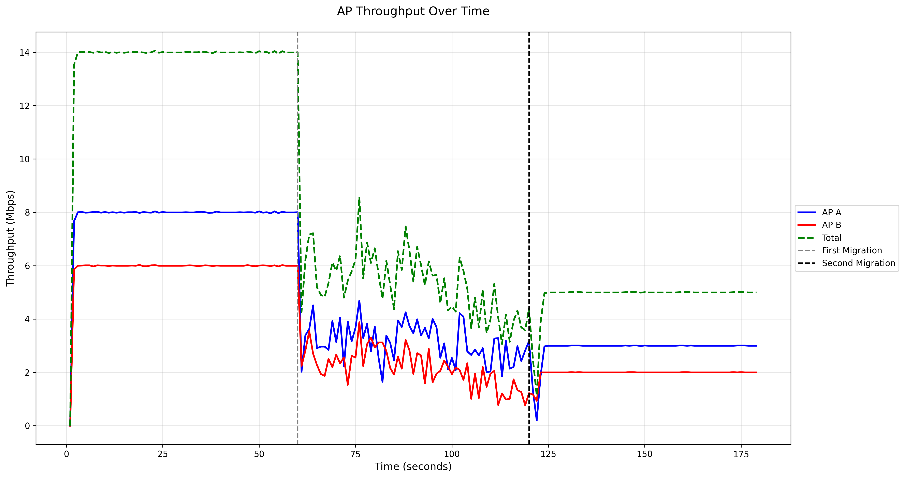
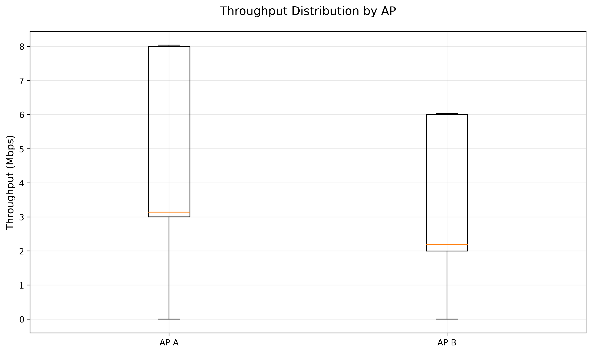

# Wireless Network Handover Analysis Report
Generated on: 2025-04-10 13:23:34

## Overview
This report analyzes the performance of a wireless network handover simulation with two access points (AP A and AP B).

## Key Performance Metrics
- **Average Throughput**
  - AP A: 4.64 Mbps
  - AP B: 3.35 Mbps
- **Peak Throughput**
  - AP A: 8.04 Mbps
  - AP B: 6.03 Mbps
- **Throughput Stability (Standard Deviation)**
  - AP A: 2.42
  - AP B: 1.91

## User Distribution Analysis
|    | Time   |   Users at AP A |   Users at AP B |   Total Users | Distribution Ratio   |
|---:|:-------|----------------:|----------------:|--------------:|:---------------------|
|  0 | t=0s   |              16 |              16 |            32 | 16.0:16.0            |
|  1 | t=60s  |              20 |              12 |            32 | 20.0:12.0            |
|  2 | t=120s |              16 |              16 |            32 | 16.0:16.0            |

## Visualization Results

## Conclusions
1. The network demonstrated variable 
    throughput performance
2. User distribution remained balanced after final migration
3. Total network capacity was affected throughout the handover process
