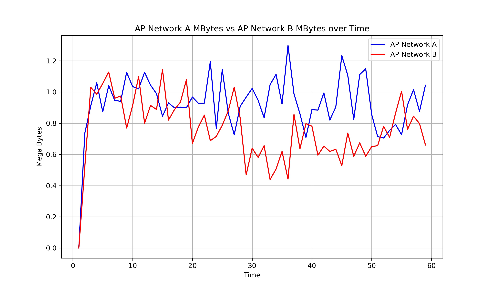

# **Multimedia Wireless Network A2**
Video Results: http://youtube.com

- [**Multimedia Wireless Network A2**](#multimedia-wireless-network-a2)
  - [1. Introduction](#1-introduction)
  - [2. NS-3 Installation](#2-ns-3-installation)
    - [2.1 Prerequisites](#21-prerequisites)
    - [2.2 Download and Install NS-3](#22-download-and-install-ns-3)
    - [2.3 Test NS-3](#23-test-ns-3)
  - [3. WiFi Simulation](#3-wifi-simulation)
    - [3.1 Deploy 2 nodes and assign users](#31-deploy-2-nodes-and-assign-users)
  - [4. Simulation](#4-simulation)
  - [5. Results and analysis](#5-results-and-analysis)
  - [References](#references)


## 1. Introduction
NS-3 is a discrete-event network simulator, primarily used for research and educational purposes. It is an open-source project that provides a flexible and extensible platform for simulating various network protocols and scenarios. NS-3 is widely used in academia and industry for network research, performance evaluation, and protocol development.

## 2. NS-3 Installation
### 2.1 Prerequisites
* The NS-3 is installed in a virtual machine running on VirtualBox with the following specifications:
  
    | Operating System | Processor | Memory | Disk Space
    |----------|----------|----------|----------|
    |   Ubuntu 20.04 LTS   |   4 vCPU   |   4 GB   | 50 GB   |

* Install prerequisites for NS-3 on Ubuntu 20.04 LTS:
```bash
sudo apt-get update
sudo apt-get install g++ python3 cmake make
```

```bash
Reading package lists... Done
Building dependency tree       
Reading state information... Done
g++ is already the newest version (4:9.3.0-1ubuntu2).
make is already the newest version (4.2.1-1.2).
python3 is already the newest version (3.8.2-0ubuntu2).
cmake is already the newest version (3.16.3-1ubuntu1.20.04.1).
The following packages were automatically installed and are no longer required:
  cabextract fuseiso
Use 'sudo apt autoremove' to remove them.
0 upgraded, 0 newly installed, 0 to remove and 408 not upgraded.
```

All of the prerequisites are already installed

### 2.2 Download and Install NS-3

* Clone the NS-3 repository from repository:
```bash
git clone https://gitlab.com/nsnam/ns-3-dev.git
```
```
Cloning into 'ns-3-dev'...
remote: Enumerating objects: 221295, done.
remote: Counting objects: 100% (3350/3350), done.
remote: Compressing objects: 100% (1256/1256), done.
remote: Total 221295 (delta 2091), reused 3279 (delta 2083), pack-reused 217945 (from 1)
Receiving objects: 100% (221295/221295), 172.66 MiB | 2.86 MiB/s, done.
Resolving deltas: 100% (185637/185637), done.
Updating files: 100% (3915/3915), done.
```

* Checkout the 3.44 version of NS-3:
```bash
cd ns-3-dev
git checkout -b ns-3.44-branch ns-3.44
```
```
Switched to a new branch 'ns-3.44-branch'
```

* Configure NS-3 using the following command:
```bash
./ns3 configure --enable-examples --enable-tests
```
```
Warn about uninitialized values.
-- The CXX compiler identification is GNU 10.5.0
-- The C compiler identification is GNU 10.5.0
-- Check for working CXX compiler: /usr/bin/g++-10
-- Check for working CXX compiler: /usr/bin/g++-10 -- works
-- Detecting CXX compiler ABI info
-- Detecting CXX compiler ABI info - done
-- Detecting CXX compile features
-- Detecting CXX compile features - done
-- Check for working C compiler: /usr/bin/gcc-10
-- Check for working C compiler: /usr/bin/gcc-10 -- works
-- Detecting C compiler ABI info
-- Detecting C compiler ABI info - done
-- Detecting C compile features
-- Detecting C compile features - done
-- Using default output directory /home/ubuntu/ns-3-dev/build

**Output omitted for brevity**

-- Configuring done
-- Generating done
-- Build files have been written to: /home/ubuntu/ns-3-dev/cmake-cache
Finished executing the following commands:
mkdir cmake-cache
/usr/bin/cmake -S /home/ubuntu/ns-3-dev -B /home/ubuntu/ns-3-dev/cmake-cache -DCMAKE_BUILD_TYPE=default -DNS3_ASSERT=ON -DNS3_LOG=ON -DNS3_WARNINGS_AS_ERRORS=OFF -DNS3_NATIVE_OPTIMIZATIONS=OFF -DNS3_EXAMPLES=ON -DNS3_TESTS=ON -G Unix Makefiles --warn-uninitialized
```

* Build NS-3 using the following command:
```
./ns3 build
```
```
Scanning dependencies of target stdlib_pch-default
[  0%] Building CXX object CMakeFiles/stdlib_pch-default.dir/cmake_pch.hxx.gch
[  0%] Building CXX object CMakeFiles/stdlib_pch-default.dir/build-support/empty.cc.o
Scanning dependencies of target stdlib_pch_exec
[  0%] Building CXX object CMakeFiles/stdlib_pch_exec.dir/cmake_pch.hxx.gch
[  0%] Building CXX object CMakeFiles/stdlib_pch_exec.dir/build-support/empty-main.cc.o
[  0%] Linking CXX executable ns3.44-stdlib_pch_exec-default
Scanning dependencies of target core
[  1%] Building CXX object src/core/CMakeFiles/core.dir/model/int64x64-128.cc.o
[  1%] Building CXX object src/core/CMakeFiles/core.dir/model/unix-fd-reader.cc.o
[  1%] Building CXX object src/core/CMakeFiles/core.dir/model/example-as-test.cc.o
[  1%] Building CXX object src/core/CMakeFiles/core.dir/helper/csv-reader.cc.o
[  1%] Building CXX object src/core/CMakeFiles/core.dir/helper/random-variable-stream-helper.cc.o
[  1%] Building CXX object src/core/CMakeFiles/core.dir/helper/event-garbage-collector.cc.o
[  1%] Building CXX object src/core/CMakeFiles/core.dir/model/time.cc.o
[  1%] Building CXX object src/core/CMakeFiles/core.dir/model/event-id.cc.o
[  1%] Building CXX object src/core/CMakeFiles/core.dir/model/scheduler.cc.o
[  1%] Building CXX object src/core/CMakeFiles/core.dir/model/list-scheduler.cc.o

**Output omitted for brevity**

Scanning dependencies of target dsr-example
Scanning dependencies of target dsr-test
Scanning dependencies of target manet-routing-compare
[ 98%] Building CXX object src/dsr/CMakeFiles/dsr-test.dir/test/dsr-test-suite.cc.o
[ 99%] Building CXX object src/dsr/examples/CMakeFiles/dsr-example.dir/dsr-example.cc.o
[ 99%] Building CXX object examples/routing/CMakeFiles/manet-routing-compare.dir/manet-routing-compare.cc.o
[ 99%] Linking CXX shared library ../../../build/lib/libns3.44-dsr-test-default.so
Scanning dependencies of target scratch_subdir_scratch-subdir
[ 99%] Building CXX object scratch/CMakeFiles/scratch_subdir_scratch-subdir.dir/subdir/scratch-subdir-additional-header.cc.o
[ 99%] Building CXX object scratch/CMakeFiles/scratch_subdir_scratch-subdir.dir/subdir/scratch-subdir.cc.o
[ 99%] Linking CXX executable ../../build/scratch/subdir/ns3.44-scratch-subdir-default
Scanning dependencies of target scratch_scratch-simulator
[ 99%] Building CXX object scratch/CMakeFiles/scratch_scratch-simulator.dir/scratch-simulator.cc.o
[ 99%] Linking CXX executable ../../../../build/src/dsr/examples/ns3.44-dsr-example-default
Scanning dependencies of target print-introspected-doxygen
[100%] Building CXX object utils/CMakeFiles/print-introspected-doxygen.dir/print-introspected-doxygen.cc.o
[100%] Linking CXX executable ../../../build/examples/routing/ns3.44-manet-routing-compare-default
[100%] Linking CXX executable ../../build/scratch/ns3.44-scratch-simulator-default
Scanning dependencies of target test-runner
[100%] Building CXX object utils/CMakeFiles/test-runner.dir/test-runner.cc.o
[100%] Linking CXX executable ../../build/utils/ns3.44-test-runner-default
[100%] Linking CXX executable ../../build/utils/ns3.44-print-introspected-doxygen-default
Finished executing the following commands:
/usr/bin/cmake --build /home/joshevan/ns-3-dev/cmake-cache -j 3
```
### 2.3 Test NS-3
* Once the build is complete, you can run the test suite to ensure that everything is working correctly:
```bash
./test.py
```
```
Finished executing the following commands:
/usr/bin/cmake --build /home/joshevan/ns-3-dev/cmake-cache -j 3
[0/790] PASS: TestSuite circular-aperture-antenna-test
[1/790] PASS: TestSuite degrees-radians
[2/790] PASS: TestSuite angles
[3/790] PASS: TestSuite cosine-antenna-model
[4/790] PASS: TestSuite isotropic-antenna-model
[5/790] PASS: TestSuite parabolic-antenna-model
[6/790] PASS: TestSuite adjacency-matrix-test
[7/790] PASS: TestSuite uniform-planar-array-test
[8/790] PASS: TestSuite aodv-routing-id-cache
[9/790] PASS: TestSuite routing-aodv
[10/790] PASS: TestSuite routing-aodv-loopback
[11/790] PASS: TestSuite routing-aodv-regression
[12/790] PASS: TestSuite applications-udp-client-server
[13/790] PASS: TestSuite applications-bulk-send
[14/790] PASS: TestSuite buildings-channel-condition-model
[15/790] PASS: TestSuite buildings-helper
[16/790] PASS: TestSuite buildings-pathloss-test
[17/790] PASS: TestSuite applications-three-gpp-http-client-server
[18/790] PASS: TestSuite buildings-penetration-losses
[19/790] PASS: TestSuite building-position-allocator
[20/790] PASS: TestSuite buildings-shadowing-test
[21/790] PASS: TestSuite outdoor-random-walk-model

** Output omitted for brevity**

[770/790] PASS: Example src/energy/examples/basic-energy-model-test
[771/790] PASS: Example src/csma/examples/csma-multicast
[772/790] PASS: Example src/csma/examples/csma-broadcast
[773/790] PASS: Example src/csma/examples/csma-one-subnet
[774/790] PASS: Example src/csma/examples/csma-ping
[775/790] PASS: Example src/csma/examples/csma-raw-ip-socket
[776/790] PASS: Example src/core/examples/main-callback
[777/790] PASS: Example src/core/examples/sample-simulator
[778/790] PASS: Example src/core/examples/main-ptr
[779/790] PASS: Example src/core/examples/sample-random-variable
[780/790] PASS: Example src/csma/examples/csma-packet-socket
[781/790] PASS: Example src/config-store/examples/config-store-save
[782/790] PASS: Example src/core/examples/test-string-value-formatting
[783/790] PASS: Example src/buildings/examples/outdoor-group-mobility-example --useHelper=0
[784/790] PASS: Example src/buildings/examples/buildings-pathloss-profiler
[785/790] PASS: Example src/buildings/examples/outdoor-group-mobility-example --useHelper=1
[786/790] PASS: Example src/bridge/examples/csma-bridge
[787/790] PASS: Example src/bridge/examples/csma-bridge-one-hop
[788/790] PASS: Example src/lr-wpan/examples/lr-wpan-error-distance-plot
[789/790] PASS: Example src/lte/examples/lena-radio-link-failure --numberOfEnbs=2 --useIdealRrc=0 --interSiteDistance=700 --simTime=17
789 of 790 tests passed (789 passed, 0 skipped, 0 failed, 1 crashed, 0 valgrind errors)
List of CRASHed tests:
    threaded-simulator
```
Only one test failed, which is the threaded-simulator test. It means that majority of the tests passed successfully. The simulator is ready to use.


## 3. WiFi Simulation

### 3.1 Deploy 2 nodes and assign users
Below is the code to deploy 2 nodes and assign users to them. The code creates two access points (APs) and 16 stations (STAs) for each AP. The MAC addresses of the STAs are saved in a CSV file.

```c++
#include "ns3/core-module.h"
#include "ns3/network-module.h"
#include "ns3/internet-module.h"
#include "ns3/wifi-module.h"
#include "ns3/mobility-module.h"
#include "ns3/applications-module.h"
#include "ns3/ssid.h"
#include <fstream>

using namespace ns3;

// Function to save MAC addresses to a CSV file
void SaveMacAddresses(NodeContainer &staNodesA, NodeContainer &staNodesB) {
  std::ofstream macFile("sta_mac_addresses.csv");
  macFile << "STA,MAC Address" << std::endl;

  for (uint32_t i = 0; i < staNodesA.GetN(); ++i) {
    Ptr<NetDevice> device = staNodesA.Get(i)->GetDevice(0);
    Mac48Address mac = Mac48Address::ConvertFrom(device->GetAddress());
    macFile << "STA-A-" << i+1 << "," << mac << std::endl;
  }

  for (uint32_t i = 0; i < staNodesB.GetN(); ++i) {
    Ptr<NetDevice> device = staNodesB.Get(i)->GetDevice(0);
    Mac48Address mac = Mac48Address::ConvertFrom(device->GetAddress());
    macFile << "STA-B-" << i+1 << "," << mac << std::endl;
  }

  macFile.close();
  NS_LOG_INFO("MAC addresses saved to sta_mac_addresses.csv");
}

int main(int argc, char *argv[]) {
    uint32_t staA = 16;
    uint32_t staB = 16;
    double simTime = 60.0;
    LogComponentEnable("WifiSimulation", LOG_LEVEL_INFO);

    NS_LOG_INFO("Create Nodes...");

    // Create nodes for STA-A and STA-B
    NodeContainer wifiStaNodesA, wifiStaNodesB, wifiApNodes;
    wifiStaNodesA.Create(staA);
    wifiStaNodesB.Create(staB);
    wifiApNodes.Create(2);

    NS_LOG_INFO("Create Wifi Channel...");
    YansWifiChannelHelper channel = YansWifiChannelHelper::Default();
    YansWifiPhyHelper phy;
    phy.SetChannel(channel.Create());

    // Set Wifi PHY parameters
    WifiHelper wifi;
    wifi.SetStandard(WIFI_STANDARD_80211n);
    wifi.SetRemoteStationManager("ns3::MinstrelHtWifiManager");

    // Set Wifi PHY parameters
    WifiMacHelper mac;
    Ssid ssidA = Ssid("network-A");
    Ssid ssidB = Ssid("network-B");

    // Set Wifi MAC parameters
    mac.SetType("ns3::StaWifiMac", "Ssid", SsidValue(ssidA), "ActiveProbing", BooleanValue(false));
    NetDeviceContainer staDevicesA = wifi.Install(phy, mac, wifiStaNodesA);

    mac.SetType("ns3::StaWifiMac", "Ssid", SsidValue(ssidB), "ActiveProbing", BooleanValue(false));
    NetDeviceContainer staDevicesB = wifi.Install(phy, mac, wifiStaNodesB);

    mac.SetType("ns3::ApWifiMac", "Ssid", SsidValue(ssidA));
    NetDeviceContainer apDeviceA = wifi.Install(phy, mac, wifiApNodes.Get(0));

    mac.SetType("ns3::ApWifiMac", "Ssid", SsidValue(ssidB));
    NetDeviceContainer apDeviceB = wifi.Install(phy, mac, wifiApNodes.Get(1));

    MobilityHelper mobility;
    // Set Mobility for STA-A Nodes (near AP-A)
    MobilityHelper mobilityStaA;
    mobilityStaA.SetPositionAllocator("ns3::RandomRectanglePositionAllocator",
                                             "X", StringValue("ns3::UniformRandomVariable[Min=-5.0|Max=5.0]"),
                                             "Y", StringValue("ns3::UniformRandomVariable[Min=-10.0|Max=10.0]"));
    mobilityStaA.SetMobilityModel("ns3::RandomWalk2dMobilityModel",
                                         "Bounds", RectangleValue(Rectangle(-10, 10, -10, 10)),
                                         "Speed", StringValue("ns3::ConstantRandomVariable[Constant=1.0]"),
                                         "Distance", DoubleValue(5.0));
    mobilityStaA.Install(wifiStaNodesA);

    // Set Mobility for STA-B Nodes (near AP-B at (10,0,0))
    MobilityHelper mobilityStaB;
    mobilityStaB.SetPositionAllocator("ns3::RandomRectanglePositionAllocator",
                                             "X", StringValue("ns3::UniformRandomVariable[Min=5.0|Max=10.0]"),
                                             "Y", StringValue("ns3::UniformRandomVariable[Min=-10.0|Max=10.0]"));
    mobilityStaB.SetMobilityModel("ns3::RandomWalk2dMobilityModel",
                                         "Bounds", RectangleValue(Rectangle(-10, 10, -10, 10)),
                                         "Speed", StringValue("ns3::ConstantRandomVariable[Constant=1.0]"),
                                         "Distance", DoubleValue(5.0));
    mobilityStaB.Install(wifiStaNodesB);

    // Set Mobility for AP Nodes
    MobilityHelper mobilityAp;
    mobilityAp.SetMobilityModel("ns3::ConstantPositionMobilityModel");
    mobilityAp.Install(wifiApNodes);

    // Set AP A Position at (0,0,0)
    Ptr<MobilityModel> mobApA = wifiApNodes.Get(0)->GetObject<MobilityModel>();
    mobApA->SetPosition(Vector(0.0, 0.0, 0.0));

    // Set AP B Position at (10,0,0)
    Ptr<MobilityModel> mobApB = wifiApNodes.Get(1)->GetObject<MobilityModel>();
    mobApB->SetPosition(Vector(10.0, 0.0, 0.0));


    InternetStackHelper stack;
    stack.Install(wifiStaNodesA);
    stack.Install(wifiStaNodesB);
    stack.Install(wifiApNodes);

    // Assign IP addresses to the nodes
    Ipv4AddressHelper address;
    address.SetBase("10.1.1.0", "255.255.255.0");
    Ipv4InterfaceContainer apInterfaceA = address.Assign(apDeviceA);
    Ipv4InterfaceContainer apInterfaceB = address.Assign(apDeviceB);
    address.Assign(staDevicesA);
    address.Assign(staDevicesB);
    Simulator::Schedule(Seconds(0.5), &SaveMacAddresses, wifiStaNodesA, wifiStaNodesB);
}
```

Details of the code:
* First create the node containers for the access points and stations using `NodeContainer`. There will be 3 node containers, one for APNodes and two for STANodes. On the APNodes, create two nodes, and on the STANodes, create 16 nodes each based on `nStaPerAp` variable.
* The `YansWifiChannelHelper` is used to create a Wi-Fi channel, and the `YansWifiPhyHelper` is used to set up the physical layer of the Wi-Fi nodes.
* The `WifiHelper` is used to set the Wi-Fi standard to 802.11n and configure the remote station manager. The remote station manager that is used is `MinstrelHtWifiManager`, which is a rate control algorithm for 802.11n.
* The `WifiMacHelper` is used to set the MAC layer type for the stations and access points. The SSIDs for the two networks are defined as `network-A` and `network-B`.
* After that, set the MAC layer type for the stations using `SetType`. The `Ssid` is set to the corresponding SSID for each network.
* The `Install` method is called to install the Wi-Fi devices on the nodes.
* Set mobility models for the stations and access points using `MobilityHelper`. The stations are set to move randomly within a specified rectangle, while the access points are set to a constant position.
* Finally, the `SaveMacAddresses` function is called to save the MAC addresses of the stations to a CSV file. The MAC addresses are obtained from the first device of each node using `GetDevice(0)` and `GetAddress()` methods.

* The MAC addresses are saved in a CSV file named [`sta_mac_addresses.csv`](../a2/results/mac_address.csv). 


## 4. Simulation

The simulation is done in 180 seconds with full queue traffic. Every traffic will send udp to its own AP with data rate 1 Mbps. Every 60 seconds there will be handover from one AP to another AP. The handover will be done by switching the SSID of the STA and changing the destination IP address of the traffic generator application. The code:

```c++
void SwitchAp(Ptr<WifiNetDevice> staDevice, Ssid newSsid, Ptr<OnOffApplication> app, Ipv4Address newApIp)
{
    Ptr<StaWifiMac> staMac = DynamicCast<StaWifiMac>(staDevice->GetMac());
    if (staMac)
    {   
        staMac->SetSsid(newSsid);
        AddressValue remoteAddress(InetSocketAddress(newApIp, 9));
        app->SetAttribute("Remote", remoteAddress);
        NS_LOG_INFO("STA " << staDevice->GetNode()->GetId() << " switched to SSID: " << newSsid);
        NS_LOG_INFO("STA " << staDevice->GetNode()->GetId() << " updated destination to " << newApIp);
    }
    else
    {
        NS_LOG_ERROR("Failed to cast to StaWifiMac for STA " << staDevice->GetNode()->GetId());
    }
}

// Function to perform the switch of APs for a group of STAs
void PerformSwitchAp(NodeContainer &staNodesA, NodeContainer &staNodesB, double percentageA, double percentageB, Ssid ssidA, Ssid ssidB, uint32_t time
, std::vector<Ptr<OnOffApplication>> &appsA, std::vector<Ptr<OnOffApplication>> &appsB, Ipv4Address apAIp, Ipv4Address apBIp)
{
    uint32_t totalStaA = staNodesA.GetN();
    uint32_t totalStaB = staNodesB.GetN();
    
    uint32_t numToSwitchA = static_cast<uint32_t>(totalStaA * percentageA);
    uint32_t numToSwitchB = static_cast<uint32_t>(totalStaB * percentageB);
    NS_LOG_INFO("Switching " << numToSwitchA << " STAs from SSID " << ssidA << " to " << ssidB);

    NodeContainer movingStaA;

    // Move STAs from AP-A to AP-B
    for (uint32_t i = 0; i < numToSwitchA; ++i) {
        movingStaA.Add(staNodesA.Get(i));
    }
    staNodesB.Add(movingStaA);

    // Create temporary containers for the remaining STAs
    NodeContainer remainingStaA;
    for (uint32_t i = numToSwitchA; i < staNodesA.GetN(); ++i) {
        remainingStaA.Add(staNodesA.Get(i));
    }
    staNodesA = remainingStaA;

    // Move STAs from AP-B to AP-A
    NodeContainer movingStaB;
    for (uint32_t i = 0; i < numToSwitchB; ++i) {
        movingStaB.Add(staNodesB.Get(i));
    }
    staNodesA.Add(movingStaB);

    // Create temporary containers for the remaining STAs
    NodeContainer remainingStaB;
    for (uint32_t i = numToSwitchB; i < staNodesB.GetN(); ++i) {
        remainingStaB.Add(staNodesB.Get(i));
    }
    staNodesB = remainingStaB;

    // Switch APs for the selected STAs
    for (uint32_t i = 0; i < numToSwitchA; ++i)
    {
        Ptr<Node> staNode = movingStaA.Get(i);
        // Set new SSID for the STA
        Ptr<MobilityModel> staA = staNode->GetObject<MobilityModel>();
        if (staA)
        {
            Ptr<UniformRandomVariable> randX = CreateObject<UniformRandomVariable>();
            randX->SetAttribute("Min", DoubleValue(5.0));
            randX->SetAttribute("Max", DoubleValue(10.0));
            
            Ptr<UniformRandomVariable> randY = CreateObject<UniformRandomVariable>();
            randY->SetAttribute("Min", DoubleValue(-10.0));
            randY->SetAttribute("Max", DoubleValue(10.0));

            double x = randX->GetValue();
            double y = randY->GetValue();
            double z = 0.0;
            staA->SetPosition(Vector(x, y, z));
        }
        else
        {
            NS_LOG_ERROR("Failed to get MobilityModel for STA " << staNode->GetId());
        }
        Ptr<WifiNetDevice> staDevice = DynamicCast<WifiNetDevice>(staNode->GetDevice(0));
        if (staDevice)
        {
            // Switch to new SSID
            SwitchAp(staDevice, ssidB, appsA[i], apBIp);
            OnOffHelper onoff2("ns3::UdpSocketFactory", InetSocketAddress(apBIp, 9));
            onoff2.SetConstantRate(DataRate("1Mbps"));
            onoff2.SetAttribute("PacketSize", UintegerValue(1472));
            onoff2.SetAttribute("OnTime", StringValue("ns3::ConstantRandomVariable[Constant=1000]"));
            onoff2.SetAttribute("OffTime", StringValue("ns3::ConstantRandomVariable[Constant=0]"));
            ApplicationContainer app = onoff2.Install(staNode);
            app.Stop(Seconds(time));
            app.Start(Seconds(time));
            app.Stop(Seconds(time+100));
        }
        else
        {
            NS_LOG_ERROR("Failed to get WifiNetDevice for STA " << staNode->GetId());
        }
        LogHandover(time, staNode, "network-A", "network-B");
    }

    NS_LOG_INFO("Switching " << numToSwitchB << " STAs from SSID " << ssidB << " to " << ssidA);
    // Switch APs for the selected STAs
    for (uint32_t i = 0; i < numToSwitchB; ++i)
    {
        Ptr<Node> staNode = movingStaB.Get(i);
        Ptr<MobilityModel> staB = staNode->GetObject<MobilityModel>();
        if (staB)
        {
            Ptr<UniformRandomVariable> randX = CreateObject<UniformRandomVariable>();
            randX->SetAttribute("Min", DoubleValue(-5.0));
            randX->SetAttribute("Max", DoubleValue(5.0));
            
            Ptr<UniformRandomVariable> randY = CreateObject<UniformRandomVariable>();
            randY->SetAttribute("Min", DoubleValue(-10.0));
            randY->SetAttribute("Max", DoubleValue(10.0));

            double x = randX->GetValue();
            double y = randY->GetValue();
            double z = 0.0;
            staB->SetPosition(Vector(x, y, z));
        }
        else
        {
            NS_LOG_ERROR("Failed to get MobilityModel for STA " << staNode->GetId());
        }
        Ptr<WifiNetDevice> staDevice = DynamicCast<WifiNetDevice>(staNode->GetDevice(0));
        if (staDevice)
        {
            // Switch to new SSID
            SwitchAp(staDevice, ssidA, appsB[i], apAIp);
            OnOffHelper onoff1("ns3::UdpSocketFactory", InetSocketAddress(apAIp, 9));
            onoff1.SetConstantRate(DataRate("1Mbps"));
            onoff1.SetAttribute("PacketSize", UintegerValue(1472));
            onoff1.SetAttribute("OnTime", StringValue("ns3::ConstantRandomVariable[Constant=1000]"));
            onoff1.SetAttribute("OffTime", StringValue("ns3::ConstantRandomVariable[Constant=0]"));
            ApplicationContainer app = onoff1.Install(staNode);
            app.Stop(Seconds(time));
            app.Start(Seconds(time));
            app.Stop(Seconds(time+100));
        }
        else
        {
            NS_LOG_ERROR("Failed to get WifiNetDevice for STA " << staNode->GetId());
        }
        LogHandover(time, staNode, "network-B", "network-A");
    }
}

ApplicationContainer InstallFullQueueTraffic(Ptr<Node> sender, Address sinkAddress, double startTime, double stopTime) {
    OnOffHelper onoff("ns3::UdpSocketFactory", sinkAddress);
    onoff.SetConstantRate(DataRate("1Mbps"));
    onoff.SetAttribute("PacketSize", UintegerValue(1472));
    onoff.SetAttribute("OnTime", StringValue("ns3::ConstantRandomVariable[Constant=1000]"));
    onoff.SetAttribute("OffTime", StringValue("ns3::ConstantRandomVariable[Constant=0]"));
    ApplicationContainer app = onoff.Install(sender);
    app.Start(Seconds(startTime));
    app.Stop(Seconds(stopTime));
    return app;


    // Set up packet sink to receive packets at APs
    PacketSinkHelper sink("ns3::UdpSocketFactory", InetSocketAddress(Ipv4Address::GetAny(), 9));
    ApplicationContainer sinkAppsA = sink.Install(wifiApNodes.Get(0));
    sinkAppsA.Start(Seconds(0.0));
    sinkAppsA.Stop(Seconds(simTime));
    sinkAppsA.Get(0)->GetObject<PacketSink>()->TraceConnectWithoutContext("Rx", MakeCallback(&RxCallbackAp1));

    ApplicationContainer sinkAppsB = sink.Install(wifiApNodes.Get(1));
    sinkAppsB.Start(Seconds(0.0));
    sinkAppsB.Stop(Seconds(simTime));
    sinkAppsB.Get(0)->GetObject<PacketSink>()->TraceConnectWithoutContext("Rx", MakeCallback(&RxCallbackAp2));
    std::vector<Ptr<OnOffApplication>> appsA, appsB;
    
    // Install traffic generator applications on STAs
    for (uint32_t i = 0; i < wifiStaNodesA.GetN(); ++i) {
        ApplicationContainer tempApp;
        tempApp = InstallFullQueueTraffic(wifiStaNodesA.Get(i), InetSocketAddress(apInterfaceA.GetAddress(0), 9), 1.0, simTime);
        appsA.push_back(DynamicCast<OnOffApplication>(tempApp.Get(0)));
    }

    // Install traffic generator applications on STAs
    for (uint32_t i = 0; i < wifiStaNodesB.GetN(); ++i) {
        ApplicationContainer tempApp;
        tempApp = InstallFullQueueTraffic(wifiStaNodesB.Get(i), InetSocketAddress(apInterfaceB.GetAddress(0), 9), 1.0, simTime);
        appsB.push_back(DynamicCast<OnOffApplication>(tempApp.Get(0)));
    }
    // First Handover at 20 seconds
    Simulator::Schedule(Seconds(20.0), &PerformSwitchAp, std::ref(wifiStaNodesA), std::ref(wifiStaNodesB), 0.25, 0.5, ssidA, ssidB, 20.0,
    std::ref(appsA), std::ref(appsB), apInterfaceA.GetAddress(0), apInterfaceB.GetAddress(0));

    // Second Handover at 40 seconds
    Simulator::Schedule(Seconds(40.0), &PerformSwitchAp, std::ref(wifiStaNodesA), std::ref(wifiStaNodesB), 0.5, 0.5, ssidA, ssidB, 40.0,
    std::ref(appsA), std::ref(appsB), apInterfaceA.GetAddress(0), apInterfaceB.GetAddress(0));
    

    Simulator::Schedule(Seconds(1.0), &LogThroughput);
    Simulator::Schedule(Seconds(0.5), &SaveMacAddresses, wifiStaNodesA, wifiStaNodesB);

    NS_LOG_INFO("Run Simulation...");
    Simulator::Stop(Seconds(simTime));
    Simulator::Run();
    Simulator::Destroy();
    NS_LOG_INFO("Simulation Done.");
}
```

Details of the code:
* The `SwitchAp` function is responsible for switching the SSID of the STA and updating the destination IP address of the traffic generator application. It takes the STA device, new SSID, application, and new AP IP address as parameters.
* The `PerformSwitchAp` function is responsible for performing the handover between APs. It takes the STA nodes, percentages of STAs to switch, SSIDs, time, applications, and AP IP addresses as parameters. It creates temporary containers for the moving and remaining STAs and updates their positions and applications accordingly. This will also save the handover log in a CSV file which is [`handover.csv`](../a2/results/handover.csv).
* The `InstallFullQueueTraffic` function is responsible for installing the traffic generator application on the STAs. It creates an `OnOffHelper` application that sends UDP packets to the specified sink address at a constant rate of 1 Mbps. The packet size is set to 1472 bytes, and the application starts sending packets at the specified start time and stops at the specified stop time.
* The `OnOffHelper` is used to create a traffic generator application that sends UDP packets to the specified sink address. The `SetConstantRate` method sets the data rate to 1 Mbps, and the `SetAttribute` method sets the packet size and on/off times for the application.
* The `PacketSinkHelper` is used to create a packet sink application that receives packets at the APs. The `InetSocketAddress` is used to specify the address and port for the sink.
* After that, the handover will be done by calling the `PerformSwitchAp` function at 60 seconds and 120 seconds. The first handover will switch 25% of the STAs from AP-A to AP-B, and the second handover will switch 50% of the STAs from AP-B to AP-A. The handover will also be saved in the CSV file.
* The `LogThroughput` function is called to log the throughput of the simulation. The throughput is calculated based on the number of packets received at the APs and the time interval. The throughput is saved in a CSV file named [`throughput.csv`](../a2/results/throughput.csv) which can be found in the results folder.

## 5. Results and analysis

This is the results of the simulation. 
* First, the result of the MAC Address. The mac address will save the MAC address of the STAs in a CSV file. The table result:
  
| STA         | MAC Address          |
|-------------|----------------------|
| STA-A-1     | 00:00:00:00:00:01    |
| STA-A-2     | 00:00:00:00:00:02    |
| STA-A-3     | 00:00:00:00:00:03    |
| STA-A-4     | 00:00:00:00:00:04    |
| STA-A-5     | 00:00:00:00:00:05    |
| STA-A-6     | 00:00:00:00:00:06    |
| STA-A-7     | 00:00:00:00:00:07    |
| STA-A-8     | 00:00:00:00:00:08    |
| STA-A-9     | 00:00:00:00:00:09    | 
| STA-A-10    | 00:00:00:00:00:0a    |
| STA-A-11    | 00:00:00:00:00:0b    |
| STA-A-12    | 00:00:00:00:00:0c    |
| STA-A-13    | 00:00:00:00:00:0d    |
| STA-A-14    | 00:00:00:00:00:0e    |
| STA-A-15    | 00:00:00:00:00:0f    |
| STA-A-16    | 00:00:00:00:00:10    |
| STA-B-1     | 00:00:00:00:00:11    |
| STA-B-2     | 00:00:00:00:00:12    |
| STA-B-3     | 00:00:00:00:00:13    |
| STA-B-4     | 00:00:00:00:00:14    |
| STA-B-5     | 00:00:00:00:00:15    |
| STA-B-6     | 00:00:00:00:00:16    |
| STA-B-7     | 00:00:00:00:00:17    |
| STA-B-8     | 00:00:00:00:00:18    |
| STA-B-9     | 00:00:00:00:00:19    |
| STA-B-10    | 00:00:00:00:00:1a    |
| STA-B-11    | 00:00:00:00:00:1b    |
| STA-B-12    | 00:00:00:00:00:1c    |
| STA-B-13    | 00:00:00:00:00:1d    |
| STA-B-14    | 00:00:00:00:00:1e    |
| STA-B-15    | 00:00:00:00:00:1f    |
| STA-B-16    | 00:00:00:00:00:20    |

* The second result is the handover log. The log will save the handover of the STAs in a CSV file.The table result:

| Time (s) | STA ID | Old SSID   | New SSID   |
--|-----------------|---------|---------
20|00:00:00:00:00:01|network-A|network-B
20|00:00:00:00:00:02|network-A|network-B
20|00:00:00:00:00:03|network-A|network-B
20|00:00:00:00:00:04|network-A|network-B
20|00:00:00:00:00:11|network-B|network-A
20|00:00:00:00:00:12|network-B|network-A
20|00:00:00:00:00:13|network-B|network-A
20|00:00:00:00:00:14|network-B|network-A
20|00:00:00:00:00:15|network-B|network-A
20|00:00:00:00:00:16|network-B|network-A
20|00:00:00:00:00:17|network-B|network-A
20|00:00:00:00:00:18|network-B|network-A
40|00:00:00:00:00:05|network-A|network-B
40|00:00:00:00:00:06|network-A|network-B
40|00:00:00:00:00:07|network-A|network-B
40|00:00:00:00:00:08|network-A|network-B
40|00:00:00:00:00:09|network-A|network-B
40|00:00:00:00:00:0a|network-A|network-B
40|00:00:00:00:00:0b|network-A|network-B
40|00:00:00:00:00:0c|network-A|network-B
40|00:00:00:00:00:0d|network-A|network-B
40|00:00:00:00:00:0e|network-A|network-B
40|00:00:00:00:00:19|network-B|network-A
40|00:00:00:00:00:1a|network-B|network-A
40|00:00:00:00:00:1b|network-B|network-A
40|00:00:00:00:00:1c|network-B|network-A
40|00:00:00:00:00:1d|network-B|network-A
40|00:00:00:00:00:1e|network-B|network-A


Based on the result, we can see that the handover is done successfully. The STAs will switch from one AP to another AP based on the percentage and specific time that is set in the code.

* The third result is the throughput of the simulation. The throughput will be logged in a CSV file. The result in graph:

The graph shows the throughput of the simulation.
* During the first 20s, the throughput of AP Network A is almost the same as AP Network B, which are around 1.1MBPs. Ideally the throughput should have around 2 MBPs, because each AP has 16 sta, and each sta have 1Mbps of data rate. So the total throughput of each AP is 16 * 1Mbps = 16 Mbps (2MBps). But, in the simulation, the throughput is not ideal because of the interference between the two APs. The AP Network A and AP Network B are too close to each other, so the signal will interfere with each other. This will cause the throughput to decrease. However, the throughput is still above 1 MBPs.
*  On the first handover (20s), the throughput of AP Network A will increase because after first handover, AP Network A will have 20 STAs and AP Network B will have 12 STAs. This results in increase of throughput of AP Network A around 25% to 1.25 MBPs and the throughput of AP Network B will decrease to 0.7 MBPs.
*  On the second handover (40s), the throughput of AP Network A will decrease to around 1.1 MBPs and then decreasing again to be the same as Network B. The throughput of AP Network B will increasing gradually to 1 MBps to be the same as network A. This is because the STAs do handover again, 10 STAs from AP Network A to AP Network B and 6 STAs from AP Network B to AP Network A. That means that in the end, both AP will have the same sta again, which is, 16 sta. So, in the end, both APs will have the same throughput around 1 MBps.


## References
* [NS-3](https://www.nsnam.org/)
